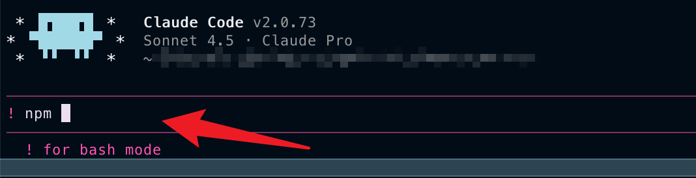

## 1주차

### 클로드 스킬

클로드 스킬은 프롬프트를 매번 복붙하지 않고, 정해진 워크 플로우를 재사용할 수 있는 스킬로 만들어 두는 시스템입니다.

**프롬프트와 스킬**
프롬프트 : 1회성 지시입니다. -> 이후 다시 지시를 해야함
스킬 : 자동으로 발동되며 영구적입니다.

스킬을 사용하기 위해서는 skill.md 파일에서 yaml 메타데이터 및 마크다운 본문을 설정합니다.

1. 문서화 스킬
   도구 사용법을 에이전트에게 가르치는 설명서

CLI 도구, API, 서버를 설명하여 이 도구를 어떻게 사용하는 지 설명해줍니다.

2. 워크플로우 스킬
   에이전트가 수행할 구체적인 단계 정의

작업 분석, 단계 수행, 결과 검증을 알려주어 스킬 특정 작업을 완료하기 위해 에이전트가 수행해야하는 스킬을 설명해줍니다.

이상적인 형태는 이 두 가지가 결합된 방식을 사용하는 것입니다.
-> 센트리에서 에러가 나면 자동으로 PR을 만들어서 수정하는 방식

스킬은 3단계 점진적 공개를 사용합니다.

레벨 1 : yaml 메타데이터. 항상 로드되어 스킬의 이름과 설명만 클로드 시스템 프롬프트에 주입시킵니다.

레벨 2 : 스킬.md 본문. 단계별 가이드, 예시 모범사례 등 md 파일을 읽습니다

레벨 3 : 참조 파일. 스크립트, 레퍼런스, 에셋 파일은 정말 필요한 순간에만 접근합니다.

스킬도 SW 개발처럼 테스트가 중요하고, 꾸준히 관리해야합니다.

- 결과가 맞는가?
- 과정이 맞는가?
- 형식이 맞는가?
- 쓸데없이 돌아가지 않는가? (토큰 비용이 읽고 쓰는 글자 수에 비례하여 늘어나기 때문에)

**스킬 작동 원리**

1. 클로드는 대화 시작 시 모든 스킬의 yaml만 먼저 읽습니다.
2. 사용자 요청에 관련된 스킬이 있다고 판단하면 해당 스킬의 본문을 로딩합니다.
3. 본문에 참조 문서가 명시되어있으면 필요한 것만 추가로 로딩합니다.
4. 이 점진적인 로딩 덕분에 컨텍스트 윈도우를 효율적으로 사용할 수 있습니다.

**스킬 생명주기**

1. 성공 기준 정하기
   어떤 것이 되면 성공인지 정합니다. 그리고 결과 과정 형식 효율의 기준을 세웁니다.

2. 성공 패턴 찾기

3. 시험 문제 만들기
   스킬을 실행해야할 때, 실행이 안되어야할 때 등의 테스트를 골고루 만들어 테스트합니다.

4. 계속 돌보기
   한번 만들었다고 끝이 아닙니다.

안쓰는 스킬이 쌓이면 AI가 읽어야할 정보가 불필요하게 늘기 때문에 모델이 개선되어 스킬이 필요없어지면 해당 스킬은 은퇴시켜야합니다

**스킬 생성 팁**
description이 중요합니다. 해당 부분이 모호하면 스킬이 아무리 잘 만들어져 있어도 발동 자체가 안됩니다.

어떤 파일을 다루는지, 사용자가 실제로 할 법한 말이 뭔지, 최종 결과물이 뭔지 고려하여 작성합니다

또한 스킬 본문 구조를 정해두는 것이 좋습니다.
이걸 해라 -> 그 다음 이걸 해라 순으로 장황하지 않고 순서대로 명확하게 작성합니다.

또한 트러블 슈팅단계에서도 해당 에러의 원인과 해결을 같이 명세하여 스스로 복구할 수 있도록 세팅합니다.

클로드에서 !를 가장 앞에 입력하면 bash 모드로 전환됩니다


또한 skill.md가 너무 길면 핵심을 놓칠 수 있기 때문에 500줄 이하로 유지하는 것을 권장합니다.
-> 너무 길어지는 경우 핵심 지시만 남기고 상세 가이드라인은 별도 참고 파일로 분리합니다

#### 사용 방법

스킬을 사용하기 위해서는 "코드 실행 및 파일 생성" 기능을 켜놔야합니다. (free는 미지원)

1. 스킬 디렉토리 생성
   개인 스킬 폴더에 디렉토리 생성합니다. 이는 모든 프로젝트에서 사용가능합니다.
   `mkdir -p ~/.claude/skills/explain-code`

2. 모든 스킬에는 skill.md가 필요합니다.
   `~/.claude/skills/explain-code/SKILL.md` 생성

name 필드는 /slash-command가 되고, description은 클로드가 자동으로 로드할 시기를 결정하는데 도움이 됩니다

```md
---
name: explain-code
description: Explains code with visual diagrams and analogies. Use when explaining how code works, teaching about a codebase, or when the user asks "how does this work?"
---

When explaining code, always include:

1. **Start with an analogy**: Compare the code to something from everyday life
2. **Draw a diagram**: Use ASCII art to show the flow, structure, or relationships
3. **Walk through the code**: Explain step-by-step what happens
4. **Highlight a gotcha**: What's a common mistake or misconception?

Keep explanations conversational. For complex concepts, use multiple analogies.
```

3. 스킬 테스트

- 클로드가 자동 호출하도록 하기 `How does this code work?`
- 스킬 이름으로 직접 호출하기 `/explain-code src/auth/login.ts`

**클로드 스킬로 만들면 좋은 작업**
매번 비슷한 규칙으로 반복하는 작업을 만들면 좋습니다

#### 커뮤니티 클로드 스킬

`/plugin marketplace add anthropics/skills`를 사용하여 커뮤니티에 있는 클로드 스킬을 사용할 수 있습니다.

단, 외부 클로드 스킬을 사용하는 경우 어떤 동작을 하는지 이해한 뒤 활성화하는 것이 안전합니다.
