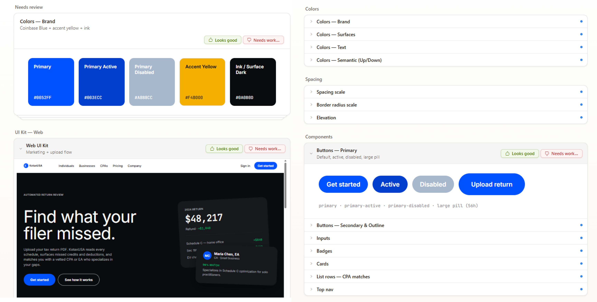
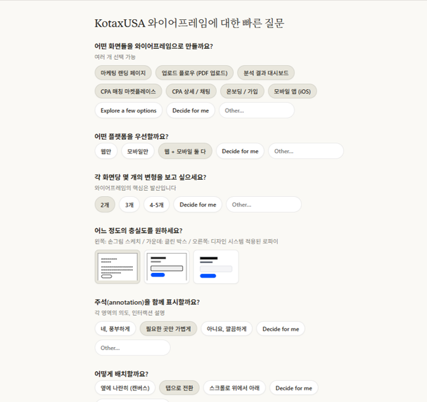
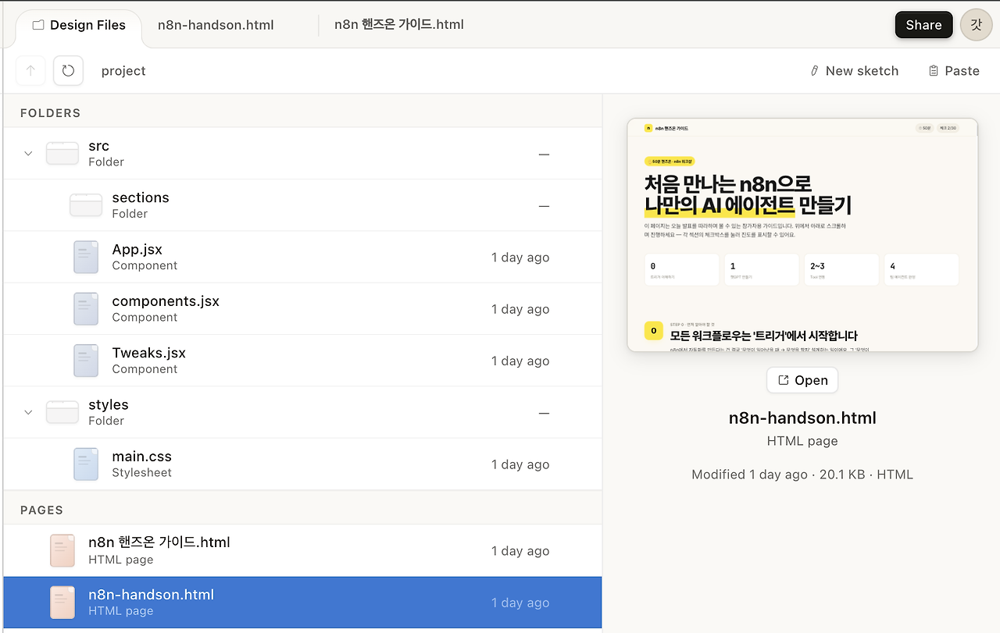

## 4주차

### 클로드 디자인

앤트로픽에서 제공하는 AI 디자인 도구입니다.
자연어로 요구사항을 설명하면 화면 디자인과 리액트/넥스트 코드까지 동시에 생성하는 특징이 있습니다.

https://getdesign.md/ 에서 여러 유명 사이트의 디자인 시스템을 마크다운으로 받을 수 있습니다.

ex : `npx getdesign@latest add bmw-m`

이 후 프로젝트 개요와 해당 디자인 시스템을 넣어 프로젝트 디자인 시스템을 만들어달라고 요청합니다.

각 화면의 와이어프레임을 만들어 서비스 흐름을 점검하고, 이후 제작을 선택하면 QA세션에서 질문을 거칩니다

**장점**

- 코드 작업과의 연결성이 크게 효율적으로 사용할 수 있습니다
- 전문 디자이너가 아니어도 어느 정도의 디자인 시스템과 와이어프레임을 빠르게 만들 수 있습니다

**단점**

- 일반적인 레이아웃을 무난하게 뽑긴하지만 결국 임팩트를 주기위해서는 사람의 손이 필요합니다.
- 세밀한 컨트롤이 아직 좋지 못합니다

#### 효과적으로 사용하기

1. 충분한 컨텍스트 제공과 단계적인 접근

   각 프롬프트 작성 시 일관성을 위해 컨텍스트를 충분히 깔아주는 것이 효과적입니다.

새 세션의 프롬프트에 컨텍스트를 붙이지 않고 화면 단위 요청만 던지면 톤이 맞지 않는 경우가 생깁니다

2. 여러 단위로 나눠서 작업을 요청합니다.

한꺼번에 많은 작업을 시키면 우선순위를 스스로 정하지 못해 결과물의 품질이 높게 나오지 못합니다

클로드 디자인으로 전체적인 시안을 잡은 뒤 피그마로 디테일 작업을 진행하는 방식이 좋습니다

#### Design Files

folders와 pages 두 섹션으로 구분됩니다

folders : 클로드가 내부적으로 생성한 소스 파일 트리입니다.
pages : 실제 출력된 HTML 페이지 목록입니다

결과 화면에서 Tweaks 패널을 통해 동적으로 커스터마이즈 컨트롤을 할 수 있습니다

#### 토큰 절약 전략

1. 디자인 시스템은 조직에서 한번만 설정합니다.
   디자인 시스템 생성 자체가 많은 토큰을 소비하기 때문에 팀에서 공유되는 조직 디자인 시스템을 설정하고 재사용합니다.

2. 단일 컴포넌트부터 시작합니다
   멀티섹션 전체 페이지를 한 번에 요청하면 수정 사이클이 많아집니다.
   랜딩 페이지 1개가 마음에 들면 섹션 추가 방식으로 접근합니다

3. adjustment knobs로 세부 조정
   채팅이나 인라인 코멘트로 매번 재생성하는 것보다 adjustment knobs로 실시간 조정하면 토큰 소비 없이 미세 조정이 가능합니다

4. 소넷 사용
