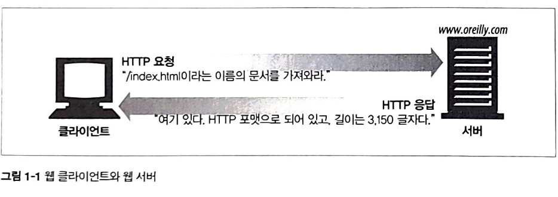
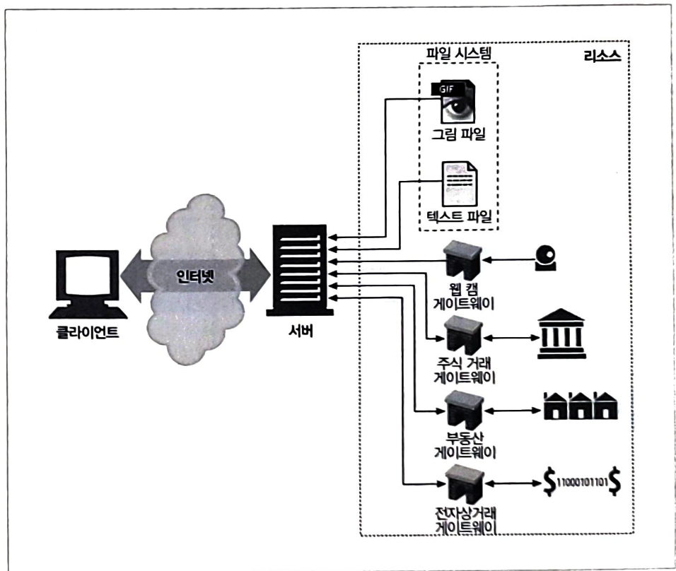
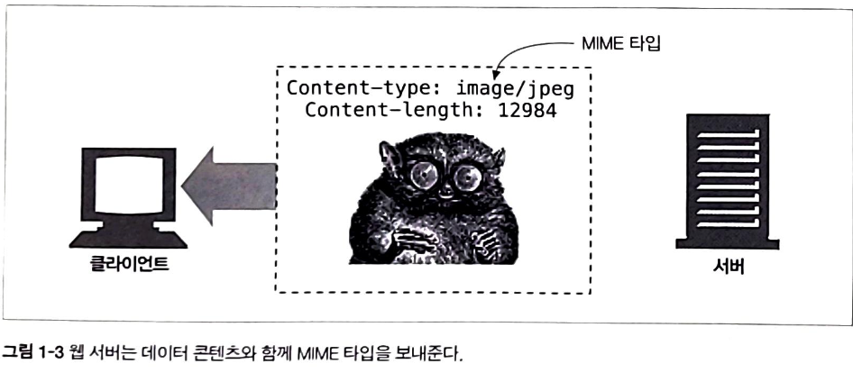
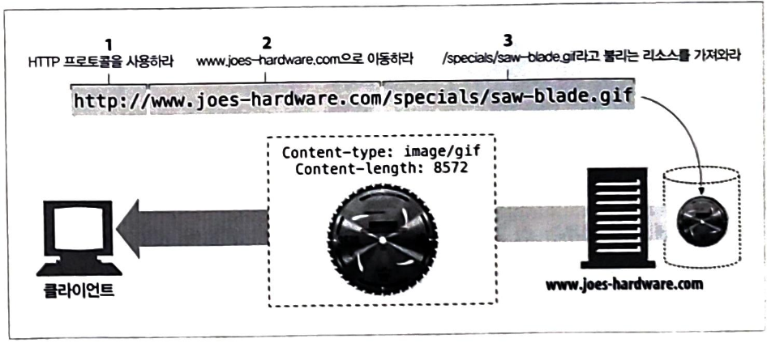
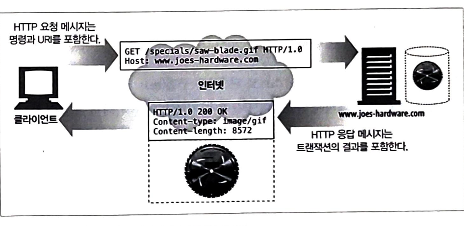
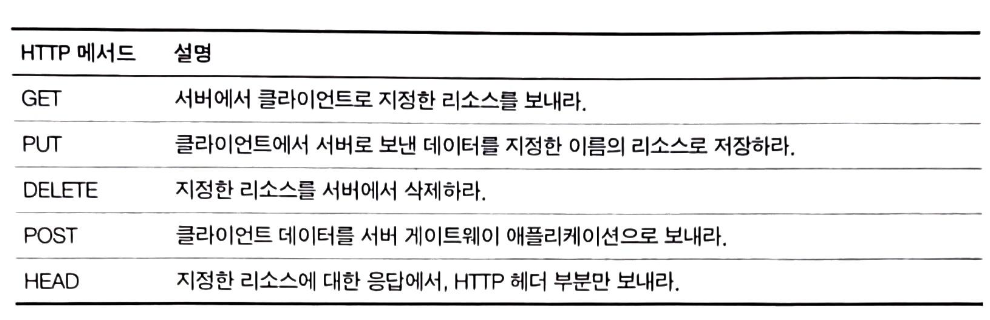
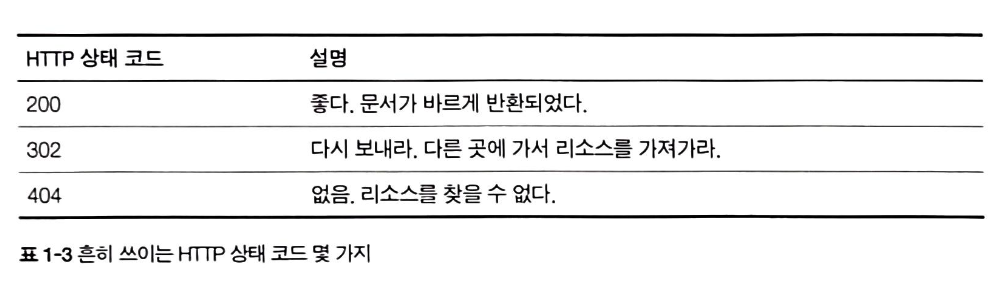
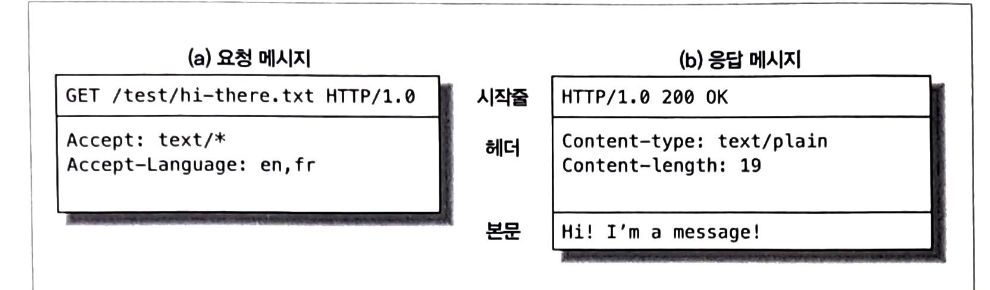

## 1주차 : http 웹의 기초

전 세계의 웹브라우저, 서버, 웹 어플리케이션은 모두 http(HyperText Transfer Protocol)을 통해 서로 통신합니다.

### http 인터넷의 멀티미디어 배달부

http는 신뢰성 있는 데이터 전송 프로토콜을 사용합니다. -> 데이터가 지구 반대편에서 오더라도 전송 중 손상되거나 꼬이지 않음을 보장합니다.

신뢰성있는 전송이기 때문에, 개발자는 어플리케이션 고유 기능을 구현하는 데 집중할 수 있습니다.

### 웹 클라이언트와 서버

웹 컨텐츠는 웹 서버에 존재합니다. 웹 서버는 http 프로토콜로 의사소통하기 때문에 보통 http 서버라고 불립니다.

클라이언트는 서버에게 http 요청을 보내고 서버는 요청된 데이터를 http 응답으로 돌려줍니다.

### 리소스

웹 서버는 웹 리소스를 관리하고 제공합니다. 웹 리소스는 웹 콘텐츠의 원천이빈다. 가장 단순한 웹 리소스는 웹 서버 파일 시스템의 정적 파일이다.

정적 파일 -> 텍스트 파일, avi 동영상 파일, jpeg 이미지 파일, 그 외 모든 종류의 파일을 포함합니다.

동적 파일 -> 사용자가 누구인지, 어떤 정보를 요청했는지, 몇 시인지에 따라 다른 콘텐츠를 생성합니다.

**미디어 타입**
인터넷은 수 많은 데이터 타입을 다루기 때문에, http는 웹에서 전송되는 객체 각각에 신중하게 MIME(Mulipurpose Internet Mail Extensions) 타입이라는 데이터 포멧 라벨을 붙입니다.

MIME는 원래 각기 다른 전자메일 시스템 사이에서 메시지가 오갈 때 겪는 문제점을 해결하기 위해 설계되었습니다.

웹 서버는 모든 http 객체 데이터에 MIME 타입을 붙이빈다. 웹 브라우저는 서버로부터 객체를 돌려받을 때, 다룰 수 있는 객체인지 MIME 타입을 통해 확인합니다. 대부분의 브라우저는 잘 알려진 객체 타입 수백 가지를 다룰 수 있다.

MIME 타입은 사선으로 구분된 **주 타입**과 **부 타입**으로 이루어진 문자열 라벨입니다.

예시]

- html => text/html
- plain ASCII => text/plain
- jpeg => image/jpeg
- gif => image/gif
- quicktime video => video/quicktime

### URI

Uniform Resource Identifier의 줄임말로, 통합 자원 식별자입니다. URI는 인터넷의 우편물 주소 같은 것으로 정보 리소스를 고유하게 식별하고 위치를 지정할 수 있습니다.

예시 : `http://www.joes-hardware.com/specials/saw-blade.gif`

### URL

Uniform Resource Locator의 줄임말로, 통합 자원 지시자입니다. URL은 리소스가 정확히 어디에 있고 어떻게 접근할 수 있는지 알려줍니다.

대부분의 URL은 세 부분으로 이루어진 표준 포멧을 따릅니다.

- URL의 첫 번째 부분은 스킴(scheme)이라고 하는데, 리소스에 접근하기 위해 사용되는 프로토콜을 서술합니다. (ex : http, rtsp)
- 두 번째 부분은 서버의 인터넷 주소를 제공합니다. (www.joes-hardware.com)
- 마지막은 웹 서버의 리소스를 가리킵니다. (/specials/saw-blade.gif)

오늘날 대부분의 URI는 URL입니다.

### URN (Uniform Resource Name)

URI의 두 번째 종류는 유니폼 리소스 이름입니다. 콘텐츠를 이루는 한 리소스에 대해 리소스 위치에 영향 받지 않는 유일무이한 이름 역할을 합니다. 이 위치 독립적인 URN은 리소스를 여기저기로 옮기더라도 문제없이 동작합니다.

리소스가 이름을 변하지 않게 유지하는 한 여러 종류의 네트워크 접속 프로토콜로 접근해도 문제없습니다.

URN은 여전히 실험 중이고 아직 널리 채택되지 않았습니다. 효율적으로 동적하기 위해서는 리소스 위치를 분석하기 위한 인프라 지원이 필요합니다. 하지만 인프라가 부재하기에 URN 채택이 더 늦춰지고 있습니다.

### 트랜잭션

http 트랜잭션은 요청 명령과 응답 결과로 구성되어 있습니다.

**메서드**
http는 http 메서드라는 여러 종류의 요청 명령을 지원합니다. 모든 http 요청 메시지는 한 개의 메서드를 갖습니다.

**상태 코드**
모든 응답 메시지는 상태 코드와 함께 반환됩니다. 각 숫자 상태 코드에 텍스트로 된 사유 구절도 함께 보냅니다.

### 메시지

http 메시지는 단순한 줄 단위의 문자열입니다. 웹 클라이언트에서 웹 서버로 보낸 http 메시지를 요청 메시지라고 부르고, 서버에서 클라이언트로 가는 메시지는 응답 메시지라고 부릅니다.

시작줄 : 메시지의 첫 줄로, 요청이면 무엇을 해야 하는지. 응답이라면 무슨 일이 일어났는지 나타냅니다.

헤더 : 시작줄 다음에는 0개 이상의 헤더 필드가 이어집니다. 각 헤더 필드는 쉬운 구문분석을 위해 쌍점으로 구분되어 있는 하나의 이름과 하나의 값으로 구성됩니다.

본문 : 빈 줄 다음에는 어떤 종류의 데이터든 들어갈 수 있는 메시지 본문이 필요에 따라 올 수 있습니다. 요청 본문은 웹 서버로 데이터를 실어 보내며, 응답 본문은 클라이언트로 데이터를 반환합니다.

문자열이며 구조적인 시작줄이나 헤더와 달리, 본문에는 임의의 이진 데이터를 포함할 수 있습니다. 따라서 비디오, 이미지 등의 데이터를 포함할 수 있습니다.

### TCP 커넥션

**TCP/IP**
http는 어플리케이션 계층 프로토콜입니다. http는 네트워크 통신의 핵심적인 세부사항에 신경쓰지않고, 대신 TCP/IP에서 이를 맡습니다.

TCP는 아래를 제공합니다.

- 오류 없는 데이터 전송
- 순서에 맞는 전달
- 조각나지 않는 데이터 스트림

TCP/IP는 TCP와 IP가 층을 이루는 패킷 교환 네트워크 프로토콜의 집합입니다.
TCP 커넥션이 맺어지면 클라이언트와 서버 컴퓨터 간 교환되는 메시지가 없어지거나, 손상되거나, 순서가 뒤바뀌어 수신되는 일은 결코 없습니다.

http 클라이언트가 서버에 메시지를 전송할 수 있게 되기 전에 IP 주소와 포트번호를 사용하여 클라이언트와 서버 사이에 TCP/IP 커넥션을 맺어야 합니다.

이를 알아내기 위해서는 URL을 사용합니다.
`http://207.200.83.29:80/index.html`

- 207.200.83.29 IP주소의 80포트로 접속하여 index.html로 들어갑니다.
  `http://www.netscape.com:80/index.html`
- DNS에 www.netscape.com을 검색하여 IP를 받아 동일하게 검색합니다.
  `http://www.netscape.com/index.html`
- http 포트가 80번이기 때문에 포트를 명시하지 않으면 80포트로 자동 사용합니다.

### 웹의 구성요소

**프록시**
클라이언트 - 서버 사이에 위치한 http 중개자입니다.

클라이언트의 모든 http 요청을 받아 서버에 전달합니다.
주로 보안을 위해 사용되며, 모든 웹 트래픽 흐름 속에서 신뢰할 만한 중개자 역할을 합니다.

**캐시**
많이 찾는 웹페이지를 클라이언트 가까이에 보관하는 http 창고

웹 캐시와 캐시 프록시는 자신을 거쳐가는 문서들 중 자주 찾는 것의 사본을 저장해두는 특별한 종류의 http 프록시 서버입니다.

**게이트웨이**
다른 어플리케이션과 연결된 특별한 웹 서버

다른 서버들의 중개자로 동작하는 특별한 서버입니다. 게이트웨이는 주로 http 트래픽을 다른 프로토콜로 변환하기 위해 사용됩니다.

게이트웨이는 언제나 스스로가 리소스를 가지고 있는 진짜 서버인 것처럼 요청을 다룹니다.

**터널**
단순 http 통신을 전달하기만 하는 특별한 프록시

두 커넥션 사이에서 raw 데이터를 열어보지 않고 그대로 전달해주는 http 어플리케이션입니다. http 터널은 주로 비 http 데이터를 하나 이상의 http 연결을 통해 그대로 전송해주기 위해 사용됩니다.

**에이전트**
자동화된 http 요청을 만드는 semi-intelligent 웹 클라이언트

사용자를 위해 http 요청을 만들어주는 클라이언트 프로그램입니다.
