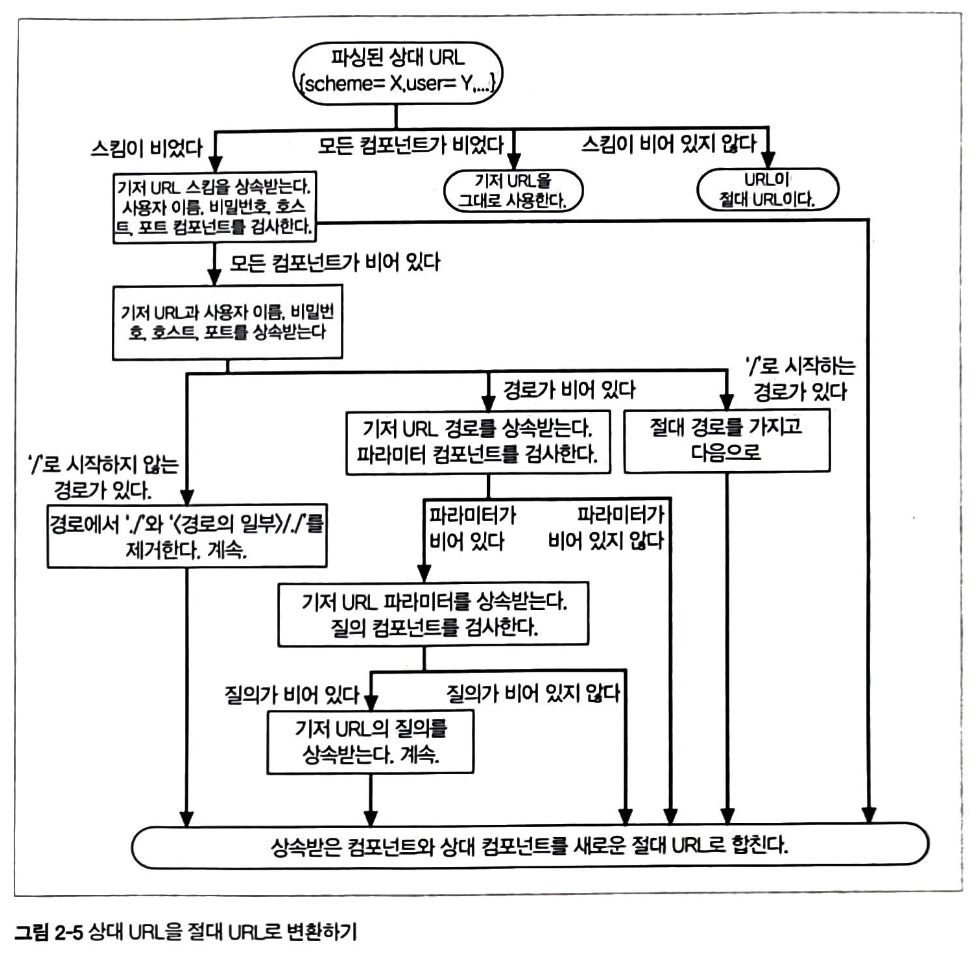
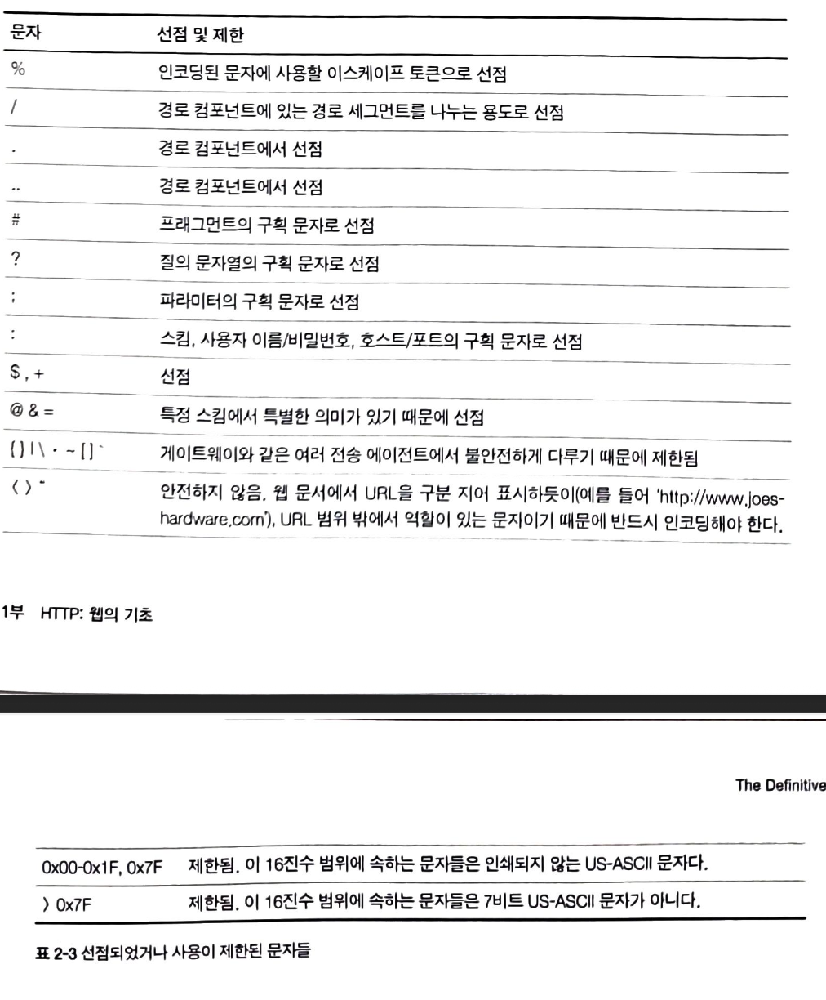

## URL과 리소스

URL은 브라우저가 정보를 찾는데 필요한 리소스 위치를 가리키며 URL을 이용하여 사람과 애플리케이션이 인터넷상의 리소스를 찾고 사용하며 공유합니다.

URL은 URI의 부분 집합이며 URI는 URL과 URN으로 구성된 종합적인 개념입니다.

`http://www.joes-hardware.com/seasonal/index-fall.html`

http : URL의 스킴 (어떻게)
www-joes-hardware.com : 서버의 위치 (어디에)
/seasonal/index-fall.html : 리소스 경로 (무엇을)

URL은 HTTP 프로토콜뿐만 아니라 이메일, FTP 등 어떤 리소스든 가리킬 수 있습니다.

대부분의 URL 스킴은 일반적으로 9개로 나뉩니다.
`<스킴>://<사용자 이름>:<비밀번호>@<호스트>:<포트>/<경로>;<파라미터>?<질의>#<프래그먼트>`

스킴 : 어떤 프로토콜을 사용하여 서버에 접근할건지
사용자 이름 : 몇몇 스킴은 리소스 접근을 위해 이를 필요로함
비밀번호 : 사용자의 비밀번호를 가리킴

- 사용자 이름/비밀번호 없이 FTP로 접근하면 'anonoymous':'브라우저 기본값'으로 사용합니다.
  호스트 : 리소스를 호스팅하는 서버의 호스트 명 혹은 IP
  포트 : 리소스를 호스팅하는 서버가 열어놓은 포트번호
  경로 : 서버 내 리소스가 서버 어디에 있는지
  파라미터 : 특정 스킴에서 입력 파라미터를 기술하는 용도. 파라미터는 이름/값을 쌍으로 가집니다
  질의 : 스킴에서 어플리케이션에 파라미터를 전달하는 데 사용
  프래그먼트 : 리소스 조각이나 일부분을 가리키는 이름. 클라이언트에서만 사용

### 단축 URL

상대 URL은 리소스 안에 있는 리소스를 간결하게 기술하는데 사용할 수 있습니다. URL 일부를 입력하면 나머지 부분을 자동으로 입력하는 URL 자동 확장을 많은 브라우저에서 지원합니다.

**상대 URL**
프래그먼트거나 URL의 일부입니다. base URL을 사용하여 기술하지 않은 정보를 추측하여 사용합니다.

**절대 URL**
리소스에 접근하는데 필요한 모든 정보를 가지고 있습니다.

### URL 확장

URL을 입력한 다음이나 입력하는 동안 자동으로 URL을 확장하는데, 이는 사용자가 빠르게 입력할 수 있게 도와줍니다.

**호스트명 확장**
호스트명 확장을 지원하는 브라우저는 단순 휴리스틱만을 사용하여 입력한 호스트 명을 전체 호스트 명으로 확장할 수 있습니다.
-> ex) yahoo를 주소 입력란에 넣으면 브라우저에서 자동으로 www.yahoo.com으로 만들어줍니다.

**히스토리 확장**
브라우저가 과거에 사용자가 방문했던 기록을 저장하여 URL의 앞 글자들을 포함하는 완결된 형태의 URL을 선택할 수 있게 합니다.

### 안전하지 않은 문자

모든 프로토콜이 데이터를 전송하기 위해 서로 다른 장치를 갖고 있기 때문에 어떤 인터넷 프로토콜을 통해서든 안전하게 전송될 수 있도록 설계하는 것이 중요합니다.
=> 안전한 전송 : 정보가 유실될 위험 없이 URL을 전송할 수 있는 것

전자메일에 사용되는 SMTP같은 프로토콜은 특정 문자를 제거할 수 있는 전송 방식을 사용합니다.
사람들이 이진 데이터나 일반적으로 안전한 알파벳 외의 문자도 포함하려는 때가 있다는 것을 알게되어 "이스케이프"를 통해 안전하지 않은 문자를 안전한 문자로 인코딩할 수 있게 했습니다.

**URL 문자 집합**
기본 문자 집합은 보통 영어 중심으로 설정되어 있습니다. US-ASCII 문자를 사용하는데, 만들어진 지 오래된 문자 집합이기 때문에 적은 수의 문자만을 포함합니다.

전 세계 사람들이 사용하는 문자까지는 지원하지 않기 때문에 이런 것들을 지원하기 위해서, URL에서 이스케이프 문자열을 쓸 수 있게 설계합니다.

**인코딩 체계**
인코딩은 안전하지 않은 문자를 %로 시작하여 아스키 코드로 표현되는 두 개의 16진수 숫자로 이루어진 이스케이프 문자로 바꿉니다.

**문자 제한**
몇몇 문자는 URL 내에서 특별한 의미로 예약되어 있습니다.

애플리케이션은 정해진 방식대로 구현해야 합니다. 안전하지 않거나 제한된 문자를 변환한느 것이 좋은데, 이런 방식을 사용하면 다른 애플리케이션에서도 혼동할 걱정 없이 공유할 수 있는 URL의 원형을 유지할 수 있습니다.

극단적인 방법으로 모든 문자를 인코딩하는 방법이 있지만 이런 방식은 안전한 문자들을 인코딩하지 않는 어플리케이션에서 오동작을 일으킬 위험이 있습니다.

### 스킴

URL 스킴에는 다양한 종류가 있습니다.

- http : 사용자 이름/비밀번호가 없는 것을 제외하고는 일반 URL 포멧을 지키는 하이퍼텍스트 전송 프로토콜 스팀입니다. 포트가 생략되어 있을 시 기본 값은 80입니다.

- https : http와 거의 같으나, HTTP 커넥션 양 끝단에서 암호화를 위해 보안 소켓 계층(SSL)을 사용하는 것입니다. 기본 포트값은 443입니다.

- mailto : 이메일 주소를 가카리며, 다음과 같습니다. `mailto:joe@joes-hardware.com`

- ftp : 파일 전송 프토토콜로 파일을 업로드/다운로드하며, 디렉토리에 있는 콘텐츠 목록을 가져오는 데 사용합니다.

- rtsp, rtspu : 실시간 스트리밍 프로토콜을 통해 읽을 수 있는미디어 리소스 식별자입니다.

- file : 주어진 호스트 기기에서 바로 접근할 수 있는 파일을 나타냅니다. 만약 호스트가 생략되어 있으면 URL을 사용하는 기기의 로컬 호스트가 기본 값입니다.

- news : 해당 리소스가 어디에 있는지 포함하지 않는 속성이 있습니다. 호스트 명이나 서버 이름도 제공하지 않으며, 사용자로부터 그 정보를 알아내는 것은 애플리케이션의 몫입니다.

- telnet : 대화형 서비스에 접근하는 데 사용합니다. URL 자체가 객체를 가리키지는 않으나 리소스라고 할 수 있는 대화형 어플리케이션은 이 텔넷 프로토콜로 접근할 수 있습니다.

URL은 리소스를 찾는데 필요한 포트와 서버 이름을 제공합니다. 하지만 이런 스킴은 리소스가 옮겨지는 URL을 더는 사용할 수 없는 것입니다. 이런 문제를 해결하기 위해서는 객체 위치와 상관없이 객체를 가리키는 실제 객체의 이름을 사용하는 것입니다. -> URN

URN은 객체가 옮겨지더라도 항상 객체를 가리킬 수 있는 이름을 제공합니다.
지속 통합 자원 지시자를 사용하면 URL로 URN의 기능을 제공할 수 있습니다. 리소스의 실제 URL 목록을 관리하고 추적하는 리소스 위치 중개 서버를 두고, 해당 리소스를 우회적으로 제공합니다.

클라이언트는 위치 할당자에게 리소스를 가져올 수 있는 영구적인 URL을 요청할 수 있으며, 영구적인 URL은 클라이언트를 리소스의 실제 URL로 연결해줍니다.

하지만 URN으로 전환하기 위해서는 많은 시간이 걸릴 것으로 예상됩니다. -> 표준 제정부터 벤더들과의 합의도 필요하기 때문에
