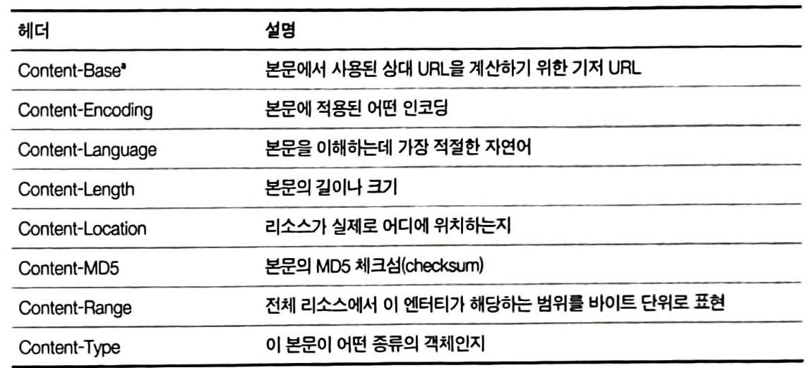

## http messages

- 메시지가 어떻게 흘러가는가
- http 메시지 세 부분(시작줄,헤더,개체 본문)
- 요청과 응답 메시지 차이
- 요청 메시지가 지원하는 여러 메서드
- 응답 메시지가 반환하는 여러 상태 코드
- 여러 http 헤더는 무슨 일을 하는가

### 메시지의 흐름

**용어 정리**
인바운드 : 서버나 시스템 안으로 들어오는 메시지 -> **클라이언트가 서버로** 보내는 요청
아웃바운드 : 서버나 시스템 밖으로 나가는 메시지 -> **서버가 클라이언트로** 보내는 응답
업스트림 : 메시지 흐름에서 원본/시작점 방향 -> 클라이언트에서 서버로 가는 방향/http**요청**이 흐르는 방향
다운스트림 : 메시지 흐름에서 최종 목적지 방향 -> 서버에서 클라이언트로 가는 방향/http**응답**이 흐르는 방향

1. 메시지는 원 서버 방향을 인바운드로 하여 송신됩니다.
2. 요청/응답 메시지에 관계없이 모든 메시지는 다운 스트림으로 흐릅니다.

http 메시지는 단순한 데이터의 구조화된 블록입니다.

- 시작줄 : 어떤 메시지인지 서술
- 헤더 블록 : 속성을 담고 있음
- 본문 : 데이터를 담고있거나 아예 없음

### 메시지 문법

모든 http 메시지는 요청 메시지 또는 응답 메시지로 분류됩니다.

요청 메시지 : 웹 서버에 어떤 동작을 요구

응답 메시지 : 요청의 결과를 클라이언트에게 돌려줍니다.

메서드 : 클라이언트에서 서버가 리소스에 대해 수행해주길 바라는 동작입니다.

요청 URL : 요청 대상이 되는 리소스를 지칭하는 완전한 URL 또는 URL의 경로 구성요소

버전 : `http/<major>.<minor>` 메이저/마이너는 모두 정수입니다.

상태 코드 : 요청 중에 무엇이 일어났는지 설명하는 세 자리의 숫자입니다.

사유 구절(reason-phrase) : 숫자로 된 상태 코드의 의밀르 사람이 이해할 수 있게 설명해주는 짧은 문구입니다. 사유 구절은 오로지 사람에게 읽히기 위한 목적입니다. `http/1.0 200 not ok` `http/1.0 200 ok` -> 사유 구절은 다르나 동등하게 성공을 의미하는 것입니다.

헤더들 : 이름, 콜론, 선택적인 공백, 값, CRLF가 순서대로 나타나는 0개 이상의 헤더입니다

엔터티 본문 : 임의의 데이터 블록을 포함합니다. 모든 메시지가 엔터티 본문을 갖는 것은 아니기 때문에 때때로 메시지는 그냥 CRLF로 끝납니다.

### 시작줄

요청줄 : 요청 메시지의 시작줄은 무엇을 해야하는 지 말해줍니다.
응답줄 : 수행 결과에 대한 상태 정보와 결과 데이터를 클라이언트에게 돌려줍니다.
메서드 : 요청의 시작줄은 메서드로 시작하고 서버에게 무엇을 해야하는 지 말해줍니다.

http는 쉽게 확장할 수 있도록 설계되어 있기 때문에, 다른 서버는 그들만의 메서드를 추가 구현했을 수 있습니다. 이러한 추가 메서드는 http 명세를 확장하는 것이기 때문에 확장 메서드라고 부릅니다.

### 상태코드

클라이언트에게 무엇이 일어났는지 말해주는 코드입니다.

해당 프로토콜도 확장이 가능합니다.

**100번대**

100 continue는 서버가 다루거나 사용할 수 없는 큰 엔터티를 서버에게 보내지 않으려는 목적으로만 사용해아합니다.
만약 서버가 100번을 응답받을 것으로 의도한 경우에서 엔터티 본문을 읽기 전에 요청을 끝내기로 결정했다면 서버는 그냥 응답을 보내고 연결을 닫아서는 안됩니다. -> 닫는 경우 클라이언트에서 응답을 받을 수 없게 되기 때문에

**200번대**
대응에 성공을 의미하는 상태 코드의 배열을 가지고 있습니다.

**300번대**
리다이렉션 상태 코드는 클라이언트가 관심있어 하는 리소스에 대해 다른 위치를 사용하라고 말해주거나 리소스 내용 대신 다른 대안 응답을 제공합니다.
만약 리소스가 옮겨졌다면, 클라이언트에게 리소스가 옮겨져씅며 어디서 찾을 수 있는지 알려주기 위해 리다이렉션 상태 코드와 로케이션 헤더를 보낼 수 있습니다.

리다이렉션 코드 중 몇몇은 리소스에 대한 어플리케이션 로컬 복사본이 원래 서버와 비교했을 때 유효한지 확인하기 위해 사용됩니다. http 어플리케이션은 그의 리소스에 대한 로컬 복사본이 여전히 최신인지 혹은 원래 서버에 있는 리소스가 수정되었는지 검사할 수 있습니다.

**400번대**
잘못 구성된 요청 메시지를 보낼 때 응답받는 코드입니다.

**500번대**
클라이언트가 올바른 요청을 보냈음에도 서버 자체에서 에러가 발생하는 경우입니다.
프록시는 클라이언트 입장에서 서버와 대화를 시도할 때 자주 에러를 만나는데, 이 문제를 설명하기 위해 500번대 에러 코드를 생성합니다.

### 사유구절

상태 코드에 대한 글로 된 설명입니다. `http/1.0 200 ok` -> ok가 사유 구절입니다.
사유 구절은 상태 코드와 1:1 대응됩니다.

### 버전 번호

http/x.y 형식으로 요청과 응답 메시지 양쪽 모두에 기술됩니다.
버전 번호는 http 통신하는 어플리케이션들에게 단서를 제공해주기 위해 사용합니다.
버전 번호는 정수로 이루어져있기 때문에 http/2.22가 http/2.3보다 이후 버전입니다.

### 헤더

각 헤더들은 간단한 문법을 가지며 이름/쉼표/공백/필드 값/CRLF가 순서대로 옵니다.

**일반 헤더**
클라이언트/서버 그리고 어딘가에 메시지를 보내는 다른 애플리케이션을 위해 다양한 목적으로 사용됩니다.

**요청 헤더**
요청 메시지를 위한 헤더입니다. 서버에게 클라이언트가 받고자 하는 데이터 타입이 무엇인지와 같은 부가 정보를 제공합니다.
ex : `Accept : */*`

**응답 헤더**
응답 메시지는 클라이언트에게 정보를 제공하기 위한 자신만의 헤더를 갖고 있습니다.

**엔티티 헤더**
엔티티 본문에 대한 헤더입니다. 엔터티 헤더는 엔티티 분문에 들어있는 데이터 타입이 무엇인지 말해줄 수 있습니다.

**확장 헤더**
어플리케이션 개발자들에 의해 만들어졌지만 아직 승인된 http 명세에는 추가되지 않은 비표준 헤더입니다.

**일반 캐시 헤더**
매번 원 서버로부터 객체를 가져오는 대신 로컬 복사본으로 캐시할 수 있도록 하는 최초의 헤더입니다.

**요청 헤더**
요청 메시지에서만 의미를 갖는 헤더입니다. 요청이 최초 발생한 곳에서 누가 혹은 무엇이 그 요청을 보냈는지에 대한 정보나 클라이언트의 선호나 능력에 대한 정보를 줍니다.

**accept 관련 헤더**
클라이언트가 무엇을 원하고 원하지 않는지 알려줄 수 있습니다. 이후 그 추가 정보를 이용하여 무엇을 보낼 것인가에 대한 결정을 내릴 수 있습니다.

**조건부 요청 헤더**
클라이언트가 이미 어떤 문서의 사본을 갖고 있는 경우 클라이언트는 그 문서를 자신이 갖고 있는 사본과 다를 때만 전송해 달라고 요청할 수 있습니다.

**요청 보안 헤더**
http는 자체적으로 요청을 위한 간단한 인증요구/응답 체계를 갖고 있습니다.

**프록스 요청 헤더**
인터넷에서 프록시가 흔해지면서 그 기능을 돕기 위한 몇몇 헤더들입니다.

**응답헤더**
응답 헤더는 클라이언트에게 부가 정보를 제공합니다. 또한 더 나아가 응답에 대한 특별한 설명을 제공할 수 있습니다.

**협상 헤더**
여러가지 표현이 가능한 상황인경우, 어떤 표현을 택할 것인지 지원하는 헤더입니다.

**응답 보안 헤더**
기본적인 인증요구 헤더가 포함됩니다.

**엔티티 헤더**
요청/응답 양쪽 모두 엔티티를 포함할 수 있기 때문에 양 타입의 메시지에 모두 나타날 수 있습니다.
일반적으로 엔티티 헤더는 메시지 수신자에게 자신이 다루고 있는 것이 무엇인지 말해줍니다.

**콘텐츠 헤더**
엔티티 콘텐츠에 대한 구체적인 정보를 제공합니다. 콘텐츠 종류, 크기, 기타 콘텐츠를 처리할 때 유용하게 활용될 수 있는 것들입니다.

**엔티티 캐싱 헤더**
엔티티 캐싱에 대한 정보를 제공합니다.

- 리소스에 대해 캐시된 사본이 아직 유효한지
- 캐시된 리소스가 더이상 유효하지 않게 되는 시점을 추정

### 엔터티 본문

메시지 세 번째 부분은 선택적인 엔터티 본문입니다. 이미지/비디오/문서/전자우편 등 여러 종류의 디지털 데이터를 실어 나를 수 있습니다.

### 메서드

모든 서버가 모든 메서드를 구현하지는 않습니다.

**안전한 메서드**
GET/HEAD 메서드와 같은 경우를 안전하다고 볼 수 있습니다. (멱등성 : 여러변 같은 요청을 해도 결과가 동일 )
해당 메서드를 사용하는 http 요청 결과로 서버에 어떤 작용도 없기 때문입니다. (정상적으로 개발했을 경우)

GET : 주로 서버에게 리소스를 요청할때 사용
HEAD : GET과 행동은 같으나 서버는 응답으로 헤더만을 돌려줍니다.

- 리소스를 가져오지 않고도 그에 대해 무엇인가를 알아낼 수 있습니다.
- 응답의 상태 코드를 통해 개체가 존재하는지 확인할 수 있습니다.
- 헤더를 확인하여 리소스가 변경되었는지 검사할 수 있습니다.

서버 개발자는 반드시 반환되는 헤더가 get으로 얻는 것과 정확히 일치함을 보장해야합니다.

**안전하지 않은 메서드**
서버 상태를 변경할 수 있는 메서드입니다.

PUT : 서버에 문서를 쓰는 역할을 합니다. 요청 URL의 이름대로 새 문서를 만들거나, 이미 존재하는 경우 본문을 사용하여 교체(업데이트)합니다.

POST : 서버에 입력 데이터를 전송하기 위해 설계되었습니다.

TRACE : 클라이언트에게 자신의 요청이 서버에 도달했을 때 어떻게 보이는지 알려줍니다. 주로 진단을 위해 사용합니다.

- 요청이 의도한 요청/응답 연쇄를 거쳐가는지 검사하는 경우
- 프록시나 다른 어플리케이션들이 요청에 어떤 영향을 미치는지 확인해보고자 하는 경우

진단을 사용할때는 괜찮으나 중간 어플리케이션이 여러 다른 종류의 요청을 일관되게 다룬다고 가정하는 문제가 있습니다. 또한 어떠한 엔터티 본문도 보낼 수 없어서 응답의 엔터티 본문에는 서버가 받은 요청이 그대로 들어있습니다.

OPTIONS : 웹 서버에게 여러 가지 종류의 지원 범위에 대해 물어봅니다.

DELETE : 서버에게 요청 URL로 지정한 리소스를 삭제할 것을 요청합니다. 그러나 클라이언트는 삭제가 수행되는 것을 보장하지 못합니다. -> 서버에서 클라이언트에게 알리지 않고 요청을 무시하는 것을 허용하기 때문에

### 확장 메서드

필요에 따라 메서드를 추가해도 문제가 없도록 설계되어 있습니다.

하지만 다음과 같이 확장된 메서드는 형식을 갖춘 명세로 정의된 것이 아니기 때문에 다른 어플리케이션에서는 이해할 수 없습니다.
이런 경우 501 NOT IMPLEMENTED로 응답하여 "엄격하게 보내고 관대하게 받아들여라"는 관습을 따를 수 있습니다.
