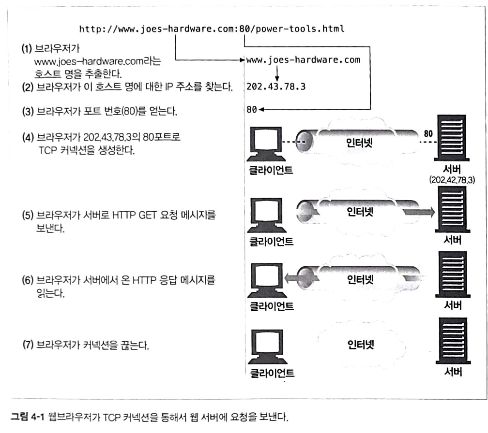
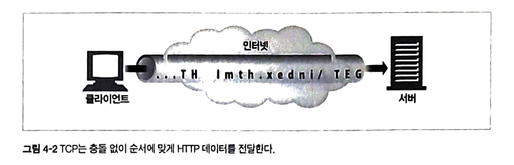
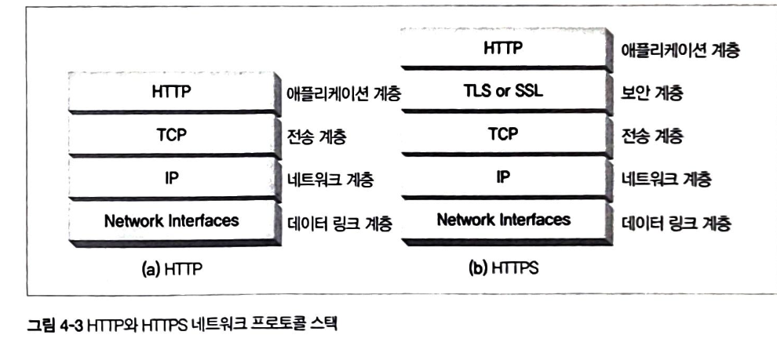
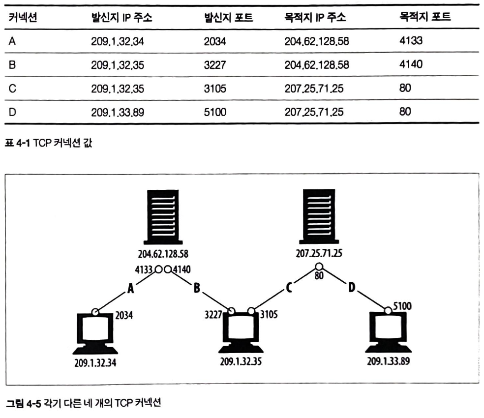
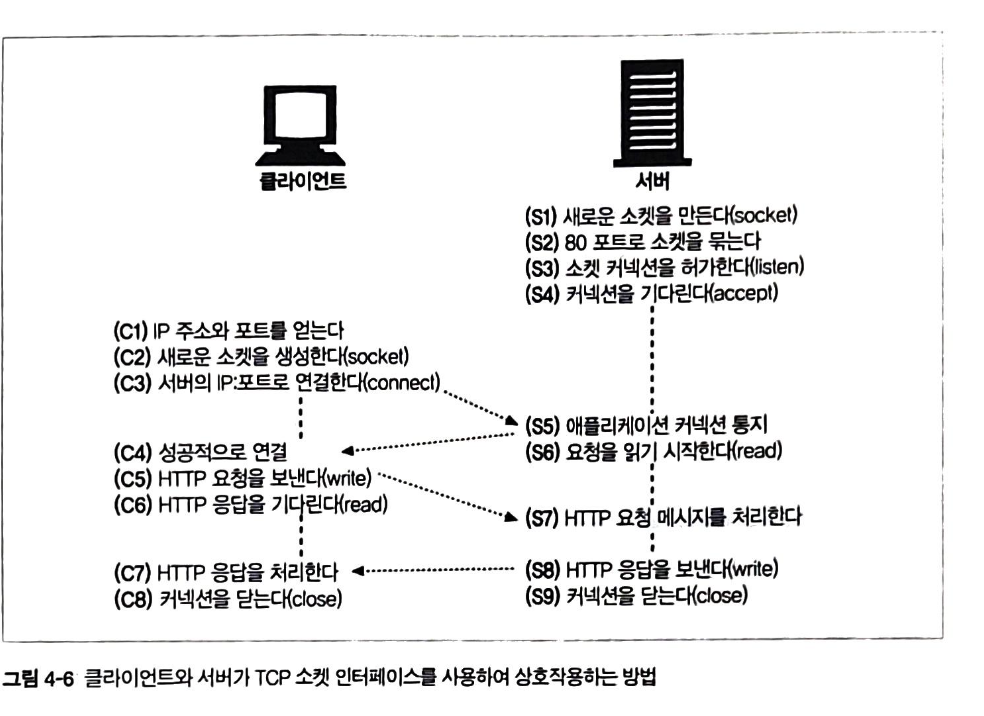
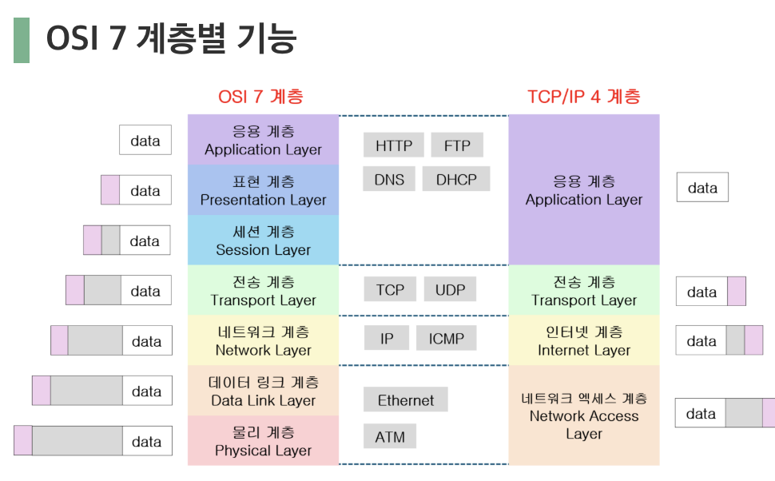
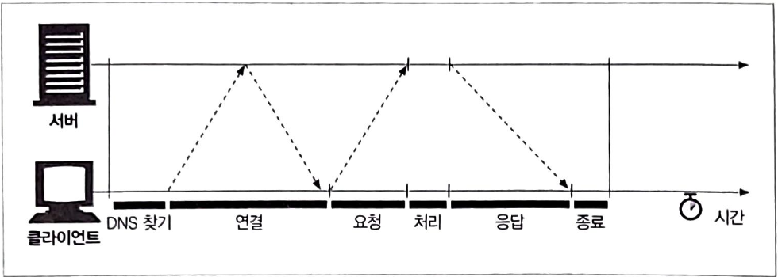
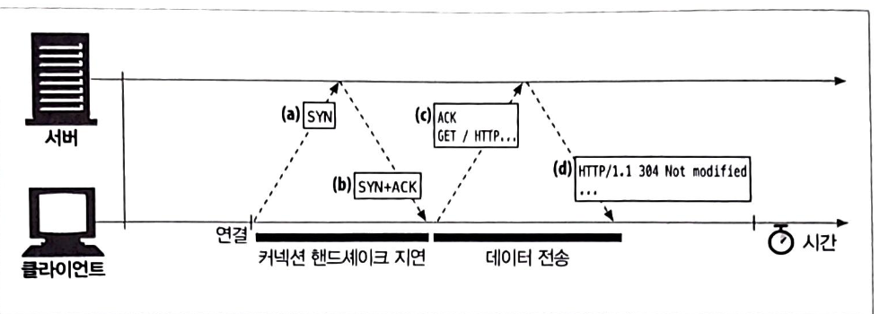
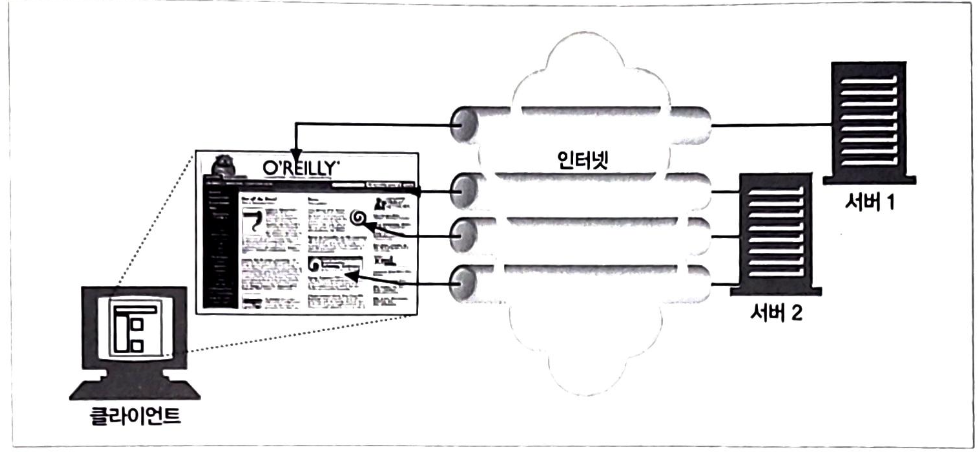
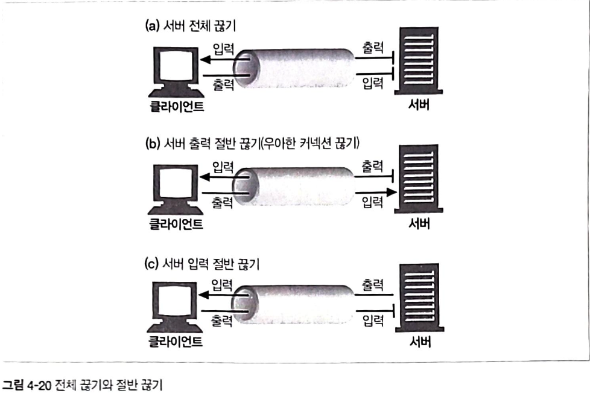

## 4. 커넥션 관리

### TCP 커넥션

http 통신은 패킷 교환 네트워크 프토로콜의 계층화 집합인 TCP/IP를 통해 이뤄집니다.

커넥션이 맺어지면 클라이언트 - 서버간에 주고받는 메시지들은 손실 혹은 손상되거나 순서가 바뀌지 않고 안전하게 전달됩니다.

#### TCP 커넥션을 통해 웹 서버에 요청을 보내는 과정

1~3단계에서는 URL을 통해 서버 IP 주소와 포트 번호를 가져옵니다.
4단계에서 웹 서버가 TCP 커넥션을 맺습니다
5단계에서는 커넥션을 통해 요청 메시지가 전달됩니다.
6단계에서는 응답을 읽고 7단계에서 커넥션이 끊어집니다.

- HTTP 커넥션은 인터넷을 안정적으로 연결해주는 역할을 수행합니다.
  

- TCP 스트림은 세그먼트로 나뉘어 아이피 패킷을 통해 전송됩니다.
  HTTP는 IP,TCP,HTTP로 구성된 프로토콜 스택에서 최상위 계층입니다.
  보안 기능을 더한 HTTPS는 TLS 혹은 SSL이라 불리기도 하며 HTTP - TCP 사이에 있는 암호화 계층입니다.

HTTP가 메시지를 전송하려는 경우 현재 연결되어 있는 TCP 커넥션을 통해 메시지 데이터 내용을 순서대로 보냅니다.
TCP는 세그먼트라는 단위로 데이터 스트림을 잘게 나누고, 세그먼트를 IP 패킷이라 불리는 봉투에 담아 인터넷을 통해 데이터를 전달합니다.

각 TCP 세그먼트는 하나의 IP 주소에서 다른 IP 주소로 IP 패킷에 담겨 전달됩니다.

IP 패킷은 IP 패킷 헤더, TCP 세그먼트 헤더, TCP 데이터 조각을 포함합니다.

IP 헤더 : 발신자와 목적지 IP주소, 크기, 기타 플래그를 가집니다.
TCP 세그먼트 헤더 : TCP 포트 번호, 제어 플래그, 데이터 순서와 무결성을 검사하기 위해 사용되는 숫자 값을 포함합니다.

- TCP는 포트 번호를 통해 여러 커넥션을 유지합니다.
  `<발신자 아이피 주소, 발신자 포트, 수신자 아이피 주소, 수신자 포트>`로 TCP 커넥션을 식별합니다.

어떤 커넥션들은 같은 목적지 포트 번호를 가리킬 수 있습니다. 또한 같은 발신지 아이피 주소를 가리키는 커넥션도 있고 같은 목적지 아이피 주소를 가리키는 커넥션도 있습니다.
-> 그러나 네 가지 커넥션 구성요소를 모두 똑같이 가리키는 커넥션은 있을 수 없습니다.

- TCP Socket Programming

운영체제는 TCP 커넥션의 생성과 관련된 여러 기능을 제공합니다.

`s = socket(params) // 연결이 되지 않은 익명의 새로운 소켓 생성`
`bind(s, <local IP:port>) // 소켓에 로컬 포트 번호와 인터페이스 할당 `
`connect(s, <remote IP:port>) // 로컬의 소켓과 원격 호스트 및 포트 사이에 TCP 커넥션 생성`
`listen(s, ...) // 커넥션을 받아들이기 위해 로컬 소켓에 허용함을 표시`
`s2 = accept(s) // 누군가 로컬 포트에 커넥션을 맺기를 기다림`
`n = read(s, buffer.n) // 소켓으로부터 버퍼에 n바이트 읽기 시도`
`n = write(s, buffer.n) // 소켓으로부터 버퍼에 n바이트 쓰기 시도`
`close(s) // TCP 커넥션을 완전히 끊음`
`shutdown(s, <side>) //TCP 커넥션의 입출력만 닫음`
`getsockspt(s, ...) // 내부 소켓 설정 옵션 값을 읽음`
`setsockopt(s, ...) // 내부 소켓 설정 옵션 값을 변경 `

소켓 API를 사용하면 TCP 엔드포인트 데이터 구조를 생성하고, 원격 서버의 TCP 종단에 그 종단 데이터 구조를 연결하여 데이터 스트림을 읽고 쓸 수 있습니다.

TCP API는 기본적인 네트워크 프로토콜의 핸드셰이킹, TCP 데이터 스트림과 아이피 패킷 간의 분할 및 재조립에 대한 모든 세부사항을 외부로부터 숨깁니다.

커넥션이 맺어지면 클라이언트는 HTTP 요청을 보내고, 서버는 그것을 읽습니다.
서버가 요청 메시지를 다 받으면 요청을 분석하여 클라이언트가 원하는 동작을 수행하고 클라이언트에게 데이터를 보냅니다.
클라이언트는 서버로부터 데이터를 받아 응답 데이터를 처리합니다.

#### TCP 성능에 대한 고려

HTTP는 TCP 바로 위에 있는 계층이기 때문에 HTTP 트랙잭션의 성능은 그 아래 계층인 TCP 성능에 영향을 받습니다.

해당 챕터에서는 TCP 성능 특성을 이해하여 HTTP 커넥션 최적화 요소를 더 잘 알게되고 더 좋은 성능의 HTTP 어플리케이션을 설계하고 구현할 수 있게 도와주는 것이 목표입니다.

- HTTP 트랜잭션 지연
  

트랜잭션 처리 시간은 커넥션 설정, 요청 전송, 응답 메시지에 비해 상당히 짧습니다. 따라서 너무 많은 데이터를 내려받거나 복잡한 자원을 실행하지 않는 이상, 대부분의 HTTP 지연은 TCP 네트워크 지연 때문에 발생합니다.

HTTP 트랜잭션을 지연시키는 원인

1. 클라이언트는 URI에서 웹 서버 IP 주소 및 포트 번호를 알아야합니다. 방문한 적이 최근에 없는 경우 DNS로 URI에 있는 호스트 명을 IP 주소로 변환해야합니다.

2. 클라이언트는 TCP 커넥션 요청을 서버에게 보내고 서버가 커넥션 허가 응답을 회신하기를 기다립니다.
   -> 커넥션 설정 시간은 새로운 TCP 커넥션에서 항상 발생하기 때문에 HTTP 트랜잭션이 늘어날수록 함께 소요시간이 증가합니다.

3. 커넥션이 맺어지면 클라이언트는 HTTP 요청을 새로 생성된 TCP 파이프를 통해 전송합니다.
   -> 웹 서버는 데이터가 도착하는 대로 TCP 커넥션에서 요청 메시지를 읽고 처리합니다.

4. 웹 서버가 HTTP 응답을 보내는 것 역시 시간이 소요됩니다.

- TCP 커넥션 핸드셰이크 지연
  어떤 데이터를 전송하는 것에 관계없이 새로운 TCP 커넥션 시, TCP 소프트웨어는 커넥션 조건을 맞추기 위해 연속으로 IP 패킷을 교환합니다.

작은 크기의 데이터 전송에 커넥션이 사용되면 이런 패킷 교환은 HTTP 성능을 저하시킬 우려가 있습니다.

1. 클라이언트는 새로운 커넥션을 생성하기 위해 작은 TCP 패킷을 서버로 보냅니다. -> SYN : 커넥션 생성 요청
2. 서버가 그 커넥션을 받으면 몇 가지의 커넥션 매개변수를 산출하고 커넥션 요청이 받아들여졌음을 의미하는 TCP 패킷을 클라이언트로 보냅니다.
3. 클라이언트는 커넥션이 잘 맺어졌음을 알리기 위해 서버에게 다시 확인 응답 신호를 보냅니다.

=> 크기가 작은 HTTP 트랜잭션은 절반 이상의 시간을 TCP 구성에 사용하기 때문에 이미 존재하는 커넥션을 재활용하여 성능 최적화를 할 수 있습니다.

- 확인 응답 지연
  인터넷 자체는 패킷 전송을 완벽히 보장하지는 않습니다. 따라서 TCP에서 성공적인 데이터 전송을 보장하기 위해 자체적인 확인 체계를 가지고 있습니다.

각 세그먼트는 순번과 데이터 무결성 체크섬을 갖고있습니다.
-> 송신자가 특정 시간 안에 확인 응답 메시지를 받지 못하면 패킷 손상 혹은 오류가 있는 것으로 판단하고 데이터를 다시 전송합니다.

확인 응답의 크기는 작기 때문에 TCP는 같은 방향으로 송출되는 데이터 패킷에 확인응답을 편승시킵니다.
-> 데이터 패킷과 확인 응답을 하나로 묶어 네트워크를 좀 더 효율적으로 사용

요청과 응답 두 가지 형식으로만 이뤄지는 HTTP 동작 방식은 확인 응답이 송출 데이터 패킷에 편승할 기회를 감소시킵니다.

- TCP slow start
  TCP 데이터 전송속도는 커넥션 생성이 얼마나 지났는지에 따라 달라질 수 있습니다.

데이터가 성공적으로 전송됨에 따라 속도 제한을 높여나가며 이렇게 속도를 조율하는 이유는 인터넷의 갑작스러운 부하와 혼잡을 방지하기 위해서입니다.

TCP 느린 시작은 한 번에 전송할 수 있는 패킷 수를 제한합니다.

- TIME WAIT의 누적과 포트 고갈
  TIME_WAIT 포트 고갈은 성능 측정 시 심각한 성능 저하를 발생시키나, 보통 실 상황에서는 문제를 발생시키지는 않습니다.

TCP 종단에서 커넥션을 끊으면 종단에서는 커넥션의 아이피 주소와 포트번호를 메모리에 기록합니다.
-> 같은 주소와 포트 번호를 사용하는 새로운 TCP커넥션이 일정 시간동안 생성되지 않게 하기 위해

일반적인 상황에서는 서버가 초당 500개 이상의 트랜잭션을 처리할 만큼 빠르지 않다면 TIME_WAIT 포트 고갈을 일어나지 않습니다.
-> 이를 해결하기 위해서 여러 개의 가상 아이피를 사용할 수도 있습니다.

단, 포트 고갈 문제를 겪지 않더라도 커넥션을 너무 많이 맺거나 대기 상태로 있는 제어 블록이 많아지는 상황은 주의해야합니다.

#### HTTP 커넥션 관리

- 커넥션 헤더
  HTTP는 클라이언트 - 서버 사이에서 프록시 서버, 캐시 서버 등과 같은 중개 서버가 놓이는 것을 허락합니다.
  HTTP메시지는 클라이언트에서 서버(혹은 리버스서버)까지 중개 서버들을 거치면서 전달됩니다.

HTTP 커넥션 헤더 필드는 커넥션 토큰을 쉼표로 구분하여 가지고 있으며, 그 값들은 다른 커넥션에 전달되지 않습니다.

-> HTTP 헤더 필드 명은 이 커넥션에만 해당되는 헤더를 나열합니다.
-> 임시적인 토큰 값은 커넥션에 대한 비표준 옵션을 의미합니다.
-> close 값은 커넥션 작업이 완료되면 종료되어야 함을 의미합니다.

커넥션 토큰이 HTTP 헤더 필드 명을 갖고 있으면 해당 필드들은 현재 커넥션만을 위한 정보이므로 다음 커넥션에 전달하면 안됩니다.
-> 커넥션 헤더에 있는 모든 헤더 필드는 메시지를 다른 곳으로 전달하는 시점에서 삭제

HTTP 어플리케이션이 커넥션 헤더와 함께 메시지를 전달받으면 수신자는 송신자에게 온 요청에 기술되어있는 모든 옵션을 적용합니다. 그 후 다음 홉에 머시지를 전달하기 전에 커넥션 헤더와 헤더에 기술되어 있던 모든 헤더를 삭제합니다.

- 순차적인 트랜잭션 처리에 의한 지연

커넥션 관리가 제대로 이뤄지지 않으면 성능이 매우 안좋아질 수 있습니다.
순차적인 처리로 인한 지연은 물리적 지연 뿐만 아니라 하나의 이미지를 내려받는 중에는 나머지 웹 페이지에 아무런 변화가 없어서 느껴지는 심리적 지연도 있습니다.

또한 순차적으로 로드하면 특정 브라우저의 경우 모든 객체를 내려받기 전까지 텅 빈 화면을 보여줍니다.
-> 객체를 화면에 배치하기 위해서 객체 크기를 알아야하기 때문에

브라우저는 실제로 병렬 커넥션을 사용하나 적은 수(대부분 6~8개)의 병렬 커넥션만을 허용합니다.
서버는 특정 클라이언트로부터 과도한 커넥션이 맺어졌을 경우 임의로 끊을 수 있습니다.

병렬 커넥션이 항상 더 빠르게 로드되지는 않으나, 여러 객체가 동시에 보이면서 내려받기 때문에 사용자 입장에서는 여러 작업이 일어나는 것을 보고 더 빠르다고 여긴다고 합니다.

**병렬 커넥션**
여러 TCP커넥션을 통한 동시 HTTP 요청

HTML 페이지를 먼저 내려받고 남은 트랜잭션이 각각 별도의 커넥션에서 동시에 처리하여 이미지를 병렬로 받습니다. 이로 인해 커넥션 지연이 겹쳐지며 총 지연시간이 줄어들어 페이지를 더 빠르게 내려받을 수 있습니다.

하지만 클라이언트 네트워크 대역폭이 좁은 경우, 대부분의 시간을 데이터 전송에 쓰이기 때문에 여러 개의 객체를 병렬로 받는 경우 제한된 대역폭 내에서 각 객체를 전송받는 것은 느리기 때문에 성능상 장점이 거의 없어집니다.

**지속 커넥션**
커넥션을 맺고 끊는 데서 발생하는 지연을 제거하기 위한 TCP 커넥션의 재활용

웹 클라이언트는 보통 같은 사이트에 여러 커넥션을 맺습니다. 따라서 서버에 HTTP 요청을 하기 시작한 애플리케이션은 웹 페이지 내 이미지 등을 갖고 오기 위해 그 서버에 또 요청하게 됩니다. => 이 속성을 사이트 지역성이라 부릅니다.

지속 커넥션은 클라이언트나 서버가 커넥션을 끊기 전까지는 트랜잭션 간에도 커넥션을 유지합니다. 이미 맺어져 있는 지속 커넥션을 활용하여 커넥션을 맺기 위한 준비 작업 시간을 절약할 수 있습니다.

HTTP/1.0+에는 `keep-alive` 커넥션이 있고, HTTP/1.1에는 `지속`커넥션이 있습니다.

Keep-Alive 동작 :
HTTP/1.1 명세에서는 빠졌으나 아직 브라우저 - 서버간에 keep-alive 핸드셰이크가 사용되기 때문에 HTTP 애플리케이션은 그것을 처리할 수 있게 개발해야합니다.

커넥션을 유지하기 위해 요청에 `Connection : Keep-Alive` 헤더를 포함시킵니다. 요청을 받은 서버는 그 다음 요청도 이 커넥션을 통해 받고자 한다면 응답 메시지에 같은 헤더를 포함시켜 응답합니다.
응답에 해당 헤더가 없으면 클라이언트는 서버가 keep-alive를 지원하지 않으며 응답 메시지가 전송된 이후 서버 커넥션을 끊을 것이라고 추정합니다.
클라이언트는 응답 전체를 모두 받기 전에 커넥션이 끊어진 경우 별다른 문제가 없는 경우 요청을 다시 보낼 수 있게 준비되어야 합니다.

중요 : 프록시는 커넥션 헤더와 커넥션 헤더에 명시된 헤더들은 절대 전달하면 안됩니다.

프록시 커넥션:
클라이언트의 요청이 중개서버를 통해 이어지는 경우 모든 헤더를 무조건 전달하는 문제를 해결하기 위해 프록시 커넥션이라는 헤더를 사용합니다.

일반적으로 전달하는 커넥션 헤더 대신 비표준인 프록시커넥션 확장 헤더를 프록시로 전달합니다.
프록시 커넥션 헤더가 keep-alive를 요청하는 것임을 인식하여 keep-alive 커넥션을 맺기 위해 자체적으로 Connection : Keep-alive 헤더를 웹 서버에 전송합니다
하지만 해당 방식은 클라이언트-서버 사이에 한 개의 프록시가 있는 경우에서만 동작하며, 멍청한 프록시 양옆에 영리한 프록시가 있다면 잘못된 헤더를 만들어내는 문제가 다시 발생합니다.

지속 커넥션 제한과 규칙:
클라이언트가 요청에 Connection : close 헤더를 포함했으면 클라이언트는 그 커넥션으로 추가적인 요청을 보낼 수 없습니다.
커넥션에 있는 모든 메시지가 자신의 길이 정보를 정확히 갖고 있을 때만 커넥션을 지속시킬 수 있습니다.
클라이언트는 전체 응답을 받기 전에 커넥션이 끊어지면 요청을 반복해서 보내도 문제가 없는 경우에는 요청을 다시 보낼 준비가 되어 있어야합니다.
하나의 사용자 클라이언트는 서버 과부하를 방지하기 위해 2N개의 커넥션을 유지해아합니다.

**파이프라인 커넥션**
공유 TCP커넥션을 통한 병렬 HTTP 요청

HTTP/1.1은 지속 커넥션을 통해 요청을 파이프라이닝할 수 있습니다.
-> keep-alive 커넥션 성능을 더 높여줍니다.

여러 개의 요청은 응답이 도착하기 전까지 큐에 쌓이며 대기 시간이 긴 네트워크 상황에서 네크워크 상의 왕복 시간을 줄여 성능을 높여줍니다.

단, 여러 제약 사항이 존재합니다.

1. HTTP 클라이언트는 커넥션이 지속 커넥션인지 확인하기 전까지는 파이프라인을 이어서는 안됩니다.
2. 응답은 요청 순서와 같게 와야합니다. -> 순번이 매겨져 있지 않아 순서 없이 오면 정렬시킬 방법이 없어서
3. HTTP 클라이언트는 커넥션이 언제 끊어지더라도 완료되지 않은 요청이 파이프라인에 있으면 언제든 다시 요청을 보낼 준비가 되어 있어야합니다.
4. 클라이언트는 비멱등성 요청과 같이 반복해서 보낼 경우 문제가 생기는 요청은 파이프라인을 통해 보내면 안됩니다.
   **다중 커넥션**
   요청과 응답들에 대한 중재

#### 커넥션 끊기

커넥션 관리에는 명확한 기준이 없습니다. 따라서 HTTP 클라이언트, 서버, 프록시는 언제든지 TCP 전송 커넥션을 끊을 수 있습니다.

심지어 에러가 없더라도 언제든 커넥션을 끊을 수 있기 때문에 예상치 못하게 커넥션이 끊어졌을 때 적절히 대응할 수 있는 준비가 되어 있어야합니다. 멱등성이 보장된 경우 반복적으로 요청하더라도 결과적으로 아무런 영향이 발생하지 않으나, 멱등성이 보장되지 않은 경우 주문이 여러번 중복되는 것과 같이 결과에 영향을 주기 때문에 반복은 피해야 합니다. 이런 경우에는 요청을 다시 보내기를 원하는지 묻는 대화상자를 보여줍니다.

애플리케이션은 TCP 입력 채널과 출력 채널 중 한 개만 끊거나 둘 다 끊을 수 있다.
close()를 호출하면 TCP 커넥션의 입력 채널과 출력 채널의 커넥션을 모두 끊습니다.

입력 채널이나 출력 채널 중에 하나를 개별적으로 끊으려면 shutdown()을 호출합니다.

단순한 HTTP 어플리케이션은 전체 끊기만을 사용할 수 있습니다. 하지만 애플리케이션이 각기 다른 HTTP 클라이언트, 서버, 프록스와 통신할 때 그리고 그들과 파이프라인 지속 커넥션을 사용할 때 기기들에 예상치 못한 쓰기 에러를 발생하는 것을 예방하기 위해 '절반 끊기'를 사용해야 합니다.

하지만 끊는 것에 대해 명확한 방법이 없기 때문에, 일반적으로 자신의 출력 채널을 먼저 끊고 다른 쪽에 있는 기기의 출력 채널이 끊기는 것을 기다리는 것입니다.
양쪽에서 더는 데이터를 전송하지 않을 것이라고 알려주면 커넥션은 리셋의 위험 없이 온전히 종료됩니다.
