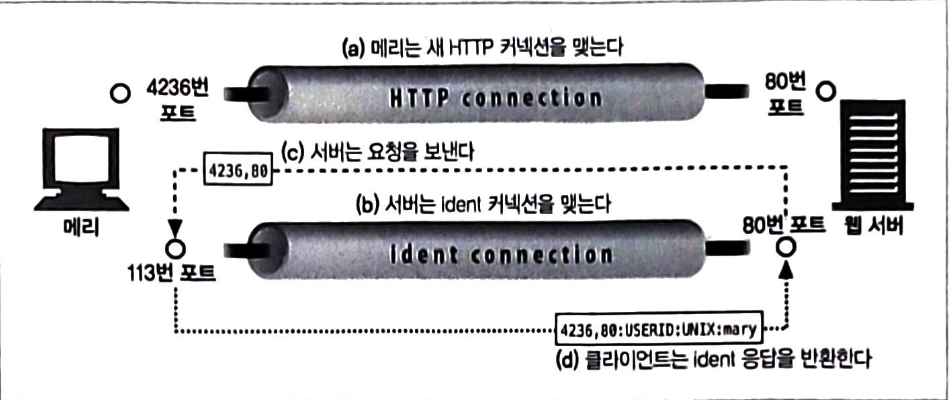

### 웹 서버

웹 서버는 HTTP 요청을 처리하고 응답을 제공합니다.
자신이 제공하는 리소스를 관리하고 웹 서버를 설정, 통제, 확장하기 위한 관리 기능을 제공합니다.

웹 서버가 하는 일은 아래와 같습니다.

1. 커넥션을 맺는다. (클라이언트 접속을 받거나 원치 않는 클라이언트면 닫는다.)
2. 요청을 받는다. (HTTP 요청 메시지를 네트워크로부터 읽어 들인다)
3. 요청을 처리한다. (요청 메시지를 해석하고 행동을 취한다 )
4. 리소스에 접근한다 (메시지에서 지정한 리소스에 접근한다)
5. 응답을 만든다 (올바른 헤더를 포함한 HTTP 응답 메시지를 생성한다)
6. 응답을 보낸다. (응답을 클라이언트에게 돌려준다)
7. 트랜잭션을 로그로 남긴다. (로그파일에 트랜잭션 완료에 대한 기록을 남긴다)

### 클라이언트 커넥션 수락

**새 커넥션 다루기**
클라이언트가 웹 서버에 TCP 커넥션을 요청하면 웹 서버는 그 커넥션을 맺고 TCP 커넥션에서 IP 주소를 추출하여 커넥션 맞은편에 어떤 클라이언트가 있는지 확인합니다.

**클라이언트 호스트 명 식별**
대부분의 웹 서버는 역방향 DNS를 사용해서 클라이언트의 IP 주소를 클라이언트의 호스트 명으로 변환하도록 설정되어 있습니다.
웹 서버는 클라이언트 호스트 명을 구체적인 접근 제어와 로깅을 위해 사용할 수 있습니다.

**ident를 통해 클라이언트 사용자 알아내기**
ident 프로토콜은 서버에게 어떤 사용자 이름이 HTTP 커넥션을 초기화했는지 찾아낼 수 있게 해줍니다. 웹 로깅시 유용하게 사용되기 때문에 일반 로그 포맷의 두 번째 필드는 각 HTTP 요청의 사용자 이름을 담고 있습니다.

하지만 공공 인터넷에서는 다음과 같은 이유로 잘 동작하지 않습니다.

- 많은 클라이언트PC는 신원화깅ㄴ 프로토콜 데몬 소프트웨어를 실행하지 않습니다.
- ident 프로토콜은 HTTP 트랜잭션을 유의미하게 지연시킵니다.
- 방화벽이 ident 트래피깅 들어오는 것을 막는 경우가 많습니다.
- ident 프로토콜은 안전하지 않고 조작하기 쉬우며 가상 IP 주소를 잘 지원하지 않습니다.
- 클라이언트 사용자 일므 노출로 인한 프라이버시 침해 우려가 있습니다.

### 요청 메시지 수신

요청 메시지를 파싱할 때 웹 서버는 다음곽 ㅏㅌ은 일을 합니다.

- 요청 줄을 파싱하여 요청 메서드, URI, 버전 번호를 찾습니다. 각 값은 스페이스 한 개로 분리되어 있으며 요청줄은 캐리지 리턴 줄바꿈 문자열로 끝납니다.
- 메시지 헤더들을 읽습니다. 각 메시지 헤더는 CRLF로 끝납니다.
- 헤더 끝을 의미하는 CRLF로 끝나는 빈 줄을 찾아낸다.
- 요청 본문이 있다면 읽어들입니다.

**커넥션 입출력 처리 아키텍쳐**
고성능 웹 서버는 수천 개의 커넥션을 동시에 열 수 있도록 지원합니다.
요청은 언제라도 도착할 수 있기 때문에 웹서버는 항상 새 요청을 주시하고 있습니다.

단일 스레드 웹 서버:
한 번에 하나씩 요청을 처리합니다. 트랜잭션이 완료되면 다음 커넥션이 처리됩니다.
구현하기에는 간단하나 처리 도중에 모든 다른 커넥션은 무시됩니다. 이런 경우에 심각한 성능 문제를 만들기 때문에 로드가 적은 서버나 type-o-serve같은 진단도구에서만 사용하는 것을 권장합니다.

멀티 프로세스와 멀티스레드 웹 서버:
멀티프로세스와 멀티스레드 웹 서버는 여러 요청을 동시에 처리하기 위해 여러 개의 프로세스 혹은 고효율 스레드를 할당합니다.

스레드/프로세스는 필요할때마다 만들 수도 있고 미리 만들수도 있습니다.
몇몇 서버는 매 커넥션마다 스레드/프로세스 하나를 할당하지만 서버가 수많은 동시 커넥션을 처리할 때 그로 인해 만들어진 수많은 프로세스나 스레드는 너무 많은 메모리나 시스템 리소스를 소비합니다.
따라서 멀티스레드 웹 서비스는 스레드/프로세스의 최대 개수에 제한을 둡니다.

대량의 커넥션을 지원하기 위해 많은 웹 서버는 다중 아키텍처를 채택했습니다. 다중 아키텍처에서는 모든 커넥션이 활동을 감시당하기 때문에 커넥션 상태가 바뀌면 그 커넥션에 대해 작은 양의 처리가 수행됩니다.

몇몇 시스템은 자신의 컴퓨터 플랫폼에 올라와있는 CPU 여러 개의 이점을 살리기 위해 멀티스레딩과 다중화를 결합합니다. 여러 개의 스레드는 각각 열려있는 커넥션을 감시하고 각 커넥션에 대해 조금씩 작업을 수행합니다.

### 요청 처리

웹 서버가 요청을 받으면 서버는 요청으로부터 메서드,리소스, 헤더, 본문을 얻어내어 처리합니다.
POST를 비롯한 몇몇 메서드는 요청 메시지에 엔티티 본문이 잇을 것을 요구합니다. 그 외 OPTIONS를 비롯한 다수의 메서드는 요청에 본문이 있는 것을 허용하되 요구하지는 않습니다.

### 리소스 매핑과 접근

웹 서버는 리소스 서버입니다. 웹 서버가 클라이언트에 콘텐츠를 전달하려면 그전에 요청 메시지 URI에 대응하는 알맞은 콘텐츠나 콘텐츠 생성기를 웹 서버에서 찾아서 그 콘텐츠 원천을 식별해야 합니다.

**Docroot**
웹 서버는 여러 종류의 리소스 매핑을 지원합니다 .리소스 매핑의 가장 단순한 형태는 요청 URI를 웹 서버의 파일 시스템 안에 있는 파일 이름으로 사용합니다.

일반적으로 웹 서버 파일 시스템의 특별한 폴더를 웹 콘텐츠를 위해 예약하고 이 폴더를 문서 루트 혹은 docroot로 불립니다.

가상 호스팅된 docroot:
각 사이트에 그들만의 분리된 문서 루트를 주는 방법으로 웹 서버에서 여러 개의 웹 사이트를 호스팅 합니다.
가상 호스팅 웹 서버는 URI나 호스트 헤더에서 얻은 IP주소나 호스트 명을 이용해 올바른 문서 루트를 식별합니다.

**디렉토리 목록**
웹 서버는 경로가 파일이 아닌 디렉토리를 가리키는 URL에 대한 요청을 받을 수 있습니다.
웹 서버는 클라이언트가 디렉터리 URL을 요청했을 때 몇 가지 다른 행동을 취하도록 설정할 수 있습니다.

- 에러를 반환한다.
- 디렉터리 대신 특별한 색인 파일을 반환한다.
- 디렉터리를 탐색해서 그 내용을 담은 HTML 페이지를 반환한다.

대부분의 웹 서버는 요청한 URL에 대응되는 디렉터리 안에서 index.html or index.htm 파일을 찾고 그 파일의 콘텐츠를 반환합니다.

**동적 콘텐츠 리소스 매핑**
웹 서버는 URI를 동적 리소스에 매핑할 수 있습니다. 웹 서버 중에서 애플리케이션 서버라 불리는 것들은 웹 서버를 복잡한 백엔드 애플리케이션과 연결하는 일을 합니다.
어떤 리소스가 동적이라면 어플리케이션 서버는 그에 대한 동적 컨텐츠 생성 프로그램이 어디에 있는지, 어떻게 그 프로그램을 실행하는지 알려줄 수 있어야 합니다.

아파치 서버에서는 특정 확장자의 파일만 실행하도록 설정할 수 있으며 실행 가능한 경로명을 포함한 URI로 요청을 받으면 그 경로에 대응하는 디렉터리에서 프로그램을 찾아 실행하려 시도합니다.

**서버사이드 인클루드**
만약 어떤 리소스가 서버사이드 인클루드를 포함하고 있는 것으로 설정되어 있다면 서버는 그 리소스 컨텐츠를 클라이언트에게 보내기 전에 처리합니다.
서버는 콘튼츠에 변수 이름이나 내장된 스크립트가 될 수 있는 어떤 특별한 패턴이 있는지 검사를 받습니다.

### 응답 만들기

서버가 리소스를 식별하면 서버는 요청 메서드로 서술되는 동작을 수행한 뒤 응답 메시지를 반환합ㄴ디ㅏ. 응답 메시지는 응답 상태 코드, 응답 헤더, 그리고 응답 본문을 포함합니다.

**응답 엔티티**
트랜잭션이 응답 본문을 생성한다면 그 내용을 응답 메시지와 함께 돌려보냅니다.

- 응답 본문 MIME 타입을 서술하는 content-type 헤더
- 응답 본문 길이를 서술하는 content-length 헤더
- 실제 응답 본문 내용

**MIME 타입 결정하기**
웹 서버에게는 응답 본문 MIME 타입을 결정해야하는 책임이 있습니다. 다음은 MIME 타입과 리소스를 연결하는 여러 방법입니다.

**리다이렉션**
웹 서버는 종종 성공 메시지 대신 리다이렉션 응답을 반환하는데 이때 브라우저가 다른 곳으로 가도록 리다이렉트 할 수 있습니다.
300번대 상태 코드로 이를 명시할 수 있습니다. -> 리소스가 임시/영구적으로 이동된 경우, 서버가 클라이언트를 조금 덜 부하가 걸린 서버로 보내기 위해, 친밀한 다른 서버가 있는 경우 등

### 응답 보내기

웹 서버는 받을 때와 마찬가지로 커넥션 너머로 데이터를 보낼 때도 비슷한 이슈에 직면합니다.
서버는 커넥션 상태를 추젝해야하며 지속적인 커넥션은 특별히 주의해서 다루어야 하며, 비지속적인 커넥션이라면 서버는 모든 메시지를 전송했을 때 자신쪽의 커넥션을 닫습니다.
