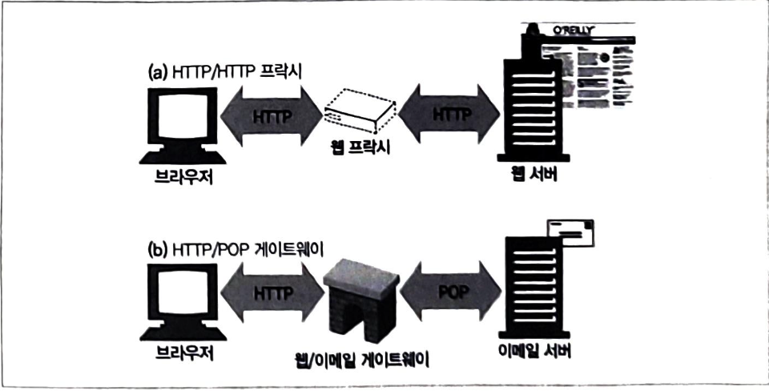
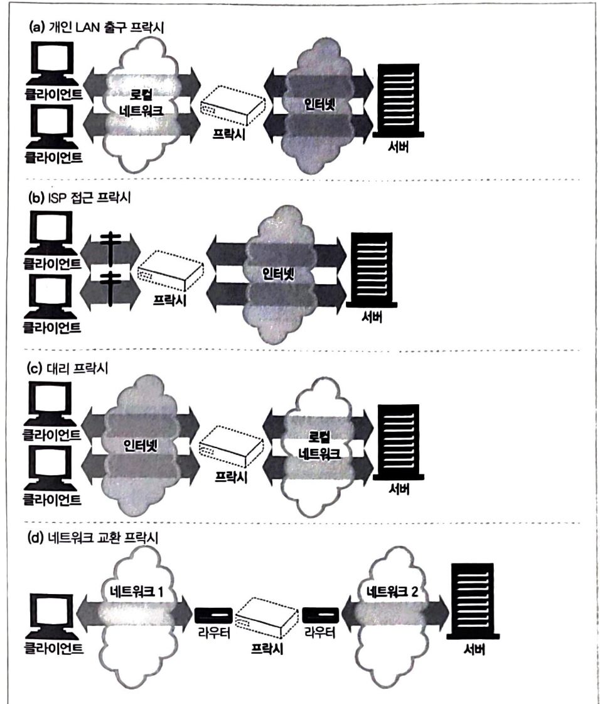
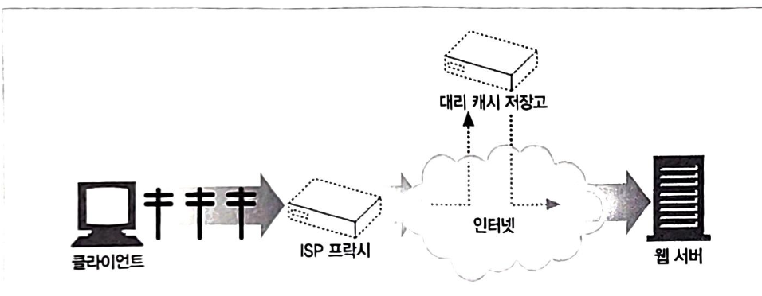

## 프락시

웹 프록시 서버는 중개자이며 클라이언트 - 서버 사이에서 http 메시지를 정리합니다.

### 웹 중개자

웹 프록시가 없다면 클라이언트는 http 서버와 직접 이야기합니다.
웹 프록시가 있다면 클라이언트는 http 서버와 직접 이야기 하지 않고 프록시와 통신하여 서버로 통신합니다

http 프록시 서버는 웹 서버이기도 하면서 웹 클라이언트이기도 합니다.
따라서 http 클라이언트의 요청을 받기 때문에, 반드시 웹 서버처럼 요청과 커넥션을 적절히 다루고 응답을 돌려줘야 합니다.
또한 요청을 서버로 보내야하기 때문에 요청을 보내고 응답을 받는 올바른 http 클라이언트처럼 동작해야 합니다.

프록시는 하나의 클라이언트가 독점적으로 사용할 수 있고, 여러 클라이언트가 공유할 수 있습니다.

**공용 프록시**
대부분의 프록시는 공용이며 공유된 프록시입니다. 중앙 집중형 프록시를 관리하는 게 더 비용효율이 높고 쉽습니다.
캐시 프록시 서버와 같은 몇몇 프록시 어플리케이션은 프록시를 이용하는 사용자가 많을수록 유리한데, 여러 사용자들의 공통된 요청에서 이득을 취할 수 있기 때문입니다.

**개인 프록시**
개인 전용 프록시는 흔하지 않으나 꾸준히 사용됩니다. (클라이언트 컴퓨터에서 직접 실행되는 형태로)

#### 프록시 vs 게이트웨이

프록시 -> 같은 프로토콜을 사용하는 둘 이상의 어플리케이션을 연결
게이트웨이 -> 서로 다른 프로토콜을 사용하는 둘 이상을 연결

게이트웨이는 클라이언트와 서버가 서로 다른 프로토콜로 말하더라도 서로 간의 트랜잭션을 완료할 수 있도록 해주는 프로토콜 변환기처럼 동작합니다.

### 프록시를 왜 사용하는지?

보안을 개선하고 성능을 높여주고 비용을 절약할 수 있습니다.
프록시 서버는 모든 http 트래픽을 들여다보고 건드릴 수 있기 때문에 부가적인 가치를 주는 여러 유용한 웹 서비스를 구현하기 위해 트래픽을 감시하고 수정할 수 있습니다.

ex) 성인 콘텐츠 차단 필터 / 문서 접근 제어 / 보안 방화벽 / 웹 캐시

**대리 프록시**
공용 콘텐츠에 대한 느린 웹 서버의 성능을 개선하기 위해 사용될 수 있습니다.
웹 서버 요청을 받지만 웹 서버와 달리 요청받은 콘텐츠 위치를 찾아내기 위해 다른 서버와 커뮤니케이션을 시작합니다.

**콘텐츠 라우터**
인터넷 트래픽 조건과 콘텐츠 종류에 따라 요청을 특정 웹서버로 유도하는 콘텐츠 라우터로 동작할 수 있습니다.

**트랜스 코더**
콘텐츠를 클라이언트에게 전달하기 전에 본문 포맷을 수정할 수 있습니다.
트랜스코딩 프록시는 크기를 줄이기 위해 자신을 거치는 gif를 jpg로 이미지 변환할 수 있습니다.

**익명화 프록시**
http 메시지에서 신원을 식별할 수 있는 특정들을 적극적으로 제거함으로 개인 정보 보호와 익명성 보장에 기여합니다.

### 프록시는 어디에 있는가?

어떻게 사용할 지에 따라 어디든 배치할 수 있습니다.

**출구 프록시**
로컬 네트워크와 더 큰 인터넷 사이를 오가는 트래픽을 제어하기 위해 프록시를 로컬 네트워크 출구에 박아 넣을 수 있습니다.
또한 부적절한 콘텐츠 브라우징을 막기 위해 필터링 출구 프록시를 사용하고 인터넷 트래픽 성능을 개선하기 위해 출구 프록시를 설정할 수 있습니다.

**접근(입구) 프록시**
종종 대리 프록시로 사용됩니다. 대리 프록시는 네트워크의 가장 끝에 있는 웹 서버들의 바로 앞에 위치하여 웹 서버로 향하는 모든 요청을 처리하고 필요할 때만 웹 서버에게 자원을 요청할 수 있습니다.

**대리 프록시**
프록시는 종종 대리 프록시(리버스 프록시)로 사용되는데, 네트워크 가장 끝에 있는 웹 서버들의 바로 앞에 위치하여 웹 서버로 향하는 모든 요청을 처리하고 필요할 때만 웹 서버에게 자원을 요청할 수 있습니다 .
일반적으로 웹 서버의 이름과 아이피 주소로 스스로 가장하기 때문에, 모든 요청은 서버가 아닌 이 프록시로 갑니다.

**네트워크 교환 프록시**
캐시를 이용하여 인터넷 교차로의 혼잡을 완화하고 트래픽 흐름을 감시하기 위해 충분한 처리 능력을 갖춘 프록시가 네트워크 사이의 인터넷 피어링 교환 지점들에 놓일 수 있습니다.

### 프록시 계층

프록시 계층에서 메시지는 최종적으로 원 서버에 도착할 때까지 프록시와 프록시를 거쳐 이동합니다. (그후 프록시를 거쳐 클라이언트까지)
프록시 계층에서 프록시 서버들은 부모 - 자식 관계를 갖습니다. 다음 인바운드 프록시를 부모라고 부르고 다음번 아웃바운드 프록시는 자식이라고 부릅니다.

### 프록시가 어떻게 트래픽을 처리하는지?

클라이언트 트래픽이 프록시로 가도록 만드는 방법에는 4가지가 있습니다.

1. 클라이언트 수정
   만약 클라이언트가 프록시를 사용하도록 설정되어 있다면 클라이언트는 http 요청을 바로 그리고 의도적으로 원 서버가 아닌 프록시로 보냅니다.

2. 네트워크 수정
   클라이언트는 알지 못하고 간섭할 수 없는 상태에서 네트워크 인프라를 가로채서 웹 트래픽을 프록시로 가도록 조정하는 몇 가지 기법이 있습니다.

**DNS 이름 공간 수정**
웹 서버 앞에 위치하는 프록시 서버인 대리 프록시는 웹 서비의 이름과 아이피 주소를 자신이 직접 사용합니다. -> 모든 요청은 서버 대신 대리 프록시로 간다.
실제 서버 아이피 주소와 이름은 변경되고 대리 프록시에게는 이전의 주소와 이름이 주어집니다.

**웹 서버를 수정한다**
http 리다이렉션 명령(305)을 클라이언트에게 돌려줌으로서 클라이언트 요청을 프록시로 리다이렉트 하도록 설정할 수 있습니다.
리다이렉트를 받는 즉시 클라이언트는 프록시와의 트랜잭션을 시작합니다.

### 클라이언트 프록시 설정

모던 브라우저는 프록시를 사용할 수 있도록 설정할 수 있으며 많은 브라우저가 프록시를 설정할 수 있도록 여러 방법을 제공합니다.

**수동 설정**
프록시를 사용하겠다고 명시적으로 설정합니다 .

**브라우저 기본 설정**
브라우저 벤더나 배포자는 브라우저를 소비자에게 전달하기 전에 프록시를 미리 설정해 놓을 수 있다.

**프록시 자동 설정(pac)**
클라이언트는 프록시를 써야 하는지, 만약 그렇다면 어떤 프록시 서버를 써야 하는지 판단하기 위해 그 자바스크립트 파일을 가져와서 실행합니다.

수동 프록시 설정은 단순하나 유연하지 못하기 때문에 PAC 파일로 보다 동적인 해결책을 통해 프록시 설정을 그때그때 상황에 맞게 계산해주는 작은 자바스크립트 프로그램을 사용합니다.

각 PAC 파일은 반드시 URI에 접근할 때 사용할 적절한 프록시 서버를 계산해주는 함수를 정의해야 합니다.

**WPAD 프록시 발견**
대부분 브라우저는 자동설정 파일을 다운받을 수 있는 설정서버를 자동으로 찾아주는 웹 프록시 자동발견 프로토콜을 제공합니다.

WPAD는 여러 발견 매커니즘들의 상승 전략을 이용해 브라우저에게 알맞은 PAC 파일을 자동으로 찾아주는 알고리즘입니다.

### 프록시 특징

1. 프록시 URI는 서버 URI와 다릅니다.
   클라이언트가 프록시를 사용하지 않도록 설정되어 있다면 부분 URI를 보냅니다.
   클라이언트가 프록시를 사용하도록 설정되어 있다면 완전한 URI를 보냅니다.

2. 가상 호스팅에서 일어나는 같은 문제
   프록시 스팀/호스트/포트번호 누락은 가상으로 호스팅 되는 웹 서버가 직면한 것과 같은 문제가 있습니다.
   가상으로 호스팅되는 웹 서버는 여러 웹 사이트가 같은 물리적 웹 서버를 공유합니다. 요청하나가 부분 URI로 오면 가상으로 호스팅 되는 웹 서버는 그 요청이 접근하고자 하는 웹 사이트 호스트명을 알 필요가 있습니다.

- 명시적인 프록시는 요청 메시지가 완전한 URI를 갖도록 함으로 문제를 해결했습니다

3. 인터셉트 프록시는 부분 URI를 받습니다.
   클라이언트가 http를 올바르게 구현했다면 그들은 명시적으로 설정된 프록시에게 완전한 URI를 보낼 것입니다.

클라이언트가 프록시를 사용한다고 설정되어 있지 않더라도 클라이언트 트래픽은 여전히 대리 프록시나 인터셉트 프록시를 지날 수 있습니다. 두 가지 경우 모두 클라이언트는 자신이 웹 서버와 대화하고 있다고 생각하고 완전한 URI를 보내지 않을 것입니다.

4. 프록시는 프록시 요청과 서버 요청을 모두 다룰 수 있습니다.
   트래피깅 프록시 서버로 리다이렉트 될 수 있는 여러 가지 방법이 존재합니다. 다목적 프록시 서버는 요청 메시지의 완전한 URI와 부분 URI를 사용해야 하며 웹 서버 요청의 경우에는 가상 호스트 헤더를 사용해야 합니다.

5. 전송 중 URI 변경
   프록시 서버는 요청 URI의 변경에 매우 신경을 써야 합니다. 몇몇 프록시는 URI를 다음으로 보내기 전에 표준 형식으로 정규화합니다.
   일반적으로 프록시 서버는 가능한 관대하도록 애써야 합니다. -> 너무 빡빡하게 잡으면 잘 동작하던 기능도 망가뜨려질 수 있어서

6. URI 클라이언트 자동확장과 호스트 명 분석
   브라우저는 프록시 존재 여부에 따라 요청URI를 다르게 분석합니다. 프록시가 없다면 사용자가 타이핑한 URI를 가지고 그에 대응하는 아이피 주소를 츶습니다.

7. 프록시 없는 URI 분석
   브라우저는 유효한 호스트 명이 발견될 때까지 다양한 호스트명의 가능성을 검색합니다.

8. 명시적인 프록시를 사용할 때의 URI 분석
   명시적인 프록시를 사용한다면 브라우저는 이와 같은 편리한 확장들 중 어느것도 더 이상 수행할 수 없습니다. -> 브라우저 URI가 프록시를 그냥 지나쳐버리기 때문

9. 인터셉트 프록시를 이용한 URI 분석
   호스트 명 분석은 보이지 않는 인터셉트 프록시와 함께일 때 약간 달라지는데 클라이언트 입장에서 프록시는 존재하지 않기 때문입니다.

### 메시지 추적

보안/비용 절감을 하거나 성능상의 이유로 많이 프록시 캐시를 사용하고 있습니다.성능상의 이유로 세계에 흩어져있는 대리 캐시 저장고에 콘텐츠를 복제해두는 방식은 현재 흔하게 사용합니다.

프록시가 흔해지면서 메시지 흐름을 추적하고 문제점을 찾는 것도 필요한 일이 되었습니다.

**via header**
via 헤더 필드는 메시지가 지나는 각 중간 노드의 정보를 나열합니다. 또 다른 노드를 지날 때마다 중간 노드는 via 목록 끝에 반드시 추가되어야 합니다.

via 헤더 필드는 메시지 전달을 추적하고 메시지 루프를 진단하고 요청을 보내고 그에 대한 응답을 돌려주는 과정에 관여하는 모든 메시지 발송자들의 프로토콜을 다루는 능력을 알아보기 위해 사용합니다.

via 문법은 쉼표로 구분된 경유지의 목록이며, 각 경유지는 개별 프록시 서버나 게이트웨이 홉을 나타내며 중간 노드의 프로토콜과 주소에 대한 정보를 담고 있습니다.

via waypoint는 프로토콜 이름(기본 http), 프로토콜 버전(필수), 노드 이름(필수), 코멘트(선택)의 최대 4개 구성요소를 담을 수 있습니다.

**via & gateway**
몇몇 프록시는 서버에게 비 http 프로토콜을 사용할 수 있는 게이트웨이 기능을 제공합니다.
via 헤더는 이런 프로토콜 변환을 기록하기 때문에 http 어플리케이션은 프록시 연쇄에서 프로토콜 능력과 변환이 있었는지를 알 수 있습니다.

**개인정보 보호와 보안**
via 문자열 안에 정확한 호스트명이 들어가기를 원하지 않는 경우가 있습니다.
명시적으로 동작이 켜져 있지 않은 이상 프록시 서버가 네트워크 방화벽의 일부인 경우 프록시는 방화벽 뒤에 숨어있는 호스트 이름과 포트를 전달하면 안됩니다.
via 노드 이름 전달이 간으하지 않으면 보안 경계선의 일부분인 프록시는 호스트 명을 그 호스트에 대한 적당한 가명으로 교체해야 합니다.

### trace method

프록시 서버는 메시지가 전달될 때 메시지를 바꿀 수 있습니다.

- 헤더가 추가/변경/삭제/변환

trace 요청이 목적지 서버에 도착했을 때 서버는 전체 요청 메시지를 http 응답 메시지 본문에 포함시켜 송신자에게 그대로 돌려보냅니다.
응답 콘텐츠 타입은 message/http이며 상태는 200 Ok입니다

trace와 options 요청의 프록시 홉 개수를 제한하기 위해 max-forwards 헤더를 사용할 수 있습니다. -> 메시지가 무한 루프에 빠지지 않는 지 테스트하거나 특정 프록시 서버 효과를 체크할 때 유용합니다.

### 프록시 인증

프록시는 접근 제어 장치로서 제공될 수 있습니다.
http는 사용자가 유효한 접근 권한 자격을 프록시에 제출하지 않는 한 콘텐츠에 대한 요청을 차단하는 프록시 인증이라는 매커니즘을 정의합니다.

제한된 콘텐츠에 대한 요청이 프록시 서버에 도착했을 때, 프록시 서버는 접근 자격을 요구하는 407 proxy authorization required 상태 코드를 어떻게 그러한 자격을 제출할 수 있는지 설명해주는 proxy-authenticate 헤더 필드와 함께 반환할 수 있습니다.

### 프로깃 상호 운용성

클라이언트/서버/프록시는 Http 명세 버전에 대해 여러 벤더들이 만듭니다.
프록시 서버는 넘어오는 헤더 필드를 모두 이해하지 못할 수 있습니다.
프록시는 이해할 수 없는 헤더 필드는 반드시 그대로 전달해야 하며 여러개가 있는 경우에는 상대적인 순서도 반드시 유지해야합니다.

**options**
http options 메서드는 서버나 웹 서버의 특정 리소스가 어떤 기능을 지원하는 지 클라이언트가 알아볼 수 있게 해줍니다.

**allow 헤더**
allow 엔터티 헤더 필드는 요청 URI에 의해 식별되는 자원에 대해 지원되는 메서드들이나 서버가 지원하는 모든 메서드를 열거합니다.
allow 헤더는 새 리소스가 지원했으면 하는 메서드를 추천하나 이를 모두 지원할 의무는 없습니다.
