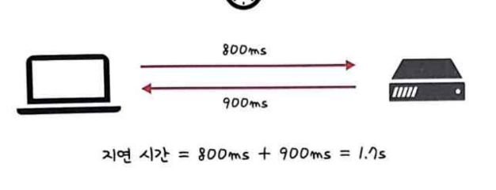
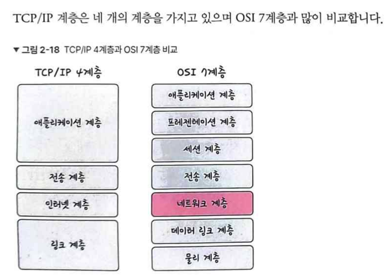
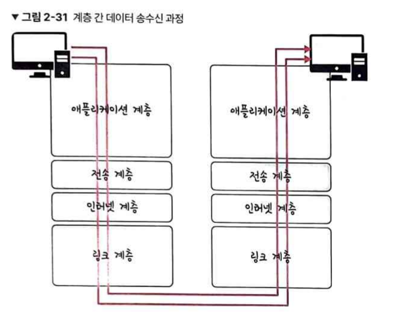
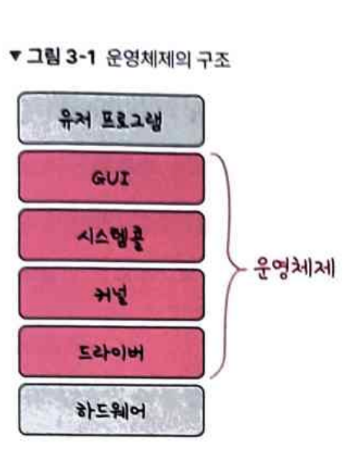
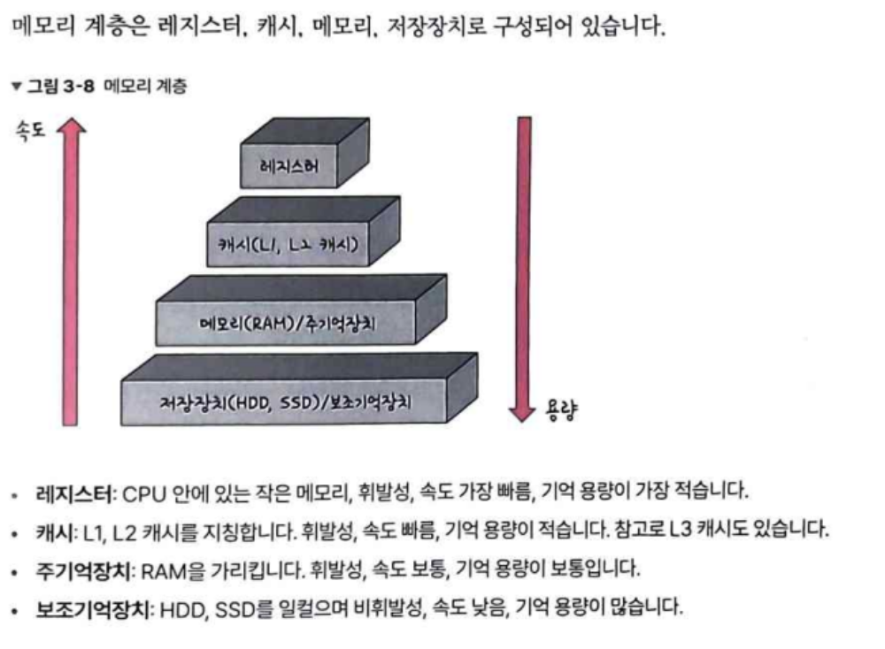

## 네트워크

네트워크란 노드와 링크가 서로 연결되어 있으며 리소스를 공유하는 집합입니다.

처리량이 많고, 지연시간이 짧고, 장애 빈도가 적고, 좋은 보안을 갖춘 네트워크가 좋은 네트워크 입니다.

레이턴시는 매체 타입, 패킷 크기, 라우터 패킷 처리 시간에 영향을 받습니다.

**네트워크 토플로지**
Network topology는 노드와 링크가 어떻게 배치되어 있는지에 대한 방식이자 연결 형태를 의미합니다.

트리 토폴로지 -> 계층형 토폴로지라고도 하고, 트리 형태로 배치한 구성입니다. 노드 추가/삭제가 쉽고 특정 노드에 트래픽이 집중되면 하위 노드에 영향을 끼칠 수 있습니다.

버스 토폴로지 -> 중앙 통신 회선 하나에 여러 노드가 연결되어 공유하는 네트워크 구성입니다. LAN에서 주로 사용되고 신뢰성이 우수하고 설치 비용이 적습니다. 단, 스푸핑에 취약하여 악의적인 노드에 패킷이 전송될 수 있습니다.

스타 토폴로지 -> 중앙에 있는 노드에 모두 연결된 네트워크 구성입니다. 노드를 추가하거나 에러 탐지가 쉽지만 중앙 노드에서 장애 발생 시 전체 네트워크를 사용할 수 없고 비용이 비싸다는 단점이 있습니다.

링형 -> 각각의 노드가 양 옆의 두 노드와 연결하여 전체적으로 고리처럼 하나의 길로 통신하는 방식입니다.

메시 토폴로지 -> 망형 토폴로지라고도 하며 그물망처럼 연결되어 있는 구조입니다. 여러 경로가 존재하여 하나의 단말이 고장나도 계속 사용하고 트래픽 분산이 가능하지만 구축 비용과 운용 비용이 바싸다는 단점이 있습니다

병목을 찾기 위해서는 어떤 토폴로지를 갖는지, 어떤 경로로 이루어져 있는지 알아야 병목 현상을 파악할 수 있씁니다.

### TCP/IP 4계층

어플리케이션 계층 : 웹 서비스, 이메일 등 서비스를 실질적으로 사람들에게 제공하는 층입니다.

전송 계층 : 송신자/수신자를 연결하는 통신 서비스를 제공하여 어플리케이션과 인터넷 계층 사이 데이터가 전달될 때 중계 역할을 합니다.

인터넷 계층 : 장치로부터 받은 네트워크 패킷을 ip주소로 지정된 목적지로 전송하기 위해 사용하는 계층이빈다. 상대방이 제대로 받았는지는 보장하지 않는 비연결형적인 특징을 갖고 있습니다.

링크 계층 : 전선,광섬유 등으로 실질적으로 데이터를 전달하며 장치 간 신호를 주고받는 규칙을 정하는 계층입니다.

**PDU**
네트워크 계층간 데이터가 전달될 때 한 덩어리의 단위를 Protocol Data Unit이라고 합니다.

어플리케이션 계층 : 메시지
전송계층 : TCP, UDP
인터넷 계층 : 패킷
링크 계층 : 프레임, 비트

### IP 주소

ARP(Address Resolution Protocol) : IP 주소로부터 MAC 주소를 구하는 IP와 MAC 주소의 다리 역할을 하는 프로토콜입니다.

ARP를 통해 가상 주소인 IP를 실제 주소인 MAC 주소로 변환하고 RARP를 통해 역으로 변환하기도 합니다.

IP 주소 통신 과정을 홉바이홉 통신이라고 하는데, 통신망에서 각 패킷이 여러 개의 라우털르 건너가는 모습을 비유적으로 표현한 것입니다. 이처럼 수많은 서브 네트워크 안에 있는 라우터의 라우팅 테이블 아이프를 기반으로 패킷을 전달하고 전달하여 라우팅을 수행하며 최종 목적지까지 패킷을 전달합니다.

라우팅 테이블 : 송신자에서 수신자까지 도달하기 위해 사용되며 라우터에 들어가 있는 목적지 정보들과 그 목적지로 가기 위한 방법이 들어있는 리스트를 뜻합니다.

게이트웨이 : 서로 다른 통신망, 프로토콜을 사용하는 네트워크 간 통신을 가능하게 하는 관문 역할을 하는 컴퓨터나 소프트웨어를 두루 일컫는 용어입니다.

**SEO에 도움되는 HTTPS**
SEO를 높게 하기 위해 여러 방법이 있습니다.

- 캐노니컬 설정

`<link rel = 'canonical' href = 'https://example.com'/>`

- 메타 설정
- 페이지 속도 개선
- 사이트맵 관리

## OS

사용자가 컴퓨터를 쉽게 다루게 해주는 인터페이스 입니다.

**역할**

- CPU 스케줄링과 프로세스 관리 : CPU 소유권을 어떤 프로세스에 할당할지, 프로세스 생성과 삭제, 자원 할당 및 반환을 관리
- 메모리 관리 : 한정된 메모리를 어떤 프로세스에 얼만큼 할당할지 관리
- 디스크 파일 관리 : 디스크 파일을 어떤 방법으로 보관할지 관리
- I/O 디바이스 관리 : 마우스, 키보드, 컴퓨터 간 데이터를 주고받는 것을 관리

**운영체제 구조**

**시스템콜**
운영체제가 커널에 접근하기 위한 인터페이스. 유저 프로그램이 운영체제의 서비스를 받기 위해 커널 함수를 호출할 때 사용합니다.

시스템콜은 하나의 추상화 계층이기 때문에 낮은 단계의 영역 처리를 많이 신경쓰지 않고 프로그램을 구현할 수 있는 장점이 있습니다.

### CPU

인터럽트에 의해 단순히 메모리에 존재하는 명령어를 해석하여 실행하는 역할을 수행합니다.

**제어장치**
입출력장치 간 통신을 제어하고 명령어를 읽고 해석하며 데이터 처리를 위한 순서를 결정합니다.

**레지스터**
CPU 안에 있는 매우 빠른 임시기억장치입니다. CPU는 자체적으로 데이터를 저장할 방법이 없기 때문에 레지스터를 거쳐 데이터를 전달합니다.

**산술논리연산장치**
산술 연산, 배타적 논리합, 논리곱 같은 연산을 계산하는 디지털 회로입니다

**인터럽트**
어떤 신호가 들어오면 CPU를 잠시 정지시키는 것을 말합니다.

### 메모리

**캐시**
데이터를 미리 복사해놓는 임시 저장소입니다. (데이터 접근 속도 향상)

### 메모리 관리

**가상 메모리**
메모리 관리 기법의 하나로 실제 이용 가능한 메모리 자원을 추상화하여 이를 사용하는 사용자들에게 매우 큰 메모리로 보이게 만드는 것을 말합니다.

**스와핑**
가상 메모리에는 존재하나 실제 메모리인 램에서 없는 데이터나 코드에 접근할 경우 페이지 폴트가 발생하는 것을 막기 위해 당장 사용하지 않는 영역을 하드디스크로 옮기고 하드디스크의 일부분을 메모리처럼 불러와 쓰는 방식입니다.

**페이지폴트**
프로세스 주소 공간에는 존재하나 컴퓨터 램에는 없는 데이터에 접근했을 경우에 발생합니다.

**스레싱**
메모리 페이지 폴트율이 높은 것을 의미하고, 컴퓨터의 심각한 성능 저하를 초래합니다.

이를 해결하기 위해서는 메모리를 늘리거나 HDD -> SSD로 변경하는 방법이 있습니다

### 메모리 할당

메모리에 프로그램을 할당할 때는 시작 메모리 위치, 메모리 할당 크기를 기반으로 할당합니다.

### 프로세스와 스레드

프로세스 : 컴퓨터에서 실행되고 있는 프로그램
스레드 : 프로세스 내 작업의 흐름

**생성상태**
프로세스가 생성된 상태를 의미합니다.

**대기상태**
메모리 공간이 충분하면 메모리를 할당받고 아니면 아닌 상태로 대기하여 CPU 스케줄러부터 CPU 소유권이 넘어오는 것을 기다리는 상태입니다.

**대기 중단 상태**
메모리 부족으로 일시 중단된 상태입니다.

**실행 상태**
CPU 소유권과 메모리를 할당받고 인스트럭션을 수행 중인 상태를 의미합니다.

**중단 상태**
어떤 이벤트가 발생한 이후 기다리며 프로세스가 차단된 상태입니다.

**일시 중단 상태**
대기 중단과 유사합니다. 중단된 상태에서 프로세스가 실행되려 했으나 메모리 부족으로 일시 중단된 상태입니다.

**종료 상태**
메모리와 CPU 소유권을 모두 놓고 가는 상태입니다.

### PCB

Process Control Block은 운영체제에서 프로세스에 대한 메타데이터를 저장한 데이터를 말합니다. 프로그램이 실행되면 프로세스가 생성되고 프로세스 주소 값들에 앞서 설명한 스택, 힙 등의 구조를 기반으로 메모리가 할당됩니다.

### IPC

Inter Process Communication의 약자로 멀티프로세스가 IPC가 가능하며 프로세스끼리 데이터를 주고받고 공유 데이터를 관리하는 메커니즘입니다.

### 교착상태

deadlock은 두개 이상의 프로세스들이 서로가 가진 자원을 기다리며 중단된 상태입니다.

원인으로는 아래와 같습니다.

- 상호 배제 : 한 프로세스가 자원을 독점하면 다른 프로세스에서 접근이 불가
- 점유 대기 : 특정 프로세스가 점유한 자원을 다른 프로세스가 요청
- 비선점 : 다른 프로세스 자원을 강제적으로 가져올 수 없음
- 환형대기 : 서로가 서로 자원을 요구하는 상황

해결방법

- 자원을 할당할 때 애초에 조건이 성립되지 않도록 설계합ㄴ디ㅏ.
- 교착 상태 가능성이 없을 때만 자원할당되며 프로세스당 요청할 자원들의 최대치를 통해 자원할당 간으 여부를 파악하는 '은행원 알고리즘'을 사용합니다.
- 교착 상태가 발생하면 사이클이 있는지 찾아보고 관련된 프로세스를 하나씩 제거합니다

**비선점형 방식**
비선점형 방식은 프로세스가 스스로 CPU 소유권을 포기하는 방식이며 강제로 프로세스를 중지하지 않습니다. 따라서 컨텍스트 스위칭으로 인한 부하가 적습니다.

**선점형 방식**
현대 운영체제가 쓰는 방식으로 사용하고 있는 프로세스를 중단시켜버리고 강제로 다른 프로세스에 소유권을 할당하는 방식입니다.
