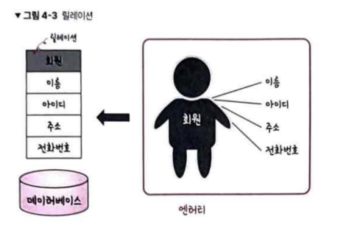
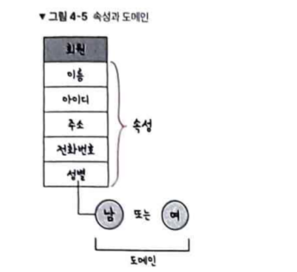
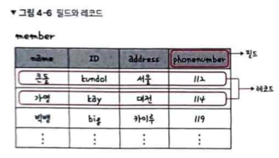
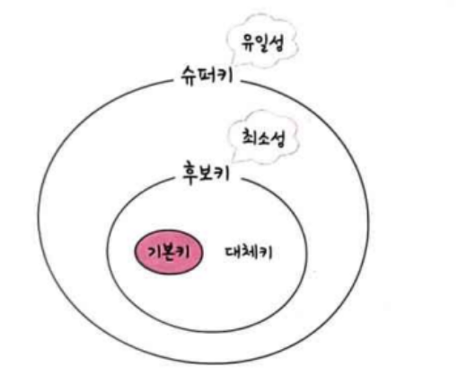
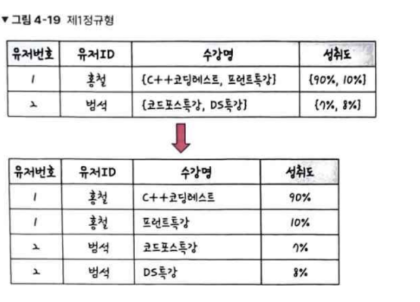
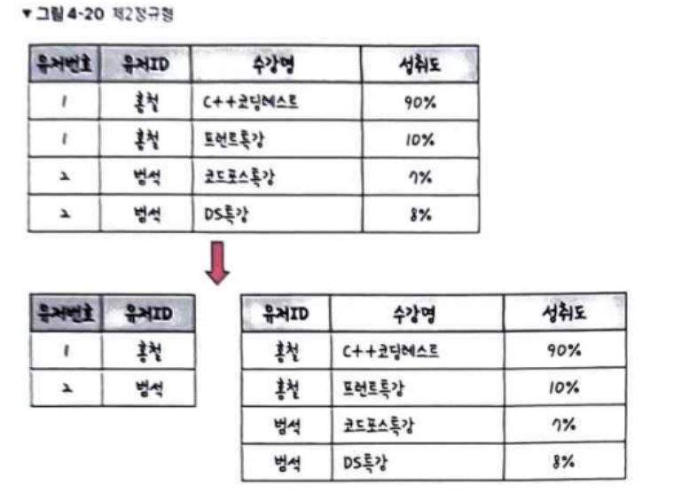
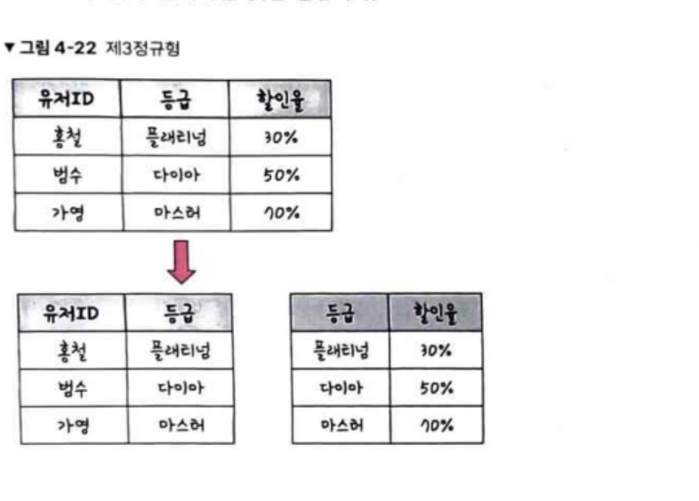
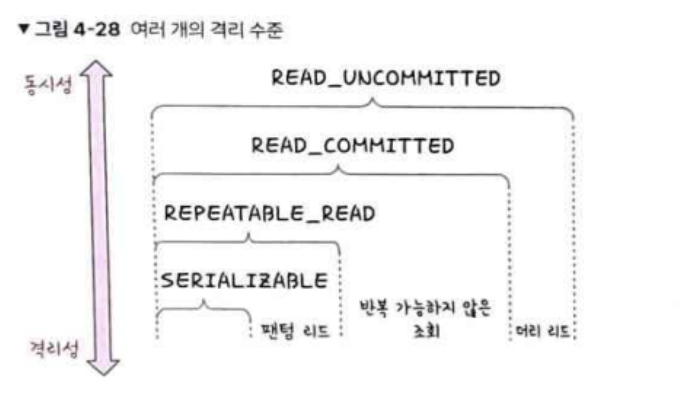
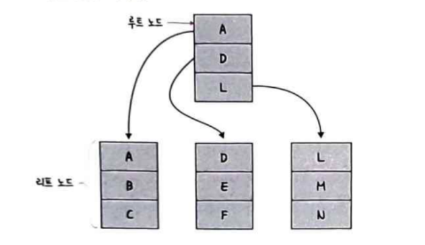
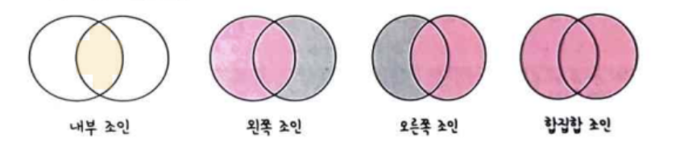

## 데이터베이스

일정한 규칙, 혹은 규약을 통해 구조화되어 저장되는 데이터 모음

-> 데이터베이스를 제어/관리하는 통합 시스템을 DBMS라고 합니다.

데이터베이스 안에 있는 데이터들은 특정 DBMS마다 정의된 쿼리 언어를 통해 삽입, 삭제, 수정, 조회 등을 수행할 수 있습니다.

**엔터티**
사람, 장소, 물건 등 여러 속성을 지닌 명사를 의미

약한 엔터티 : 혼자서 존재하지 못하고 다른 존재 여부에 따라 종속적인 경우 (ex: 방)
강한 엔터티 : 혼자서 존재할 수 있는 존재 (ex: 건물)

**릴레이션**
데이터베이스에서 정보를 구분하여 저장하는 기본 단위


관겨형 데이터베이스에서는 테이블이라고하며, NoSQL 데이터베이스에서는 컬렉션이라고 합니다

**속성**
릴레이션에서 관리하는 구체적이며 고유한 이름을 갖는 정보입니다.

**도메인**
릴레이션에 포함된 각각의 속성들이 가질 수 있는 값의 집합


**필드와 레코드**


**필드 타입**

MySQL, MariaDB 같은 경우는 세분화된 정수 타입이 많음
SQLite같은 경우 타입 시스템이 유연해서 보다 느슨함

숫자 : TINYINT, SMALLINT, MEDIUMINT, INT, BIGINT 등이 있습니다.
날짜 : DATE, DATETIME, TIMESTAMP
문자 : CHAR, VARCHAR, TEXT, BLOB, ENUM, SET이 있습니다.

**관계**
여러 테이블간 서로의 관계가 정의되어있습니다.

1:1 관계 : 유저 - 이메일처럼 1:1로 매칭되는 경우
1:N 관계 : 유저 - 상품처럼 N을 여러가지 가질 수 있는 경우
N:M 관계 : 학생 - 학생\_강의 - 강의 처럼 테이블간 복수의 관계를 가질 수 있는 경우

**키**


유일성 : 중복되는 값이 없어야 합니다.
최소성 : 필드를 조합하지 않고 최소 필드만 써서 키를 형성할 수 있는 것입니다.

기본키 : 유일성과 최소성을 만족하는 키
자연키 : 중복된 값들을 제외하며 중복되지 않는 것을 자연스럽게 뽑다 나오는 키입니다. 자연키는 언젠가는 변하는 속성을 갖습니다.
인조키 : 인위적으로 중복되지 않는 것을 부여한 값 입니다. 자연키와 대조적으로 변하지 않기 때문에 보통 기본키는 인조키로 설정합니다.

외래키 : 다른 테이블 기본키를 그대로 참조하는 값으로 개체와의 관계를 식별하는 데 사용합니다. 외래키는 중복되어도 괜찮습니다

후보키 : 기본키가 될 수 있는 후보이며 유일성과 최소성을 동시에 만족하는 키입니다.

대체키 : 후보키가 2개 이상인 경우 어느 하나를 기본키로 지정하고 남은 후보키입니다.

슈퍼키 : 각 레코드를 유일하게 식별할 수 있는 유일성을 갖춘 키입니다

### ERD / 정규화

ERD(Entity Relationship Diagram)는 데이터베이스를 구축할 때 가장 기초적인 뼈대 역할을 합니다.

ERD는 시스템 요구 사항을 기반으로 작성되기 때문에 디버깅 또는 비즈니스 프로세스 재설계가 필요한 경우에 설계도 역할을 담당하기도 합니다.

**정규화**
릴레이션 간 잘못된 종속 관계로 인해 데이터베이스 이상 현상이 일어나 이를 해결하거나 저장 공간을 효율적으로 사용하기 위해 릴레이션을 여러 개로 분리하는 괒어입니다.

데이터베이스 이상 현상 -> 회원이 1개의 등급이 아닌 3개의 등급을 가지거나 삭제할 때 필요한 데이터가 같이 삭제되고, 데이터 삽입 시 하나의 필드 값이 널이되면 안되어 삽입하기 어려운 현상을 말합니다.

정규형의 원칙은 같은 의미를 표현하는 릴레이션이지만 좀 더 좋은 구조로 만들어야 하며 자료의 중복성은 감소하고 독립적인 관계는 별개의 릴레이션으로 표현해야 합니다. 그리고 각각의 릴레이션은 독립적인 표현이 가능해야 하는 것을 말합니다.

**제1정규형**
릴레이션의 모든 도메인이 더 이상 분해될 수 없는 원자 값만으로 구성되어야 합니다.
속성 값 중에서 한 개의 기본키에 대해 두 개 이상 값을 가지는 반복집합이 있으면 안됩니다.



**제2정규형**
릴레이션이 제1정규형이며, 부분 함수의 종속성을 제거한 형태를 말합니다.
부분 함수의 종속성 제거는 기본키가 아닌 모든 속성이 기본키에 완전 함수 종속적인 것을 말합니다.



단, 릴레이션을 분해할 때 동등한 릴레이션으로 분해하고, 정보 손실이 발생하지 않아야합니다.

**제3정규형**
제2정규형이고 기본키가 아닌 모든 속성이 이행적 함수 종속을 만족하지 않는 상태입니다.

이행적 함수 종속이란 A -> B, B -> C가 존재하면 A -> C가 성립하는데, 이때 집합 C가 A에 이행적으로 함수 종속이 되었다고 표현합니다.



**보이스/코드 정규형**
BCNF는 제3정규형이고, 결정자가 후보키가 아닌 함수 종속 관계를 제거하여 릴레이션의 함수 종속 관계에서 모든 결정자가 후보키인 상태를 말합니다.

정규화를 한다고해서 성능이 100% 좋아지지는 않습니다. 테이블을 나누면 쿼리 조인을 해야하는 경우에는 오히려 느려질 수 있어서 서비스에 따라 정규화/비정규화 과정을 진행해야 합니다.

### 트랜잭션

트랜잭션은 데이터베이스에서 하나의 논리적 기능을 수행하기 위한 작업의 단위입니다.
원자성, 일관성, 독립성, 지속성이란 특징이 있으며 이를 ACID 특징이라고 합니다.

**원자성**
트랜잭션과 관련된 일이 모두 수행되었거나 되지 않았거나를 보장합니다.
트랜잭션 커밋에 문제가 생겨 롤백하는 경우 이후에 모두 수행되지 않음을 보장합니다.

트랜잭션 단위로 로직을 묶을 때 외부 API를 호출하면 롤백 시 어떻게 할 것인지 방법이 있어야하고 트랜잭션 전파를 신경써야합니다.

**일관성**
허용된 방식으로만 데이터를 변경하는 것을 의미합니다.

**격리성**
트랜잭션 수행 시 서로 끼어들지 못하는 것을 의미하며 여러 격리 수준으로 나누어 격리성을 보장합니다.



**지속성**
성공적으로 수행된 트랜잭션은 영원히 반영되는 것을 의미합니다.

### 무결성

데이터의 정확성, 일관성, 유효성을 유지하는 것을 말합니다.

개체 무결성 : 기본키로 선택된 필도는 빈 값을 허용하지 않음
참조 무결성 : 서로 참조 관계에 있는 두 테이블의 데이터는 항상 일관된 값을 유지해야 함
고유 무결성 : 특정 속성에 대해 고유한 값을 가지도록 조건이 주어진 경우 그 속성 값은 모두 고유한 값을 가짐
널 무결성 : 특정 속성 값에 널이 올 수 없다는 조건이 주어진 경우 그 속성 값은 널이 될 수 없음

### 인덱스

인덱스는 데이터를 빠르게 찾는 하나의 장치입니다.

**B-tree**
인덱스는 보통 B-트리라는 자료구조로 이루어져 있고, 루트노드, 리프 노드, 그리고 사이에 있는 브랜치 노드로 나뉩니다.



### 조인

하나의 테이블이 두 개 이상의 테이블을 묶어 하나의 결과물을 만드는 것을 말합니다. 몽고DB에는 lookup으로 처리할 수 있으나 성능이 떨어지기 때문에 여러 테이블을 조인하는 작업이 많은 경우 관계형 데이터베이스를 쓰는 것이 좋습니다.

inner join : 왼쪽 테이블과 오른쪽 테이블의 두 행이 모두 일치하는 행이 있는 부분만 표기
left outer join : 왼쪽 테이블의 모든 행이 결과 테이블에 표기됩니다.
right outer join : 오른쪽 테이블의 모든 행이 결과 테이블에 표기됩니다.
full outer join : 두 개의 테이블을 기반으로 조인 조건에 만족하지 않는 행까지 모두 표기



**중첩 루프 조인**
중첩 for문과 같은 원리로 조건에 맞는 조인을 하는 방법입니다.
랜덤 접근에 대한 비용이 많이 증가하여 대용량 테이블에서는 사용하지 않습니다.

```
for each row in t1 matching reference key{
    for each row in t2 matching reference key {
        if row satisfies join conditions, send to client
    }
}
```

**정렬 병합 조인**
조인한 필드 기준으로 정렬하고 이후에 조인 작업을 수행합니다.
조인할 때 쓸 적절한 인덱스가 없고 대용량 테이블을 조인하고 조인 조건으로 비교 연산자가 있을 때 사용합니다.

**해시 조인**
해시 테이블을 기반으로 조인합니다. 동등 조인에서만 사용할 수 있으며, 하나의 테이블이 메모리에 온전히 들어가면 보통 중첩 루프 조인보다 효율적압니다.
