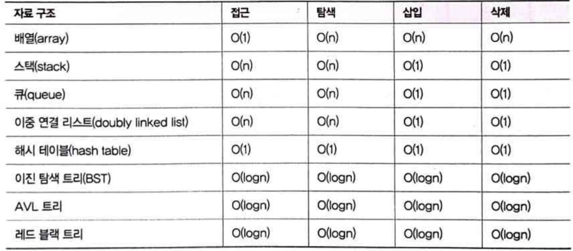
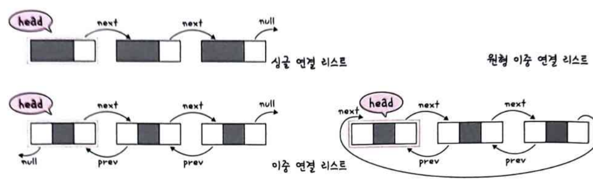
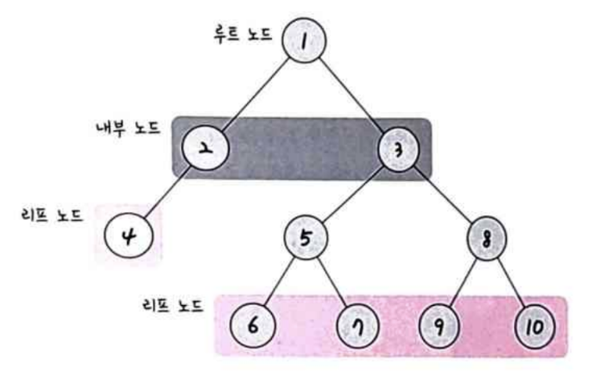
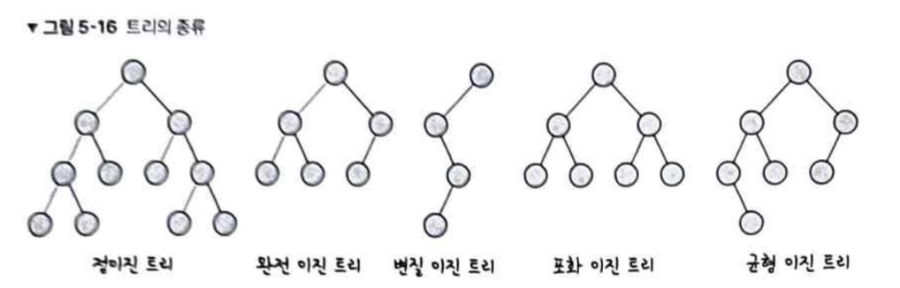

## 자료구조

효율적으로 데이터를 관리하고 수정/삭제/탐색/저장할 수 있는 데이터 집합

**시간 복잡도**

빅오 표기법 ; 문제를 해결하는 데 걸리는 시간과 입력의 함수 관계이빈다. '가장 많이 영향을 끼치는' 항의 상수 인자만 남깁니다.

=> O(n^2)보다는 O(1)로 시간이 걸릴 수 있게 지향해야합니다.

**공간 복잡도**
프로그램을 실행시킬 때 필요로 하는 자원 공간의 양

### 선형 자료 구조

요소가 일렬로 나열되어 있는 자료 구조

**연결리스트**
데이터를 감싼 노드를 포인터로 연결해서 공간적인 효율성을 극대화 시킨 자료 구조
삽입, 삭제 : O(1) / 탐색 : O(n)

prev 포인터와 next 포인터로 앞과 뒤의 노드를 연결시킨 것이 연결 리스트입니다.
연결 리스트는 싱글,이중,원형 이중이 있으며 맨 앞에 있는 노드를 헤드라고 합니다.

원형 이중 연결 리스트의 마지막 노드의 next는 헤드 노드를 가리킵니다.

**배열**
같은 타입의 변수들로 이루어져 있으며 크기가 정해져있고 인접한 메모리 위치에 있는 데이터를 모아놓은 집합입니다. 중복을 허용하고 순서가 있습니다. (랜덤 접근도 가능!)
삽입, 삭제 : O(n) / 탐색 : O(1)

데이터 추가/삭제를 많이 할때는 연결 리스트, 탐색은 배열이 좋습니다b

**벡터**
동적으로 요소를 할당할 수 있는 동적 배열입니다. 컴파일 시점에 개수를 모를 때 사용합니다.
중복을 허용하고 순서가 있고 랜덤 접근이 가능합니다.
탐색, 맨뒤 요소 삭제및 삽입 : O(1) / 그 외 요소 삭제/삽입 : O(n)

**스택**
Last in First Out 자료구조입니다. 재귀적인 함수나 웹 브라우저 방문 기록 등에 사용됩니다.
삽입, 삭제 : O(1) / 탐색 : O(n)

**큐**
First in First out 자료구조 입니다.
삽입, 삭제 : O(1) / 탐색 : O(n)

### 비선형 자료 구조

일렬로 나열하지 않고 자료 순서나 관계가 복잡한 구조입니다.

**그래프**
정점과 간선으로 이뤄진 자료 구조
vertext(가는곳), edge(가는 길)
outdegree : v로부터 나가는 간선 indegree : v로 들어오는 간선

**트리**
트리는 그래프 중 하나로, 정점과 간선으로 이루어져 있고, 트리 구조로 배열된 일종의 계층적 데이터 집합입니다. 루트 노드, 내부 노드, 리프 노드 등으로 구성됩니다.

깊이 : 트리의 깊이는 각 노드마다 다르며 루트 노드부터 특정 노드까지 최단 거리로 갔을 때 거리를 말합니다.
높이 : 트리 높이는 루트 노드부터 리프 노드까지 거리 중 가장 긴 거리를 의미하니다.
레벨 : 트리 레벨은 보통 깊이와 같은 의미입니다. 0레벨 부터 시작합니다.
서브트리 : 트리 내 하위 집합을 서브트리라고 합니다. (트리 내 부분 집합)

**이진 트리**
이진 트리는 자식 노드 수가 2개 이하인 트리입니다.

정이진 트리(full binary tree) : 자식 노드가 0 또는 2개인 이진 트리입니다.
완전 이진 트리(complete binary tree) : 왼쪽에서부터 채워져있는 이진 트리입니다. 마지막 레벨을 제외하고는 모든 레벨이 완전히 채워져있고, 마지막 레벨은 왼쪽부터 채워져 있습니다.
변질 이진 트리(degenerate binary tree) : 자식 노드가 하나밖에 없는 이진 트리입니다.
포화 이진 트리(perfect binary tree) : 모든 노드가 꽉 차 있는 이진 트리입니다.
균형 이진 트리(balanced binary tree) : 왼쪽과 오른쪽 노드의 높이 차가 1이하인 이진 트리입니다. -> map, set을 구성하는 레드 블랙 트리는 균형 이진 트리 중 하나입니다.

**힙**
힙은 완전 이진 트리 기반의 자료 구조입니다 최소힙과 최대힙 두 가지가 있고, 해당 힙에 따라 특정한 특징을 지킨 트리입니다.

최대힙 : 루트 노드에 있는 키는 모든 자식에 있는 키 중에서 가장 커여합니다. 또한 각 노드의 자식 노드와의 관계도 이와 같은 특징이 재귀적이어야 합니다.
최소힙 : 최소힙에서 루트 노드에 있는 키는 모든 자식에 있는 키 중에서 최소값이어야 합니다. 또한, 각 노드의 자식 노드와의 관게도 이와 같은 특징이 재귀적으로 이뤄져야합니다.

최대힙 삽입 -> 힙에 새로운 요소가 들어오면 새로운 노드를 힙의 마지막 노드에 이어 삽입합니다. 이를 부모 노드들과 크기를 비교하며 교환해서 힙의 성질을 만족시킵니다.

최대힙 삭제 -> 최대힙에서 최대값은 루트 노드이므로 루트 노드가 삭제되고, 이후 마지막 노드와 루트 노드를 스왑하는 과정을 거쳐 재구성됩니다.

**해시 테이블**
해시 테이블은 무한에 가까운 데이터들을 유한한 개수의 해시 값으로 매핑한 테이블입니다.
삽입, 삭제, 탐색 시 평균적으로 O(1)의 시간 복잡도를 가집니다.
