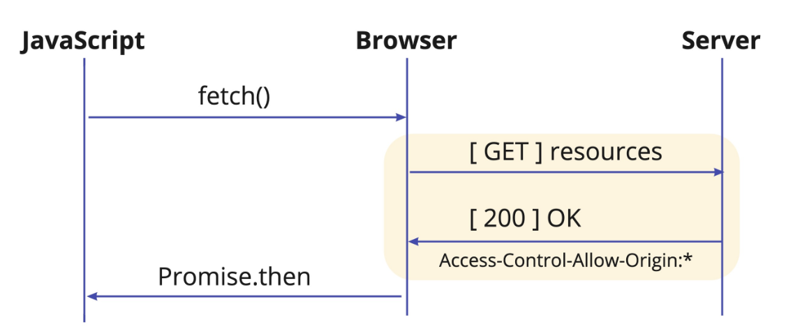
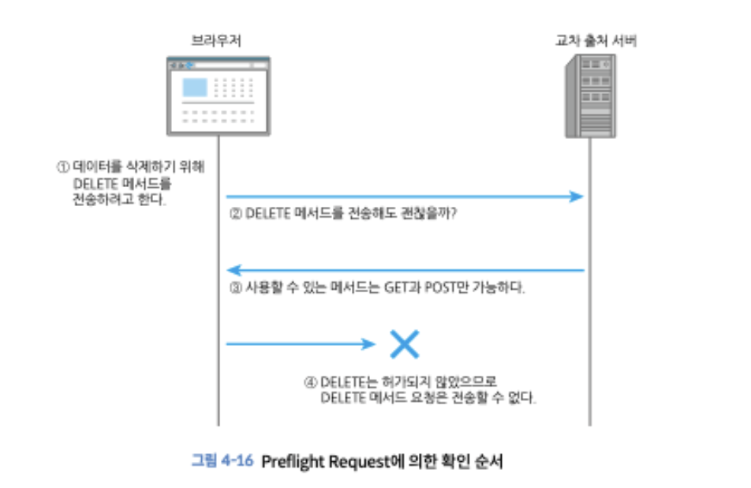

## 2주차

### 동일 출처 정책(SOP)

Same Origin Policy로 한 출처에서 로드된 웹 페이지가 다른 출처의 리소스에 접근하는 것을 제한하여 보안 위협을 방지하는 정책입니다.

접속 제한이 없는 경우 iframe을 사용하는 경우 다른 사용자의 로그인 정보를 훔쳐보는 등 악용될 여지가 있습니다.

**iframe은 보안 및 성능상의 이유로 신중하게 사용해야 합니다.**

**동일 출처 기준?**
웹 어플리케이션의 출처가 같으면 동일 출처, 아니면 교차 출처 입니다.

스키마, 호스트명, 포트 번호 중 하나만 달라도 동일 출처가 아닙니다.

`https://` : 스키마명
`example.com` : 호스트명
`:443` : 포트명
`/path/to/index.html` : 경로

기본적으로 브라우저는 동일 출처 정책으로 설정되어 있기 때문에 교차 출처의 코드나 데이터에 접근하는 경우가 제한됩니다.

하지만 동일 출처에 제한되지 않는 사례들도 있습니다. ex) css, 폼 전송, font, img 등

### CORS

출처 간 리소스 공유(Cross-origin Resource Sharing)의 약자로, 처음 웹 개발을 할 때 자주 만나는 문제(CORS ERROR)입니다.

교차 출처로 요청을 전송하기 위해 사용됩니다.
`Access-Control-Allow-Origin : https://site.example` -> 헤더에는 하나의 출처만 지정할 수 있기 때문에 모든 출처의 접근을 허가하려면 와일드카드(\*)를 사용합니다.

**단순 요청**

프리플라이트 요청을 쓰지 않고 서버로 단순 요청하는 과정입니다.

단순 요청에는 아래와 같은 조건이 모두 충족되어야합니다.

- GET, HEAD, POST 중 하나
- Accept, Accept-Language, Content-Language, Content-Type(application/x-www-form-urlencoded, multipart/form-data, text/plain)

**프리플라이트 요청**
PUT, DELETE로 서버 리소스를 변경하거나 fetch 함수 등에 의해 임의로 http 헤더가 추가되는 경우에는 사전에 브라우저와 서버 간 합의된 요청이 필요합니다. 이 요청을 프리플라이트 요청이라고 합니다.



프리플라이트는 OPTION 메서드를 사용합니다. 요청을 전송하는 출처 외에도 출처에서 이용하려는 메서드와 추가하려는 http 헤더를 전송하여 교차 출처에서 사용 가능 여부를 확인합니다.

프라플라이트 요청에서 전송하는 메시지 예시

```json
Origin : https://site.expamle
Acess-Control-Request-Method : DELETE
Access-Control-Request-Headers : content-type
```

응답은 아래와 같습니다.

```json
Access-Control-Allow-Origin : https:/site.example
Access-Control-Allow-Methods : GET, PUT, POST, DELETE, OPTIONS
Access-Control-Allow-Headers : Content-Type, Authorization, Content-Length, X-Requested-With
Access-Control-Max-Age : 3600
```

브라우저가 예비 요청의 응답을 미리 확인 후 본 요청이 유효할 것이라고 판단되면 본 요청을 보냅니다.

Max-age 옵션의 경우에는 교차 출처로 네트워크가 느린 환경에서 요청이 대량 전송되는 경우, 병목현상을 일으킬 수 있기 때문에 사용한느 캐싱 옵션입니다.

**CORS 요청 모드**
fetch 함수에서 요청 모드를 변경하는 모드 옵션이 있습니다.

`fetch(url, {mode : 'cors'})`
옵션 값으로는 아래와 같습니다.
same-origin : 교차 출처에 요청이 전송되지 않고 에러가 발생한다.
cors : CORS가 설정되어 있지 않거나 CORS를 위반하는 요청이 전송되면 에러가 발생한다. 기본값
no-cors : 교차 출처로 요청은 단순 요청으로만 제한됩니다.

**crossorigin 속성을 사용하는 CORS 요청**
HTML 요소도 crossorigin 속성을 부여하면 cors 모드로 요청을 전송할 수 있습니다.
` `

속성을 부여한 경우 cors 모드가 되기 때문에 Access-Control-Allow-Header 등의 CORS 헤더가 필요합니다.

crossorigin의 경우 아래 옵션을 갖습니다.
`crossorigin=""` : same-origin / 동일 출처만 전송
`crossorigin='anonymous'` : omit / 전송하지 않음
`crossorigin='use-credentials' : include / 모든 출처 전송

**postMessage를 사용해 iframe으로 데이터 전송**
iframe 내 교차 출처 페이지를 신뢰할 수 있을 때는 데이터의 송수신이 필요한 경우가 있습니다. 이때 postMessage 함수를 사용하여 교차 출처 간 데이터를 안전하게 전송할 수 있습니다.

---

동일 출처 정책은 브라우저 프로그램에 의해 실행되기 때문에, 프로그램을 실행하는 컴퓨터 하드웨어에 대한 공격을 막을 수 없습니다. 해당 공격을 사이드 채널 공격이라고 합니다.

스펙터(Spectre)라는 공격을 통해 정밀한 타이머로 동일한 작업을 계속 반복하여 조금씩 메모리 내용을 추측하는 공격 방법을 통해 교차 출처 페이지에서 메모리 데이터를 추측할 수 있는 방법이 있었습니다. 따라서 이런 공격도 막을 수 있는 방법이 필요했습니다.

브라우저는 내부 웹 어플리케이션마다 프로세스를 분리하여 사이드 채널 공격을 막습니다.
프로세스 분리는 사이트라는 단위로 이뤄지며 이런 구조를 **Site Isolation**라고 합니다. 일반적인 사이트와 다르게 이것은 출처와 다른 정의를 갖는 보안을 위한 경계입니다.
=> 서로 다른 사이트의 콘텐츠가 같은 프로세스에서 실행되지 않도록 분리하는 기술입니다.
-> Site isolation에 의해 브라우저가 iFrame을 통해 다른 사이트의 메모리 데이터에 접근하는 것을 막을 수 있습니다.

하지만 **Site Isolation**도 출처 단위의 사이드 채널 공격은 막지 못합니다.
`SharedArrayBuffer`라는 자바스크립트 타이머의 정밀도를 다루는 객체에 의해 브라우저의 API가 무효화되었습니다.

- SharedArrayBuffer : 자바스크립트에서 제공하는 고성능 메모리 공유 기능. 여러 웹 워커 간에 메모리를 공유할 수 있으며, 병렬 처리를 빠르게 할 수 있어서 머신러닝, 고성능 게임 등에 쓰입니다.

하지만 공격자의 입장에서도 고성능 메모리 접근 수단이 되기때문에, 정확한 타이밍 측정을 통해 Spectre 같은 공격을 브라우저 안에서 실행하여 js 코드로 메모리를 엿볼 수 있는 공격입니다.

Cross-Origin Isolation을 설정한 사이트에서만 사용할 수 있습니다.

세 가지 방법을 통해 SharedArrayBuffer 등 제한된 기능을 사용할 수 있습니다.

1. CORP (Cross-origin resource policy)
   CORP 헤더를 설정하여 헤더가 지정된 리소스를 가져올 때 동일 출처 또는 동일 사이트로 제한할 수 있습니다.
   `Cross-Origin-Resource-Policy : same-origin`

2. COEP (Cross-origin embedder policy)
   페이지의 모든 리소스에 CORP 또는 CORS 헤더 설정을 강제할 수 있습니다. COEP가 설정된 페이지에서 CORP가 설정되지 않은 리소스를 발견하면 브라우저는 해당 페이지에서 Cross-Origin isolation이 유효하지 않은 것으로 간주합니다.

   `Cross-Origin-Embedder-Policy : require-corp`

3. COOP (Cross-origin opener policy)
   COOP 헤더를 페이지에 설정하면 앵커 요소와 window.open으로 오픈한 교차 출처 페이지 접근을 제한할 수 있습니다. 이를 유효화하려면 아래와 같은 응답을 추가합니다.
   `Cross-Origin-Opener-Policy : same-origin`
   웹 페이지에 same-origin을 지정하면 소셜 로그인/결제 서비스와 같은 교차 출처 서비스를 결합한 페이지가 정상적으로 동작하지 않을 수 있습니다. 이 경우에는 COOP가 설정되어 있지 않아도 same-origin-allow-popup을 지정하여 접근을 허용합니다.

---

## ch.05 xss

웹 어플리케이션 공격은 능동적 공격과 수동적 공격 패턴이 있습니다.

능동적 공격은 SQL injection, OS injection과 같은 유형이 있습니다.
수동적 공격은 피싱 사이트를 통해 방문자가 공격 코드를 실행하도록 하는 공격 방법입니다.

서버를 통하지 않고 브라우저에서 끝나는 공격 방법은 서버 로그를 남기지 않기 때문에 감지할 수 없습니다.

아래 4가지는 대표적인 수동적 공격입니다.

- XSS
- CSRF
- 클릭재킹
- 오픈 리다이렉트

1. XSS
   웹 어플리케이션 취약점을 이용하여 악성 스크립트를 실행하는 공격입니다.
   교차 출처 페이지에서 실행되는 자바스크립트 공격은 SOP에 의해 차단되나, XSS는 공격 대상 페이지에서 자바스크립트를 실행하므로 SOP로는 막을 수 없습니다.

XSS는 페이지 HTML에 악성 스크립트를 삽입하여 사용자가 이를 실행하게 만드는 공격 방법입니다.
이를 이용하면 강제로 피싱 사이트로 이동되는 코드를 구현할 수 있습니다.

```html
<div id="keyword">
  
</div>
```

XSS의 종류에도 크게 3가지로 분류됩니다.

1. 반사형 XSS
2. 저장형 XSS
3. DOM 기반 XSS

반사형과 저장형의 경우는 웹 어플리케이션의 서버 코드 결함으로 인해 발생하고, DOM 기반은 프론트엔드 코드 결함으로 발생합니다. 3가지 모두 사용자 브라우저에서 공격 코드가 실행되는 공통점이 있습니다.

반사형 XSS : 공격자가 준비한 함정에서 발생하는 요청에 잘못된 스크립트를 포함하는 HTML을 서버에서 생성하여 발생하는 XSS
잘못된 스크립트가 포함된 요청을 보낸 사용자만 영향을 받습니다.

저장형 XSS : 공격자가 폼 등으로부터 제출한 악성 스크립트를 포함하는 데이터가 서버에 저장되어 저장된 악성 스크립트가 웹 어플리케이션에 반영되어 발생합니다.
DB에 등록된 데이터가 반영된 페이지를 보는 모든 사용자에게 영향을 줍니다.

DOM기반 XSS : 자바스크립트로 DOM을 조장할 때 발생합니다. 프론트엔드 코드는 개발자도구로 볼 수 있기 때문에, 공격자가 노릴 수 있는 취약점 중 하나입니다.

innerHTML을 사용하여 DOM을 조작하는 것이 다양한 원인 중 하나입니다.

돔 기반 XSS는 브라우저 기능을 사용할 때 발생하며, 원인이 되는 기능은 소스와 싱크로 분류합니다. location.hash 문열과 같은 것을 소스. 소스의 문자열에서 자바스크립트를 생성하고 실행하는 것을 싱크라고 합니다.

XSS 대책을 위해서는 아래와 같은 대책이 있습니다.

1. 문자열 이스케이프 처리
   이스케이프 처리를 통해 프로그램 예악어나 기호등을 특별하지 않은 의미로 변환하는 작업입니다.

2. 속성값 문자열 쌍따옴표로 감싸기
   html 속성값에 문자열을 넣으면 이스케이프 처리로는 예방할 수 없습니다. 이를 해결하기 위해서는 삽입값을 쌍따옴표로 묶어 문자열로 처리시킵니다.
   하지만 이런 방법이 완벽하지는 않기 때문에, 쿼리 스트링 안의 쌍따옴표를 `&quot;`로 이스케이프 처리합니다.

3. 링크 URL 스키마를 http/https로 제한

`<a>`요소의 href를 이용한 공격은 이스케이프와 쌍따옴표를 묶는 방법으로 예방할 수 없습니다.
`<a id = 'my-link' href ='javascript:alert(1)'>링크</a>`와 같은 방법으로 공격할 수 있기 때문에, 해당 취약성은 href 속성값을 http/https로만 좁혀서 해결합니다.

쿼리 스트링 값이 https://, http://로 시작하는 경우에만 href 속성에 할당합니다.

4. DOM 조작을 위한 메서드와 프로퍼티
   DOM 기반 XSS는 innerHTML 등의 기능을 사용할 때 발생합니다.

사용자가 입력한 데이터를 DOM 조작 함수와 프로퍼티를 사용해 텍스트 노드로 사용하도록 수정합니다.

5. 쿠키 httpOnly 속성 추가
   로그인이 필요한 웹 어플리케이션은 로그인 후 세션 정보를 쿠키에 저장하는 경우가 있습니다. 웹 어플리케이션에 XSS취약성이 있으면 쿠키 값이 노출되어 공격자가 사용자로 위장할 수 있습니다.

서버에서 쿠키를 발행할 때, httponly 속성을 부여하여 쿠키 유출 위험을 줄일 수 있습니다. 해당 속성을 부여하면 자바스크립트로 쿠기 값을 가져올 수 없스빈다.

리액트/앵귤러/뷰를 사용하면 자동으로 XSS를 예방해줍니다.

하지만 dangerouslySetInnerHTML의 경우 위험이 노출되며, js 스키마에 의한 XSS는 막을 수 없습니다.

DOMPurify를 통해 악의적인 자바스크립트 실행은 방지하는 라이브러리를 사용합니다.

DOMPurify.santize를 통해 XSS 공격 위험이 있는 문자열을 제거합니다.

혹은 Sanitize API를 사용합니다.
DOMPurify와 같이 XSS 원인인 위험한 문자열을 제거하는 API입니다.
이를 통해 XSS 원인이되는 문자열을 삭제할 수 있습니다.

**Content Security Policy를 사용하여 XSS 대처하기**
CSP는 XSS와 같이 악성 코드를 포함하는 인젝션 공격을 감지해 피해를 막는 브라우저 기능입니다.

응답 헤더 뿐만아니라 meta 요소로 CSP 설정을 포함할 수 있습니다.

CSP에서는 다양한 콘텐츠를 제어하기 위한 directive가 있습니다.
`script-src` : 스크립트 실행 허용
`style-src` : CSS 등 스타일 적용 허용
`img-src` : 이미지 불러오기 허용
`media-src` : 사운드, 영상 불러오기 허용
`connect-src` : XHR과 fetch 함수 등 네트워크 접근 허용
`default-src`: 지정되지 않은 directive 전체 허용
`frame-ancestors` : iframe 등 현재 페이지에 삽입 허용
`upgrade-insecure-requestes` : http://로 시작하는 url 리소스를 https://로 시작되는 url로 변환하여 요청
`sandbox` : 콘텐츠를 샌드박스화하여 외부로부터 접근 등을 제어

---

## 마무리

XSS는 공격자가 만든 함정에 이ㅡ해 브라우저에서 공격자의 코드를 실행시키는 공격입니다.
XSS는 동일 출처 정책으로는 막을 수 없습니다.
XSS는 라이브러리, 브라우저의 기능을 사용해서 막을 수 있습니다.
CSP는 인젝션 공격을 막을 수 있으나, 웹 어플리케이션이 동작할 때 문제가 생길 수 있으므로 보고서를 모니터링 함녀서 적용해야합니다.
