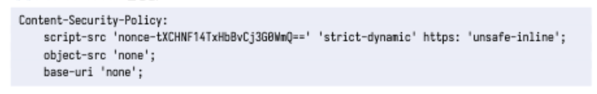

## ch.05 xss

웹 어플리케이션 공격은 능동적 공격과 수동적 공격 패턴이 있습니다.

능동적 공격은 SQL injection, OS injection과 같은 유형이 있습니다.
수동적 공격은 피싱 사이트를 통해 방문자가 공격 코드를 실행하도록 하는 공격 방법입니다.

서버를 통하지 않고 브라우저에서 끝나는 공격 방법은 서버 로그를 남기지 않기 때문에 감지할 수 없습니다.

아래 4가지는 대표적인 수동적 공격입니다.

- XSS
- CSRF
- 클릭재킹
- 오픈 리다이렉트

1. XSS
   웹 어플리케이션 취약점을 이용하여 악성 스크립트를 실행하는 공격입니다.
   교차 출처 페이지에서 실행되는 자바스크립트 공격은 SOP에 의해 차단되나, XSS는 공격 대상 페이지에서 자바스크립트를 실행하므로 SOP로는 막을 수 없습니다.

XSS는 페이지 HTML에 악성 스크립트를 삽입하여 사용자가 이를 실행하게 만드는 공격 방법입니다.
이를 이용하면 강제로 피싱 사이트로 이동되는 코드를 구현할 수 있습니다.

```html
<div id="keyword">
  
</div>
```

XSS의 종류에도 크게 3가지로 분류됩니다.

1. 반사형 XSS
2. 저장형 XSS
3. DOM 기반 XSS

반사형과 저장형의 경우는 웹 어플리케이션의 서버 코드 결함으로 인해 발생하고, DOM 기반은 프론트엔드 코드 결함으로 발생합니다. 3가지 모두 사용자 브라우저에서 공격 코드가 실행되는 공통점이 있습니다.

반사형 XSS : 공격자가 준비한 함정에서 발생하는 요청에 잘못된 스크립트를 포함하는 HTML을 서버에서 생성하여 발생하는 XSS
잘못된 스크립트가 포함된 요청을 보낸 사용자만 영향을 받습니다.

저장형 XSS : 공격자가 폼 등으로부터 제출한 악성 스크립트를 포함하는 데이터가 서버에 저장되어 저장된 악성 스크립트가 웹 어플리케이션에 반영되어 발생합니다.
DB에 등록된 데이터가 반영된 페이지를 보는 모든 사용자에게 영향을 줍니다.

DOM기반 XSS : 자바스크립트로 DOM을 조장할 때 발생합니다. 프론트엔드 코드는 개발자도구로 볼 수 있기 때문에, 공격자가 노릴 수 있는 취약점 중 하나입니다.

innerHTML을 사용하여 DOM을 조작하는 것이 다양한 원인 중 하나입니다.

돔 기반 XSS는 브라우저 기능을 사용할 때 발생하며, 원인이 되는 기능은 소스와 싱크로 분류합니다. location.hash 문열과 같은 것을 소스. 소스의 문자열에서 자바스크립트를 생성하고 실행하는 것을 싱크라고 합니다.

XSS 대책을 위해서는 아래와 같은 대책이 있습니다.

1. 문자열 이스케이프 처리
   이스케이프 처리를 통해 프로그램 예악어나 기호등을 특별하지 않은 의미로 변환하는 작업입니다.

2. 속성값 문자열 쌍따옴표로 감싸기
   html 속성값에 문자열을 넣으면 이스케이프 처리로는 예방할 수 없습니다. 이를 해결하기 위해서는 삽입값을 쌍따옴표로 묶어 문자열로 처리시킵니다.
   하지만 이런 방법이 완벽하지는 않기 때문에, 쿼리 스트링 안의 쌍따옴표를 `&quot;`로 이스케이프 처리합니다.

3. 링크 URL 스키마를 http/https로 제한

`<a>`요소의 href를 이용한 공격은 이스케이프와 쌍따옴표를 묶는 방법으로 예방할 수 없습니다.
`<a id = 'my-link' href ='javascript:alert(1)'>링크</a>`와 같은 방법으로 공격할 수 있기 때문에, 해당 취약성은 href 속성값을 http/https로만 좁혀서 해결합니다.

쿼리 스트링 값이 https://, http://로 시작하는 경우에만 href 속성에 할당합니다.

4. DOM 조작을 위한 메서드와 프로퍼티
   DOM 기반 XSS는 innerHTML 등의 기능을 사용할 때 발생합니다.

사용자가 입력한 데이터를 DOM 조작 함수와 프로퍼티를 사용해 텍스트 노드로 사용하도록 수정합니다.

5. 쿠키 httpOnly 속성 추가
   로그인이 필요한 웹 어플리케이션은 로그인 후 세션 정보를 쿠키에 저장하는 경우가 있습니다. 웹 어플리케이션에 XSS취약성이 있으면 쿠키 값이 노출되어 공격자가 사용자로 위장할 수 있습니다.

서버에서 쿠키를 발행할 때, httponly 속성을 부여하여 쿠키 유출 위험을 줄일 수 있습니다. 해당 속성을 부여하면 자바스크립트로 쿠기 값을 가져올 수 없스빈다.

리액트/앵귤러/뷰를 사용하면 자동으로 XSS를 예방해줍니다.

하지만 dangerouslySetInnerHTML의 경우 위험이 노출되며, js 스키마에 의한 XSS는 막을 수 없습니다.

DOMPurify를 통해 악의적인 자바스크립트 실행은 방지하는 라이브러리를 사용합니다.

DOMPurify.santize를 통해 XSS 공격 위험이 있는 문자열을 제거합니다.

혹은 Sanitize API를 사용합니다.
DOMPurify와 같이 XSS 원인인 위험한 문자열을 제거하는 API입니다.
이를 통해 XSS 원인이되는 문자열을 삭제할 수 있습니다.

**Content Security Policy를 사용하여 XSS 대처하기**
CSP는 XSS와 같이 악성 코드를 포함하는 인젝션 공격을 감지해 피해를 막는 브라우저 기능입니다.
CSP는 서버에서 허용되지 않은 자바스크립트 실행과 리소스 불러오기 등을 차단합니다.

응답 헤더 뿐만아니라 meta 요소로 CSP 설정을 포함할 수 있습니다.

CSP에서는 다양한 콘텐츠를 제어하기 위한 directive가 있습니다.
`script-src` : 스크립트 실행 허용 // 자기 서버와 특정 cdn에서만 자바스크립트 로드 가능
`style-src` : CSS 등 스타일 적용 허용
`img-src` : 이미지 불러오기 허용 // 이미지,폰트,ajax 요청 등 특정 도메인에서만 가져오도록 제한
`media-src` : 사운드, 영상 불러오기 허용
`connect-src` : XHR과 fetch 함수 등 네트워크 접근 허용
`default-src`: 지정되지 않은 directive 전체 허용
`frame-ancestors` : iframe 등 현재 페이지에 삽입 허용
`upgrade-insecure-requestes` : http://로 시작하는 url 리소스를 https://로 시작되는 url로 변환하여 요청 // https 페이지에서 http 리소스 로드를 막아 중간자 공격 방지
`sandbox` : 콘텐츠를 샌드박스화하여 외부로부터 접근 등을 제어

다음과 같은 설정의 경우 모든 종류의 콘텐츠를 불러오는 위치는 trusted.com과 서브도메인으로 제한됩니다.
`Contnet-Security-Policy : default-src *.trucsted.com`

`<meta>`요소로 CSP를 활성화한 경우에는 다음 directive를 지정할 수 없습니다.

- frame-ancestors
- report-uri
- sandbox

CSP에 지정할 수 있는 소스 키워드는 아래와 같습니다.
`self` : CSP로 보호하는 페이지와 동일 출처만 허용
`none` : 모든 출처를 허용하지 않음
`unsafe-inline` : script-src와 style-src의 directive에서 인라인 스크립트 및 인라인 스타일을 사용하도록 허용
`unsafe-eval` : srcipt-src의 directive에서 eval함수 사용 허용
`unsafe-hashes` : script-src의 directive에서 DOM에 설정된 onclick, onfocus 등 이벤트 실행을 허용하나 `<script>` 요소를 사용해 인라인 스크립트 또는 자바스크립트 스키마를 사용하는 자바스크립트 실행은 허용하지 않음

unsafe 문법으로 인라인 스크립트를 사용할 수 있으나 XSS의 위험이 있기 때문에 인라인 스크립트를 사용하기 위해서는 아래와 같은 문법으로 대체합니다.

**Script CSP**
CSP를 적용한 페이지는 HTML 내 자바스크립트를 작성하는 인라인 스크립트가 금지됩니다.
인라인 스크립트를 사용하기 위해서는 `unsafe-inline`을 사용해야 하는데, 이는 권장되지 않으므로 안전하게 사용하기 위해서는 `nonce-source`, `hash-source`라는 CSP 헤더를 사용해야 합니다.


**nonce-source**
`nonce-source`는 `<script>`요소에 지정된 랜덤 토큰이 CSP 헤더에 지정된 토큰과 일치하지 않으면 에러를 발생시킵니다. 지정하는 토큰은 고정된 값을 주는 게 아닌 요청마다 토큰을 변경해야 공격자가 추측하기 어렵습니다.

**hash-source**
none-source와 같이 토큰을 지정해 인라인 스크립트의 실행을 허용하는 기능입니다. CSP 헤더에 자바스크립트와 CSS 코드의 해시값을 지정합니다. HTML/CSS/JS로만 구성되고, 서버가 없는 정적 사이트는 요청마다 nonce 값을 생성할 수 없으나 hash-source를 사용하면 안전하게 CSP를 설정할 수 있습니다.

strict-dynamic를 스크립트 요소의 동적 생성을 허용합니다. 하지만 DOM 기반 XSS의 싱크인 innerHTML과 document.write는 기능이 제한됩니다.

**object-src / base-uri**
플래시와 같은 플러그인을 제한하는 directive입니다. none으로 설정하면 플래시와 같은 플러그인을 악용한 공격을 방지할 수 있습니다.

**trusted Types**
Strict CSP는 강력한 XSS 대책이나, 개발자 구현 방식에 따라 DOM 기반 XSS가 발생할 가능성이 있습니다. 이를 해결하기 위해 검사되지 않은 문자열을 HTML에 삽입하는 것을 금지하는 Trusted Types의 브라우저 기능이 있습니다. 기반값은 비활성화로 되어있으며, policy라고 하는 함수가 검사한 타입만 HTML에 삽입하도록 제한합니다.


**policy 함수에 의한 검사와 변환**
policy 함수는 window.trustedTypes.createPolicy 함수를 사용합니다.
브라우저가 Trusted Types를 지원하지 않을 수 있기 때문에 함수를 사용할 수 있는지 체크한 뒤, 문자열을 검사하기 위한 함수를 정의하는 객체를 설정합니다.

여러 개의 policy를 적용하면 CSP 헤더의 trusted-types의 directive를 사용하여 policy 이름을 지정할 수 있습니다.

policy 함수에 default를 지정하면 Trusted Types의 디폴트 policy를 사용할 수 있습니다. trusted types의 타입이 아닌 일반 문자열을 싱크에 대입하면 디폴트 policy가 문자열을 자동으로 검사합니다.

**Report-only 모드를 사용한 policy test**
CSP를 적용할 때는 웹 어플리케이션을 손상시킬 위험이 없는지 테스트해야합니다.
CSP를 적용할 때 발생하는 영향을 요약하여 JSON 형식으로 전송하는 기능입니다.

해당 모드를 사용하려면 `Content-Policy-Report-Only`헤더를 사용합니다.

실제 CSP를 적용하기 전에 Report-only를 몇 달간 운영해보고 CSP 위반이 없는지 확인하는 것이 좋습니다. -> 잘못 설정하면 웹 어플리케이션이 동작하지 않기 때문에.

---

## 마무리

XSS는 공격자가 만든 함정에 의해 브라우저에서 공격자의 코드를 실행시키는 공격입니다.
XSS는 동일 출처 정책으로는 막을 수 없습니다.
XSS는 라이브러리, 브라우저의 기능을 사용해서 막을 수 있습니다.
CSP는 인젝션 공격을 막을 수 있으나, 웹 어플리케이션이 동작할 때 문제가 생길 수 있으므로 보고서를 모니터링 하면서 적용해야합니다.
