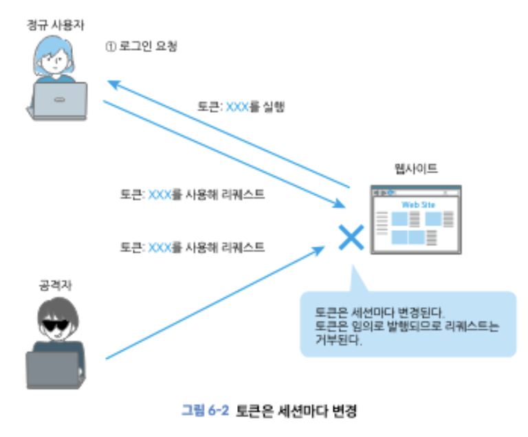

## ch 06. CSRF / 클릭재킹 / 오픈 리다이렉트

### 1. CSRF

Cross site request forgery의 줄임말로, 공격자가 준비한 함정에 의해 웹 어플리케이션의 기능이 사용자 의도와 상관없이 호출되는 공격입니다.

XSS처럼 공격자가 마음대로 스크립트를 동작시키거나 웹 어플리케이션에 요청을 생성하지는 못하나, 계정 삭제, 송금, SNS 업로드 등 웹 어플리케이션의 기능을 악용할 수 있습니다.

**공격 절차**

1. 사용자가 은행 사이트에 로그인
2. 로그인 성공 시 세션 아이디가 쿠키에 기록됨
3. 사용자가 공격자에게 송금하기 위한 악성 폼이 삽입된 피싱 사이트로 유도
4. 사용자의 쿠키와 함께 피싱 사이트에서 은행 사이트로 요청이 전송
5. 은행 사이트 서버는 전송된 쿠키를 정상으로 간주하여 요청 처리

=> `<form>`요소로 전송되는 요청은 동일 출처 정책에 의해 제한되지 않기 때문에 은행 사이트의 서버에서 요청을 전송한 사용자를 정상으로 인식합니다.

이를 막기 위한 효과적인 대책으로는 **토큰**을 사용하는 방법입니다.



토큰을 사용하는 CSRF 방지는 세션마다 다른 값의 토큰을 발행하며, 이 정보는 사용자가 볼 필요가 없기 때문에 input 요소에 type = hidden 속성으로 숨깁니다.

일치하는지 여부를 확인하고, 일치하지 않는 경우 잘못된 요청으로 간주합니다.

```js
// ex : express.js + csurf 미들웨어
import express from "express";
import csrf from "csurf";
const app = express();

const csrfProtection = csrf({ cookie: true });
app.get("/form", csrfProtection, (req, res) => {
  res.render("send", { csrfToken: req.csrfToken() });
});
```

```js
// ex : react에서 csrf 토큰 사용
import axios from "axios";

// CSRF 토큰을 쿠키에서 꺼내오기
function getCsrfToken() {
  const match = document.cookie.match(/XSRF-TOKEN=([^;]+)/);
  return match ? match[1] : null;
}

// 요청시 자동으로 헤더에 붙이기
axios.interceptors.request.use((config) => {
  const token = getCsrfToken();
  if (token) {
    config.headers["X-CSRF-TOKEN"] = token;
  }
  return config;
});
```

- SPA 환경에서는 JWT 인증 + CSRF 방어를 자주 사용합니다.
  - 로그인 시 httponly 쿠키에 jwt 저장
  - 서버에서 xsrf-token같은 csrf 토큰을 일반 쿠키에 ㅜ가로 내려줌
  - 프론트에서 요청 시 x-csrf-token 헤더에 같이 전송

**Double Submit 쿠키를 사용하는 CSRF 대책**
세션용 쿠키와 달리 랜덤 토큰 값을 가진 쿠키를 발행하고 토큰을 사용해 정상적인 요청인지를 확인하는 CSRF 대책입니다.

정상적인 페이지에서 로그인할 때 세션용 쿠키와 CSRF를 위한 httponly 속성이 부여되지 않은 토큰 값을 갖는 쿠기도 발행합니다. 정상 페이지에서 폼을 전송할 때 브라우저 자바스크립트로 쿠키 내부의 토큰을 가져오고 폼의 요청 헤더와 바디에 삽입합니다. 브라우저는 폼 데이터와 쿠키를 서버로 전송하고 서버는 폼 데이터 속 토큰과 쿠키 속 토큰의 일치 여부를 검사합니다.

일치할 때는 정상 페이지로 간주하여 성공 응답을 반환하고 토큰이 일치하지 않거나 존재하지 않는 경우에는 정상 페이지가 아닌 요청으로 간주하여 에러를 발생시킵니다.


도메인이 다른 페이지의 쿠키는 접근할 수 없도록 브라우저가 관리합니다. -> 피싱 사이트에 접속하더라도 피싱 사이트는 쿠키를 가질 수 없습니다.

요청을 받는 서버에서 토큰을 보관할 수 없는 경우에는 Double Submit 쿠키를 사용하는 방식이 효과적입니다.

**Same site 쿠키를 사용하는 대책**
로그인 후 페이지에서 수행하는 중요한 처리를 피싱 사이트가 사용자의 쿠키를 사용해 요청을 임의로 전송하는 공격 방법

로그인된 세션 정보가 들어있는 쿠키를 전송하지 않으면 대부분의 CSRF 공격을 막을 수 있습니다. Samesite 쿠키는 쿠키와 전송을 제어하는 기능으로 쿠키 전송을 동일한 사이트로 제한할 수 있습니다.

`Set-Cookie session=0123123; HttpOnly; Secure; SameSite=Lax` 형태로 설정합니다.

- Strict : 교차 사이트에서 전송하는 요청에 쿠키를 추가하지 않음
- Lax : URL이 바뀌는 화면 전환 및 GET 요청이면 교차 사이트에서 사용. 이외 교차 사이트의 요청은 쿠키를 추가하지 않음 (기본값)
- None : 사이트에 관계없이 모든 요청에 쿠키 전송

**Origin 헤더를 사용하는 대책**
HTML을 전송하는 서버와 API를 제공하는 서버가 다르면 HTML에 원타임 토큰을 포함해도 API서버는 해당 값의 유효성을 확인할 수 없습니다. 그러나 API를 제공하는 서버에서 Origin 헤더를 확인하면 허가되지 않은 출처의 요청을 금지할 수 있습니다.

```js
app.post("/remit", (req, res) => {
  if (!req.headers.origin || req.headers.origin !== "https://site.example") {
    res.status(401);
    res.send("허가되지 않은 요청입니다.");
    return;
  }
});
```

**CORS를 사용하는 대책**
CORS의 Preflight request에서 요청 내용을 확인하면 의도하지 않은 fetch 함수와 XHR의 요청을 방지할 수 있다. Preflight Request를 사용하는 CSRF 대책은 Origin 헤더를 사용하는 대책과 마찬가지로 HTML을 전달하는 프론트엔드 서버와 API를 제공하는 서버가 분리됐을 때 유용합니다. -> 다만 요청횟수가 늘어나므로 성능에 좋지 않다는 의견도 있습니다.

Preflight Request를 의도적으로 발생시키려면 X-Requested-With : XMLHttpRequest와 같은 임의 헤더를 부여합니다.

```js
fetch("https://example/remit", {
  method: "POST",
  headers: {
    "X-Requested-With": "XMLHttpRequest",
  },
  credentials: "include",
  body: {
    to: "attacker",
    amount: 100000,
  },
});
```

전송받은 서버는 허가된 출처로부터의 요청인지 X-Requested-With 헤더가 추가되어있는지 확인합니다. 허가되지 않았으면서 헤더가 추가되어있지 않으면 CSRF 공격의 가능성이 있으므로 요청을 에러 처리합니다.

**클릭재킹**
사용자 의도와 다르게 버튼/링크 등을 클릭하게 하여 의도치 않은 처리를 실행하도록 하는 공격입니다.

1. 공격 대상의 웹 어플리케이션 페이지를 iframe을 사용하여 피싱 사이트와 중첩
2. CSS를 사용하여 iframe을 투명하게 해 사용자에게 보이지 않게 합니다.
3. 공격 대상 페이지에서 중요 기능을 하는 버튼이 피싱 사이트상의 버튼 위치와 중첩되도록 CSS로 조정합니다.
4. 피싱 사이트에 접속한 사용자가 피싱 사이트에서 버튼을 클릭하도록 유도합니다.
5. 사용자는 피싱 사이트에서 버튼을 클릭해도 실제로는 투명하게 겹쳐진 공격 대상의 페이지 버튼이 클릭됩니다.

이를 막기 위해서는 iframe과 같이 프레임에 페이지를 삽입하는 것을 제한해야 합니다.

`X-Frame-Options`
해당 헤더가 추가된 페이지는 프레임 내부에 삽입이 제한됩니다
DENY : 모든 출처의 프레임 내부에 삽입을 제한한다.
SAMEORIGIN : 동일 출처의 프레임 내부에 삽입을 허가한다. 교차 출처의 프레임 내부에 삽입은 제한한다.
ALLOW_FROM uri : uri에 지정한 출처에 대해 프레임 내부 삽입을 허가합니다. 다만 이를 지원하지 않는 브라우저도 있고 자체적인 버그도 있기 때문에 CSP frame-ancestors를 이용하는 것이 좋습니다.

`CSP frame-ancestors`
프레임 내부에 페이지 삽입을 제한합니다
frame-ancestors 'none' : Deny와 똑같이 모든 출처 프레임 내부에 해당 페이지 삽입을 제한합니다.  
frame-ancesors 'self' : SAMEORIGIN과 똑같이 동일 출처 프레임 내부에 삽입을 허가합니다. 교차 출처의 프레임 내부에 삽입을 제한합니다  
frame-ancestors uri : 지정한 출처의 프레임 내부에 삽입을 허가합니다.

- 와일드 카드를 사용하여 문자열 부분을 일치하도록 지정할 수 있으며, 여러 출처를 지정할 수 있습니다.

**오픈 리다이렉트**
웹 어플리케이션 내부의 리다이렉트 기능을 통해 피싱 사이트 등으로 강제 이동시키는 공격입니다. 사용자가 정상적인 사이트에 접속하려고 해도 강제로 피싱 사이트로 리다이렉트되는 특징이 있습니다.


보통 오픈 리다이렉트는 요청에 포함된 URL 문자열 파라미터를 서버에서 리다이렉트 URL로 사용하기 때문에 발생합니다.
오픈 리다이렉트를 방지하려면 외부에서 입력한 URL을 체크합니다. 이동하려는 페이지가 특정 URL로만 정해져있다면 해당 URL이 특정 URL에 해당하는지 체크하는 것으로 해결합니다.

쿼리 스트링 URL이 현재 페이지의 출처와 비교하여 동일한 경우에만 페이지를 이동하도록 막습니다.

```js
const url = new URL(location.href);
const redirectURL = url.searchParams.get("url");
if (redirectURL) {
  const redirectURLObj = new URL(redirectURL, location.href);

  if (redirectURLObj.origin === location.origin) {
    location.href = redirectURL;
  }
}
```

- CSRF는 사용자 권한 등이 필요한 처리를 강제로 실행하는 공격입니다.
- 요청이 정상인지 확인하는 방식과 브라우저 기능을 사용합니다 .
- 클릭재킹은 사용자를 속여 버튼/링크를 클릭하도록 하기 때문에 iframe 삽입을 금지하여 공격을 방지합니다.
- 오픈 리다이렉트는 이동 기능을 통해 피싱 사이트로 이동시키기 때문에, 이동 대상인 URL을 체크합니다.
