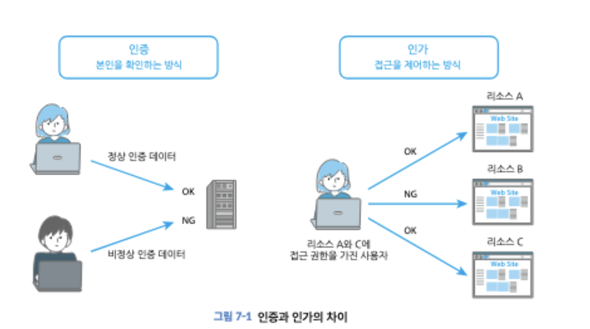

## 5. 인증 인가

### 인증 (Authentication)

인증은 통신 상대가 누구인지를 확인하는 것이며, 로그인이 대표적인 인증 기능입니다.

인증은 크게 3가지로 구분됩니다.

지식 정보 : 비밀번호 등 사용자만 알고 있는 정보

소지 정보 : 스마트폰이나 보안키, IC 카드 등 사용자 본인만이 물리적으로 갖고 있는 것에 포함되는 정보

생체 정보 : 지문,얼굴,홍채 등 사용자 본인의 생물학적인 정보

여러 요소를 조합하여 인증을 진행하면 보안을 향상시킬 수 있습니다.

### 인가 (Authorization)

통신 상대에게 특정한 권한을 부여하는 것을 의미합니다.
웹 어플리케이션에 로그인할 때 사용자는 인증과 동시에 허가도 받습니다.



### 인증 방식의 종류

대표적으로 비밀번호 인증 방식이 있는데, 폼에 입력한 비밀번호를 서버로 전송하고 서버는 전송받은 비밀번호와 데이터베이스에 저장되어 있는 비밀번호의 일치 여부를 확인합니다.

단, 비밀번호를 전송할 때 평문으로 전송하면 도청의 우려가 있어 HTTPS 통신을 사용해야 합니다.

그 외 방식은 아래와 같은 방식이 있습니다.

SMS 인증 : 로그인에 필요한 링크나 코드 등의 정보 SMS로 전송하고 사용자가 수신한 메시지 정보로 로그인하는 인증 방식

소셜 로그인 : 소셜 서비스 계정으로 웹 어플리케이션에 로그인하는 인증 방식

FIDO : Fast Identity Online의 약자로 지문/얼굴/코드 등을 바탕으로 생성한 공개키와 비밀키로 사용자를 인증하는 기술

WebAuthn : FIDO 기술인 'FIDO2'를 웹에서 사용하기 위한 Web Authentication입니다.

### 비밀번호 인증에 대한 공격

브루트포스 공격 : 이론상 가능한 모든 패턴을 대입하는 공격 방법입니다. 비밀번호의 자릿수나 사용할 수 있는 문자의 종류 등이 적어 복잡도가 낮기 때문에 발생합니다.

사전 공격 : password, 123456과 같이 단순 문자열, 인명, 지명 등 비밀번호에 자주 사용되는 문자열의 입력을 반복하는 공격 방법

비밀번호 리스트 공격 : 유출된 다른 서비스 비밀번호를 그대로 입력하는 공격기법

리버스 브루트 포스 : 비밀번호를 고정하고 로그인을 위한 아이디를 변경하며 반복 인증을 시도한느 공격방법 -> 이 경우에는 로그인 실패 횟수에 따라 계정을 잠그는 대책이 통하지않습니다.(브루트포스 방지 대책)

비밀번호 인증을 강화하는 것 외에 인증을 통과해도 계정 탈취 등을 막기 위한 대책입니다

복합 인증 : 지식 정보, 소지 정보, 생체 정보의 요소 중 여러 요소를 조합하는 방법으로 보안강돌르 더욱 높이는 인증입니다.

또한 2가지 요소를 조합하는 인증을 이중 요소 인증이라고 합니다.
-> ex : 비밀번호 인증 후 SMS로 전송되는 코드를 재차 입력하여 로그인하는 웹 어플리케이션

이와 비슷하게 2단계 인증이 있습니다. 비밀번호 인증 후 추가로 질문과 답을 사용하여 인증하는 방식은 지식 정보를 2회 사용하는 인증입니다. (지식 정보 단일 요소를 사용)

계정 잠금 기능 : 로그인을 일정 횟수만큼 실패했을 때 해당 사용자 아이디에 잠금을 걸어 브루트 포스 공격을 막는 기능입니다.
-> 정상적인 사용자가 잠금 해제하기 위해 일회용 비밀번호를 전달하는 방법 등을 구현해야합니다.

**입력 내용 유효성 검사**

required 속성 : 해당 요소의 입력이 필수로 설정됩니다. 해당 속성이 있는 폼이 비어있으면 폼의 전송을 막습니다.

pattern 속성 : 입력값이 지정된 정규표현식과 일치하는지 확인하는 속성입니다.
`<input id = 'password' type = 'password' name = 'password' pattern = "여기에 패턴 넣기">`

title 속성 : 에러 메시지에 추가 정보를 표시하려면 title 속성을 사용합니다.

자바스크립트를 사용한 유효성 검사 : 패턴 속성보다 더 복잡한 유효성 검사는 자바스크립트를 사용한다.

CSS를 사용한 실시간 피드백 : 생성 버튼을 누르기 전까지 사용자의 입력값을 검사할 수 없는데, CSS의 의사 클래스 `:valid`와 `:invalid`를 사용합니다.

### 비밀번호 입력 보조하기

사용자가 비밀번호를 쉽게 설정할 수 있게 돕는 방법입니다.

비밀번호 표시/숨김 전환 : input 요소 타입 속성에 `password`를 지정하면 비밀번호는 숨길 수 있으나 사용자는 입력하는 문자를 볼 수 없어 복잡한 암호를 피하기 쉽습니다.

이 입력값을 표시/숨김할 수 있게 보조 기능을 추가하여 복잡한 암호를 설정할 수 있도록 돕습니다.

```jsx
<div class="signup-item">
  <input type="checkbox" id="display-password" />
  <label for="display-password">비밀번호 표시 </label>
</div>
```

```js
const checkbox = document.querySelector("#display-password");
checkbox.addEventListener("change", () => {
  if (checkobx.checked === true) {
    password.type = "text";
  } else {
    password.type = "password";
  }
});
```

비밀번호 관리자 지원 : 안전한 비밀번호를 생성해주거나 한번 로그인한 웹 어플리케이션의 사용자 아이디와 비밀번호를 자동으로 입력해주는 기능

비밀번호 관리자를 사용해 로그인 양식의 자동 입력을 사용하려면 input 요소의 autocomplete 속성을 사용합니다.

```html
<input class="signup-input" autocomplete="username" />

<input ... name="password" autocomplete="current-password" />
```

비밀번호 복사 및 붙여넣기 기능 : 비밀번호 복사/붙여넣기를 금지하면 단순하고 추측하기 쉬운 비밀번호를 설정하게 할 수 있습니다. 따라서 이 기능을 활성화합니다.

모바일 사용자에게 적절한 키보드 표시 : 키보드 유형을 지정하려면 input 요소 내 inputmode 속성을 지정합니다.

### 로그인 정보 유출에 주의

웹 분석 서비스 이용에 주의 : 웹 분석 서비스를 사용하면 페이지에서 키보드나 마우스 조작을 추적할 수 있습니다.

브라우저에 기능 정보를 저장할 때 주의 : 통신이 도청됐을 때나 XSS 공격에 의해 로그인 정보나 액세스 토큰이 유출될 우려가 있으므로 로그인 정보나 액세스 토큰을 쿠키에 저장할 때 Secure 속성 / httpOnly 속성을 설정합니다.

쿠키 외에도 세션스토리지나 로컬스토리지와 같은 웹 스토리지를 사용할 수도 있습니다.

세션 스토리지 -> 동일한 탭에서만 접근 가능하며 탭이 닫히면 삭제
로컬 스토리지 -> 브라우저 전체에서 공유되며 저장 기한은 없다. 사용자가 데이터를 삭제하거나 등록한 웹 어플리케이션이 삭제될때 까지 유지된다.

웹 스토리지에 보안 정보를 저장할 때는 세션이 끊어질 때를 조심해야 합니다. 로그아웃 할 때 웹 스토리지를 삭제하는 처리가 있더라도 세션이 끊어져 로그아웃이 진행되면 사용자나 웹 어플리케이션의 의도와는 상관없이 웹 스토리지에 데이터가 계속 남아 있을 수 있습니다.

로컬 스토리지에 보안 정보가 남아있으면 XSS를 통해 정보가 유출될 수 있습니다.

**마무리**

- 상대가 누구인지 확인하는 행위 : 인증
- 상대에게 권한을 주는 것 : 인가
- 인증에는 3가지 요소가 있으며 이를 결합하면 보안을 강화할 수 있습니다.
- 비밀번호 인증을 노린 공격은 이중 인증 방식이 효과적입니다.
- 사용자 경험과 디자인을 개선하면 복잡한 비밀번호의 입력을 보조할 수 있습니다.
