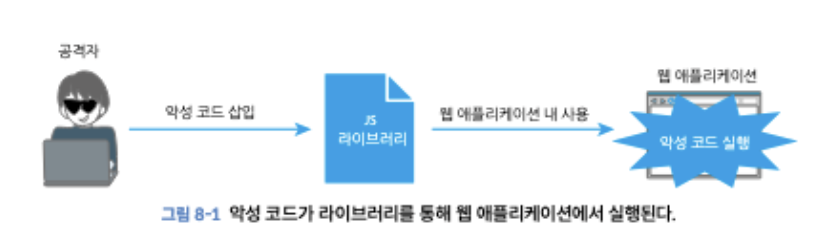
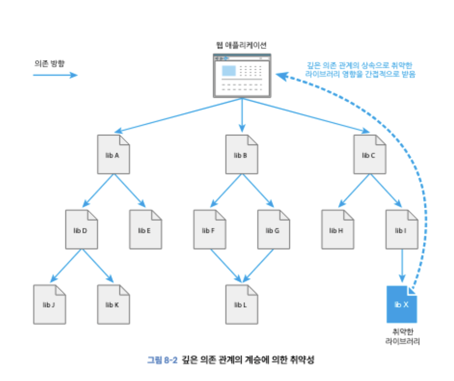

## 라이브러리를 노린 보안 리스크

라이브러리는 웹 어플리케이션을 개발할 때 필요합니다. 이번 주는 라이브러리를 사용할 때의 보안 리스크와 보험적 조치로서 예방책을 알아봅니다.

**오픈소스 소프트웨어의 사용**
오픈소스 소프트웨어(OSS)는 코드가 공개되어 있어 누구나 소스를 읽을 수 있고, 라이선스에 따라 누구든지 이용, 변경, 버그 수정이 가능합니다.

대부분 CDN과 npmjs.com을 통해 배포됩니다.

**CDN**
Content Delivery Network는 웹 페이지 리소스를 빠르고 효율적으로 전송하기 위한 서버를 제공하는 구조를 말합니다. 전 세계에 서버를 두고 먼 곳에서 웹 어플리케이션을 개발하더라도 가까운 위치의 CDN 서버에서 콘텐츠를 가져올 수 있도록 하므로 웹 페이지 표시 속도를 높일 수 있습니다.

자바스크립트와 css 등의 라이브러리 중에는 CDN에서 바로 전송되는 것도 있고, 브라우저에서 HTML과 자바스크립트를 사용해 직접 CDN의 리소스를 가져올 수 있습니다.

`<script crossorigin src = 'cdn주소'/>`

### 라이브러리에 숨어 있는 보안 리스크

**서드파티 라이브러리를 경유하는 공격**
사용자 / 웹 어플리케이션과 같은 대상을 직접 공격하는 것이 아니라 서드파티가 작성한 라이브러리나 툴을 사용해 대상을 간접적으로 노리는 공격입니다.

**리뷰가 충분하지 않은 코드에 의한 취약성**
코드 리뷰가 충분하지 않은 상태에서 머지가 진행되거나 리뷰 없이 수정할 수 있는 OSS가 있습니다. 이런 경우의 소프트웨어는 악의를 가진 공격자의 타깃이 됩니다.

개발자가 악성코드가 포함된 라이브러리를 사용하는 경우 웹 어플리케이션의 사용자가 피해를 입을 수 있습니다.

**계정 탈취에 의한 취약성**
라이브러리 개발자와 유지보수하는 계정이 탈취되면 라이브러리에 악성 코드가 포함될 수 있습니다
eslint, coa, ua-parser-js 등 다양한 패키지들의 유지보수 계정이 탈취되어 악의적인 코드가 포함된 사건이 있었습니다.

이용자 수 상위 100개의 패키지를 유지보수하는 npm 계정은 2단계 인증을 필수로 진행하도록 하고 있습니다.

**의존 관계 상속에 의한 취약성**
웹 어플리케이션이 직접 의존하는 라이브러리에 악성 코드가 없더라도, 라이브러리가 참고하는 라이브러리에 악성 코드가 포함되어 있을 수 있습니다.

**CDN에서 콘텐츠 변조**
CDN을 사용하면 자체 서버에서 전송할 필요가 없고 사용자와 가까운 서버를 사용하기 때문에 성능도 향상됩니다. 하지만 CDN의 라이브러리가 변조되면 라이브러리를 사용하는 브라우저에서 악성 코드를 실행하게 될 위험이 있습니다.

**CDN에서 취약성을 갖는 버전의 라이브러리 가져오기**
CDN을 사용할 때 신뢰할 수 있는 CDN서비스로만 좁혀두면 보안 단계가 낮은 CDN 등으로부터 라이브러리를 가져오는 것을 방지할 수 있습니다.

라이브러리 범위를 좁히려면 CSP를 사용합니다.
`Content-Security-Policy : script-src cdn.example`

하지만 취약성이 있는 버전의 라이브러리를 명시적으로 사용하지 않더라도 CDN이 취약성이 있는 버전을 배포 중이라면 CSP를 우회하는 공격도 가능합니다.

### 보안 대책

**취약성을 확인하는 툴과 서비스 사용**
npm audit이라는 커맨드를 통해 로컬에 설치된 npm 패키지에 알려진 취약점이 포함된 버전의 포함 여부를 확인합니다.
`--production` 옵션과 함께 실행하면 `npm install --save-dev`명령에서 설치한 패키지를 확인하지 않습니다.

문제가 있는 패키지는 npm instal로 수정된 새 버전을 다시 설치할 수 있고, npm audit fix를 사용하여 수정할 수 있습니다.

**정기적으로 라이브러리 취약성을 확인하는 서비스 도입**
깃허브에서 제공하는 Dependabot을 사용할 수 있습니다.
레포지토리에서 사용하는 라이브러리에 알려진 취약점을 확인하는 서비스로, 취약성 데이터베이스를 기반으로 취약성이 있는 라이브러리의 사용을 확인합니다.
취약성이 있는 패키지가 발견되면 해당 레포지토리 페이지에 알림을 표시합니다.

이 외에도 yamory, Snyk같은 서비스가 존재합니다.

**유지보수가 꾸준한 라이브러리 사용하기**
코드의 최종 커밋 날짜와 이슈 대응 상태 등에서 유지보수 지속 여부를 확인할 수 있으며, 여러 개발자가 개발 및 이슈 대응을 하는지 등의 내용도 체크하여 선택합니다.

**최신 버전의 라이브러리 사용하기**
취약점을 수정하더라도 수정된 버전 이후 버전을 사용하지 않으면 계속 리스크에 노출된 상태가 유지됩니다

한동안 라이브러리를 업데이트 하지 않은 경우 최신 버전으로 수정하려고 할 때 사용 방법이나 인터페이스가 이전 버전에서 바뀌면 어플리케이션 코드를 수정해야 할 수 있습니다.

Renovate를 하용하여 라이브러리를 항상 최신 상태로 유지해주는 서비스를 사용할 수 있습니다.

**하위 자원 무결성을 통한 변조 확인하기**
CDN 서버의 라이브러리가 변조되어 악성 코드가 포함되면 브라우저에서 라이브러리를 불러온 사용자에게 문제가 발생할 수 있습니다. 브라우저는 문제를 방지하기 위해 서버에서 가져온 리소스에 변조가 없는지 확인하는 하위 자원 무결성 기능을 쓸 수 있습니다.

하위 자원 무결성(SRI)는 리소스 내용의 해시값을 확인하여 변조 여부를 확인할 수 있습니다.

교차 출처 리소스에 대해 확인하는 경우 crossorigin 속성을 부여합니다.

**CDN에서 불러오는 라이브러리의 버전 지정하기**
CSP로 라이브러리를 가져오는 CDN의 범위를 좁히더라도 해당 CDN이 취약성을 갖는 이전 버전의 라이브러리를 제공하면 문제가 발생할 수 있습니다. 따라서 라이브러리 파일을 검색할 때 버전을 지정하는 것이 중요합니다.

버전별로 라이브러리를 제공하는 CDN 서비스를 사용하여 취약점이 있는 라이브러리 버전을 불러오는 것을 방지할 수 있습니다.

SRI, 버전 지정, CSP의 사용으로 취약성이 없는 라이브러리를 사용하도록 합니다.
