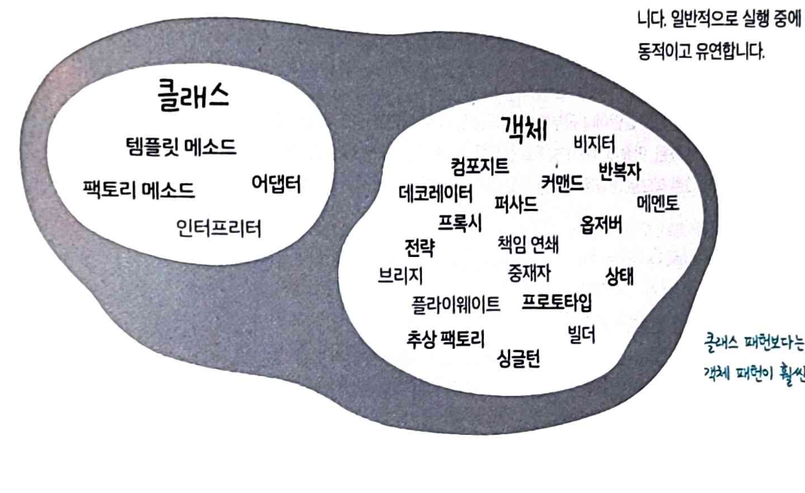

## 실전 디자인 패턴

**디자인 패턴**
패턴 : 특정 컨텍스트 내에서 주어진 문제의 해결책

컨텍스트 : 패턴이 적용되는 상황
문제 : 컨텍스트 내에서 이뤄내야 하는 목표
해결책 : 우리가 차장내야 하는 것. 제약 조건 속에서 누가 적용해도 목표를 이룰 수 있는 일반적인 디자인

### 디자인 패턴 범주

**생성 패턴**
객체 인스턴스를 생성하는 패턴입니다. 클라이언트와 그 클라이언트가 생성해야하는 객체 인스턴스 사이의 연결을 끊어주는 패턴입니다.

싱글턴, 빌더, 프로토 타입, 추상 팩토리, 팩토리 메소드

**구조 패턴**
클라스와 객체를 더 큰 구조로 만들 수 있게 구성을 사용하는 패턴입니다.

데코레이터, 컴포지트, 프록시, 파사드, 브릿지, 어댑터, 플라이웨이트

**행동 패턴**
클래스와 객체들이 상호작용하는 방법과 역할을 분담하는 방법을 다루는 패턴입니다.

템플릿 메소드, 비지터, 중재자, 반복자, 싱글턴, 메멘토, 옵저버, 인터프리터, 역할 변경, 상태, 전략

### 클래스 패턴 or 객체 패턴

**클래스 패턴**
클래스 사이의 관계가 상속으로 어떻게 정의되는지를 다룹니다. 클래스 사이의 관계는 대부분 컴파일할 때 결정됩니다.

**객체 패턴**
객체 사이의 관계를 다루며 객체 사이의 관계는 보통 구성으로 정의됩니다. 일반적으로 실행 중에 관계가 결정되기때문에 보다 동적이고 유연합니다.

### 패턴으로 생각하기

디자인을 할 때 가장 중요한 것은 "최대한 단순한 방법으로 문제를 해결하기"(Keep it Simple) 입니다.

디자인 패턴은 만병통치약이 아니기 때문에 패턴이 내가 설계한 디자인에 미칠 영향과 결과를 주의 깊게 생각해야합니다.

디자인을 할 때 현재 문제에 적합하다는 확신이 들면 패턴을 도입합니다. 더 간단한 해결책이 있다면 패턴을 적용하기 전에 그 해결책 사용을 고려합니다.

시스템이 점점 복잡해지면서 처음에 기대한 유연성이 발휘되지 못하면 패턴을 과감히 제거하는 게 낫습니다. -> 패턴보다 간단한 해결책이 더 나을 것 같은 경우

꼭 필요하지 않은 패턴은 미리 적용할 필요가 없습니다.

## 기타패턴

**브리지 패턴**
구현과 더불어 추상화 부분까지 변경해야 한다 => 브릿지 패턴 검토

-> 인터페이스와 실 구현 부분을 서로 다른 방식으로 변경해야하는 경우 유용합니다

장점 :
구현과 추상화 부분을 분리할 수 있음(완전히 결합하지 않아서)
추상화된 부분과 실 구현 부분을 독립적으로 확장 가능
추상화 부분을 구현한 구상 클래스가 바뀌어도 클라이언트는 영향을 끼치지않음

**빌더 패턴**
제품을 여러 단계로 나눠서 만들도록 제품 생성 단계를 캡슐화하고 싶은 경우 검토합니다.

-> 복합 객체 구조를 구축하는 용도로 많이 쓰입니다.

장점 :
복합 객체 생성 과정을 캡슐화
제품 내부 구조를 클라이언트로부터 보호
클라이언트는 추상 인터페이스만 볼 수 있기 때문에 제품을 구현한 코드를 쉽게 바꿀 수 있습니다.

**책임 연쇄 패턴**
1개 요청을 2개 이상의 객체에서 처리해야하는 경우 사용을 검토합니다

-> 윈도우 시스템에서 마우스 클릭과 키보드 이벤트를 처리할 때 흔히 사용됩니다.
-> 요청이 반드시 수행된다는 보장이 없다는 단점이 있습니다.

장점 :
요청을 보낸 쪽과 받는 쪽을 분리할 수 있습니다.
사슬에 들어가는 객체를 바꾸거나 순서를 바꿀 수 있습니다

**플라이웨이트 패턴**
어떤 클래스의 인스턴스 하나로 여러 개의 가상 인스턴스를 제공하고 싶으면 해당 패턴을 사용합니다.

-> 어떤 클래스의 인스턴스가 아주 많이 필요하지만 모두 같은 방식으로 제어할 때 유용합니다.

장점 :
실행 시 객체 인스턴스의 개수를 줄여서 메모리를 절약할 수 있습니다.

**인터프리터 패턴**
어떤 언어의 인터프리터를 만들 때 사용합니다.

-> 간단한 언어를 구현할 때 유용하게 쓰입니다.
-> 효율보다는 간단하고 단순하게 문법을 만드는 것이 더 중요한 경우에 사용합니다.

장점 :
문법을 클래스로 표현하여 쉽게 언어를 구현하고 쉽게 변경하거나 확장할 수 있습니다.

**중재자 패턴**
서로 관련된 객체 사이의 복잡한 통신과 제어를 한곳으로 집중하는 경우 사용합니다.

-> 서로 연관된 GUI 구성 요소를 관리하는 용도로 사용합니다. 단, 디자인을 잘 못하면 중재자 객체가 매우 복잡해집니다.

장점 :
제어 로직을 한 군데 모아놔 관리하기 수월합니다.
시스템과 객체를 분리하여 재사용성을 향상시킬 수 있습니다.

**메멘토 패턴**
객체를 이전 상태로 복구해야 하는 경우 메멘토 패턴을 사용합니다.

장점 :
저장된 상태를 핵심 객체와 다른 별도의 객체에 보관할 수 있어 안전합니다.
핵심 객체 데이터를 계속해서 캡슐화된 상태로 유지할 수 있습니다.

**프로토타입 패턴**
어떤 클래스 인스턴스를 만들 때 자원과 시간이 많이 들거나 복잡하면 프로토타입 패턴을 사용합니다.

-> 시스템에서 복잡한 클래스 계층구조에 파묻혀 있는 다양한 형식의 객체 인스턴스를 새로 만들 때 유용하게 쓸 수 있습니다.

장점 :
클라이언트는 새로운 인스턴스를 만드는 과정을 몰라도 됩니다.

**비지터 패턴**
다양한 객체에 새로운 기능을 추가하는데 캡슐화가 중요하지 않은 경우 사용합니다

자점 :
비교적 손쉽게 새 기능을 추가할 수 있습니다.
구조를 변경하지 않으면서 복합 객체 구조에 새로운 긴으을 추가할 수 있습니다.
