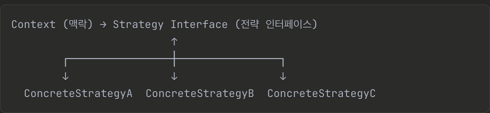

## 1주차

$$$$$$디자인 패턴의 효과$$$$$$
디자인 패턴을 공부하면 개발자 간 대화가 서로 쉬워진다는 장점이 있고 아키텍처를 생각하는 수준이 높아집니다!

### 오리 시뮬레이션 게임

초기 게임을 위해 만들어뒀던 클래스를 확장하는 과정에서 발생하는 내용이 정리되어있습니다.

- Duck이라는 슈퍼클래스가 있습니다.
- 오리 종류(MallardDuck, ReadheadDuck...)에 해당하는 서브 클래스는 슈퍼클래스를 상속받습니다.

1. fly 요구사항을 슈퍼클래스에 추가했습니다. 이때, 상속받은 서브 클래스들은 문제가 없을까요?

-> 슈퍼클래스에 fly를 추가하면 MallardDuck, RedheadDuck 경우에는 괜찮으나 러버덕의 경우 날면 안되기 때문에 "버그"입니다.

2. 슈퍼 클래스에서 상속받은 메소드를 오버라이드하는 방식으로 해결하는 것에 대한 문제점은?

-> 서브 클래스에서 오버라이드 처리를 하는 경우 유지보수 측면에서 불리합니다.

### 디자인 원칙

애플리케이션에서 달라지는 부분을 찾아내고 달라지지 않는 부분과 분리한다.
-> 나중에 바뀌지 않는 부분에는 영향을 미치지 않고 그 부분만 고치거나 확장할 수 있습니다.
-> 순수함수 분리했던 때랑 비슷하다고 생각

### 전략 패턴

동일한 목적을 가진 여러 알고리즘을 정의하고 이들을 캡슐화하여 런타임에 교체 가능하게 만드는 디자인 패턴

조건문으로 분기 처리하는 과정이 많아질때 도입하면 좋다.
-> 가독성과 테스트에 용이하고 기존 코드 수정없이 새 전략을 추가하기 좋다(확장성)
-> 단 로직이 매우 간단하거나 변경 가능성이 거의 없을때는 조건문이 더 나아요!

핵심개념


- Context : 전략을 사용하는 객체
- Strategy : 전략의 공통 인터페이스
- ConcreteStrategy : 실제 알고리즘 구현체

```jsx
// 정렬 전략들
const sortStrategies = {
  name: (a, b) => a.name.localeCompare(b.name),
  date: (a, b) => new Date(a.createdAt) - new Date(b.createdAt),
  price: (a, b) => a.price - b.price,
  popularity: (a, b) => b.views - a.views,
};

function ProductList() {
  const [products, setProducts] = useState([]);
  const [sortBy, setSortBy] = useState("name");

  const sortedProducts = useMemo(() => {
    const strategy = sortStrategies[sortBy];
    return [...products].sort(strategy);
  }, [products, sortBy]);

  return (
    <div>
      <select value={sortBy} onChange={(e) => setSortBy(e.target.value)}>
        <option value="name">이름순</option>
        <option value="date">최신순</option>
        <option value="price">가격순</option>
        <option value="popularity">인기순</option>
      </select>

      {sortedProducts.map((product) => (
        <ProductCard key={product.id} product={product} />
      ))}
    </div>
  );
}
```
