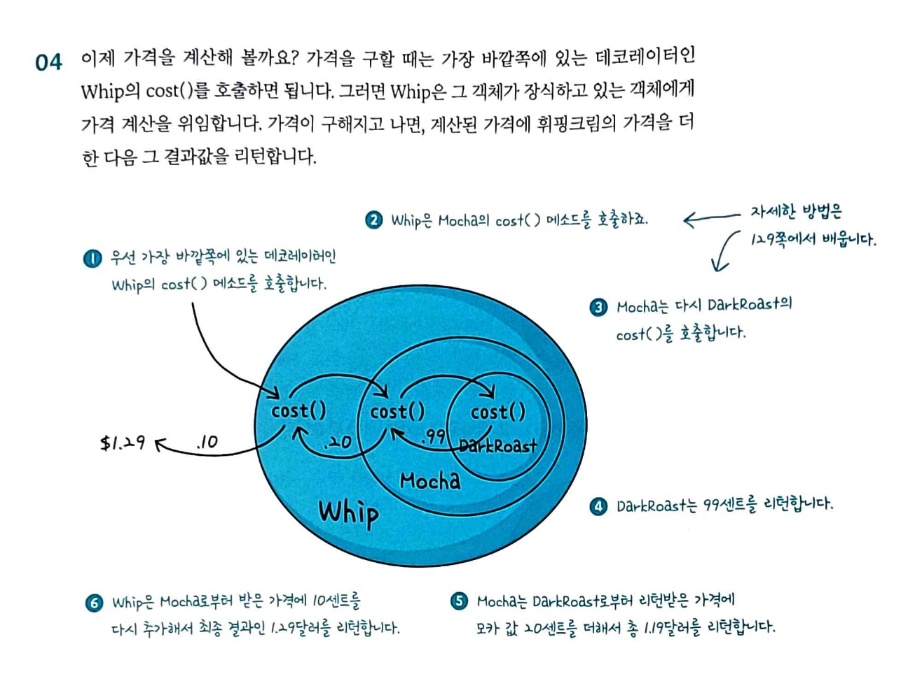
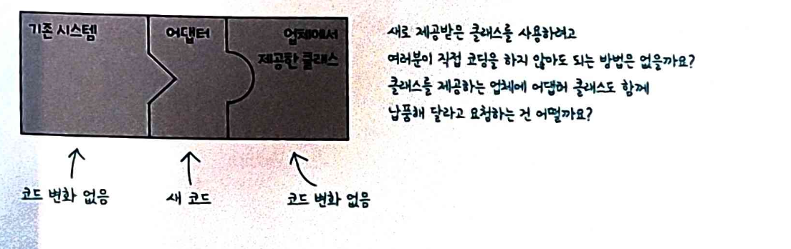

# 3주차

## 데코레이터 패턴

객체에 동적으로 새로운 기능을 추가할 수 있는 구조 패턴입니다.
기존 코드를 수정하지 않고도 객체 기능을 확장할 수 있습니다.

Component : 기본 인터페이스
ConcreateComponent : 실제 기본 객체
Decorator : 기능을 추가하는 래퍼
ConcreteDecorator : 구체적인 기능 구현

**OCP 살펴보기**
Open-Closed Principle은 중요한 디자인 원칙 중 하나입니다.

**클래스는 확장에는 열려 있어야 하지만 변경에는 닫혀있어야 한다.**

### 적용 개념

음식 위에 토핑을 데코하는 것 처럼 생각하는 개념입니다.

ex) 모카와 휘핑 크림을 추가한 다크 로스트 커피

1. DarkRoast 객체를 가져온다.
2. Mocha 객체를 장식한다.
3. Whip 객체를 장식한다.
4. cost() 메소드를 호출하며 첨가물 가격 계산은 해당 객체에 위임한다.

여기에 데코레이터를 적용합니다.




바깥쪽에 있는 cost 메소드 부터 호출하여 리턴을 받아갑니다
데코레이터는 자신이 장식하고 있는 객체에게 행동을 위임하는 일 말고도 추가 작업을 수행할 수 있습니다.

```js
// 기본 커피
const simpleCoffee = {
  cost: () => 2000,
  description: () => "기본 커피",
};

// Decorator 팩토리 함수
const withShot = (coffee) => ({
  cost: () => coffee.cost() + 500,
  description: () => coffee.description() + " + 샷",
});

const withMilk = (coffee) => ({
  cost: () => coffee.cost() + 300,
  description: () => coffee.description() + " + 우유",
});

const withWhip = (coffee) => ({
  cost: () => coffee.cost() + 400,
  description: () => coffee.description() + " + 휘핑크림",
});

// 사용 (체이닝)
const myCoffee = withWhip(withMilk(withShot(simpleCoffee)));

console.log(myCoffee.description()); // "기본 커피 + 샷 + 우유 + 휘핑크림"
console.log(myCoffee.cost()); // 3200
```

#### 데코레이터 패턴의 장단점

**장점**

1. 개방-폐쇄 원칙(OCP) : 기존 코드 수정 없이 기능 확장
2. 단일 책임 원칙(SRP) : 각 데코레이터가 하나의 기능만 담당
3. 유연성 : 런타임에 동적으로 기능 추가/제거 가능
4. 조합 가능 : 여러 데코레이터를 자유롭게 조합

**단점**

1. 복잡도 증가 : 데코레이터가 많아지면 코드 추적 어려움
2. 순서 의존성 : 데코레이터 적용 순서에 따라 결과가 달라질 수 있음
3. 디버깅 어려움 : 여러 레이어를 거치므로 에러 추적이 복잡함

#### 데코레이터 패턴과 상속이 뭐가 다른지?

여러 기능을 조합하거나 기존 코드 수정없이 동적으로 기능을 확장하고 싶을 때 데코레이터 사용!

```js
// ❌ 상속 방식 (경직됨)
class Coffee {}
class CoffeeWithShot extends Coffee {}
class CoffeeWithShotAndMilk extends CoffeeWithShot {}
class CoffeeWithShotAndMilkAndWhip extends CoffeeWithShotAndMilk {}
// 조합이 늘어날수록 클래스 폭발!

// ✅ 데코레이터 방식 (유연함)
const coffee = withWhip(withMilk(withShot(new Coffee())));
// 자유로운 조합 가능
```

**중요**
데코레이터는 감싸고 있는 객체에 행동을 추가하는 용도입니다.
-> 여러 단계의 데코레이터를 파고 들어가서 어떠한 작업을 해야한다면 원래의 패턴 의도와 다르다.

데코레이터를 빼먹을 위험은?
-> 데코레이터를 쓰면 관리할 객체가 늘어나니까 실수할 위험이 있을 수 있지만 보통 팩토리나 빌더같은 다른 패턴으로 데코레이터를 만듭니다.

---

## 어뎁터 패턴

호환되지 않는 인터페이스를 가진 객체들이 함께 동작할 수 있도록 중간에서 변환해주는 패턴입니다

### 핵심 구조

`Client -> Target Interface -> Adapter -> Adaptee(기존 클래스)`
Target : 클라이언트가 사용하는 인터페이스
Adapter : Target 인터페이스를 구현하고 Adaptee를 감싸는 래퍼
Adaptee : 어댑터가 감싸는 기존 클래스 (변환 대상)



```js
// ❌ 문제 상황: 여러 결제 API의 인터페이스가 다름

// 기존 코드가 기대하는 인터페이스
class PaymentProcessor {
  processPayment(amount) {
    throw new Error("구현 필요");
  }
}

// Adaptee 1: 토스페이먼츠 (기존 API)
class TossPayments {
  constructor(clientKey) {
    this.clientKey = clientKey;
  }

  requestPayment(orderInfo) {
    console.log("토스페이먼츠 결제 요청:", orderInfo);
    return {
      status: "SUCCESS",
      transactionId: "TOSS_" + Date.now(),
    };
  }
}

// Adaptee 2: 카카오페이 (기존 API)
class KakaoPay {
  constructor(apiKey) {
    this.apiKey = apiKey;
  }

  pay(paymentData) {
    console.log("카카오페이 결제 요청:", paymentData);
    return {
      result: "OK",
      tid: "KAKAO_" + Date.now(),
    };
  }
}

// ✅ 해결: Adapter로 통일된 인터페이스 제공

// Adapter 1: 토스페이먼츠 어댑터
class TossPaymentsAdapter extends PaymentProcessor {
  constructor(clientKey) {
    super();
    this.tossPayments = new TossPayments(clientKey);
  }

  processPayment(amount) {
    const orderInfo = {
      amount: amount,
      orderId: "ORDER_" + Date.now(),
      orderName: "상품 구매",
    };

    const result = this.tossPayments.requestPayment(orderInfo);

    return {
      success: result.status === "SUCCESS",
      transactionId: result.transactionId,
    };
  }
}

// Adapter 2: 카카오페이 어댑터
class KakaoPayAdapter extends PaymentProcessor {
  constructor(apiKey) {
    super();
    this.kakaoPay = new KakaoPay(apiKey);
  }

  processPayment(amount) {
    const paymentData = {
      total_amount: amount,
      item_name: "상품 구매",
    };

    const result = this.kakaoPay.pay(paymentData);

    return {
      success: result.result === "OK",
      transactionId: result.tid,
    };
  }
}

// 사용
function checkoutWithPayment(paymentProcessor, amount) {
  const result = paymentProcessor.processPayment(amount);

  if (result.success) {
    console.log("결제 성공:", result.transactionId);
  } else {
    console.log("결제 실패");
  }
}

// 어떤 결제 수단이든 동일한 방식으로 사용 가능
const tossAdapter = new TossPaymentsAdapter("toss_client_key");
checkoutWithPayment(tossAdapter, 10000);

const kakaoAdapter = new KakaoPayAdapter("kakao_api_key");
checkoutWithPayment(kakaoAdapter, 10000);
```

어탭터 패턴이 특정 클래스 인터페이스를 클라이언트에서 요구하는 다른 인터페이스로 변환하여 인터페이스가 호환되지 않아 같이 쓸 수 없었던 클래스를 사용할 수 있게 도와줍니다.


..?

어댑터 패턴에는 기존 시스템 클래스를 상속해서 호환 작업을 하냐, 합성해서 호환 작업을 해주냐에 따라 2가지 패턴 방법으로 나뉘게 됩니다.

**객체 어댑터**

- 합성된 멤버에게 위임을 이용한 어댑터 패턴
- 자기가 해야할 일을 클래스 멤버 객체 메소드에게 다시 시킴으로써 목적을 달성하는 것을 위임이라고 합니다.
- 합성을 활용했기 때문에 런타임 중에 Adaptee가 결정되어 유연합니다.
- 그러나 Adaptee 객체를 필드 변수로 저장해야 되기 때문에 공간 차지 비용이 듭니다.

**클래스 어댑터**

- 클래스 상속을 이용한 어댑터 패턴
- Adaptee를 상속했기 때문에 따로 객체 구현없이 바로 코드 재사용이 가능하다.
- 상속은 대표적으로 기존에 구현된 코드를 재사용하는 방식입니다.

### 사용 시기

- 레거시 코드를 쓰고 싶은데 새로운 인터페이스가 레거시 코드와 호환되지 않는 경우
- 이미 만든 것을 재사용하고자 하나 이 재사용 가능한 라이브러리를 수정할 수 없는 경우
- 이미 만들어진 클래스를 새로운 인터페이스에 맞게 개조하는 경우
- 소프트웨어 구 버전과 신 버전을 공존시키고 싶은 경우

**장점**

- 프로그램 기본 비즈니스 로직에서 인터페이스 또는 데이터 변환 코드를 분리할 수 있기 때문에 SRP를 만족합니다.
- 기존 클래스 코드를 건드리지 않고 클라이언트 인터페이스를 통해 어댑터와 작동하기 때문에 OCP를 만족합니다.
- 만일 추가로 필요한 메소드가 있다면 어댑터에 빠르게 만들 수 있다. 만약 버그가 발생해도 기존의 클래스에는 버그가 없으므로 어댑터 역할의 클래스를 중점적으로 조사하면 되고 프로그램 검사도 쉬워집니다.

**단점**

- 새로운 인터페이스와 어댑터 클래스 세트를 도입해야하기 때문에 코드 복잡성이 증가합니다.
- 때로는 직접 서비스 클래스를 변경하는 것이 간단할 수 있는 경우가 있기 때문에 신중하게 선택해야합니다.

## 파사드 패턴

복잡한 서브시스템에 대한 단순화된 인터페이스를 제공하는 패턴입니다.
-> TV, 스피커, 에어컨을 리모콘 하나로 조작하는 것 같이 복잡한 시스템을 간단하게

### 핵심 구조

```js
Client -> Facade -> Subsystem A
                  -> Subsystem B
                  -> Subsystem C

```

Client : 서브 시스템에 직접 접근하는 대신 Facade를 사용한다.
Facade : 간단한 인터페이스 제공
Subsystems : 실제 복잡한 작업을 수행하는 클래스들

파사드는 복잡한 서브시스템을 단순화하는 것을 목적으로하여 1:N 통합 관계입니다. 복잡한 시스템을 간단히 사용하고 싶을때 적용할 수 있습니다.

### 사용 시기

- 복잡한 시스템을 간단히 사용하고 싶을 때
- 여러 서브 시스템을 조합하는 작업이 반복될 때
- 클라이언트 코드를 서브시스템 변경으로부터 보호하고 싶을 떄

**장점**

- 하위 시스템 복잡성에서 코드를 분리하여 외부에서 시스템을 사용하기 쉬워집니다.
- 하위 시스템 간 의존 관계가 많을 경우 이를 감소시키고 의존성을 한 곳으로 모을 수 있습니다.
- 복잡한 코드를 감춰 클라이언트가 시스템 코드를 모르더라도 Facade클래스만 이해하고 사용 가능합니다.

**단점**

- 파사드가 앱의 모든 클래스에 결합된 god 객체가 될 수 있습니다.
- 파사드 클래스 자체가 서브 시스템에 대한 의존성을 가져 의존성을 완전히 피할 수 없습니다.
