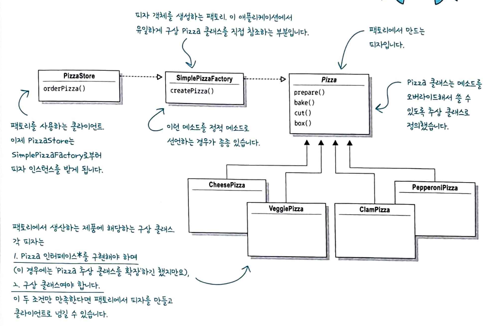
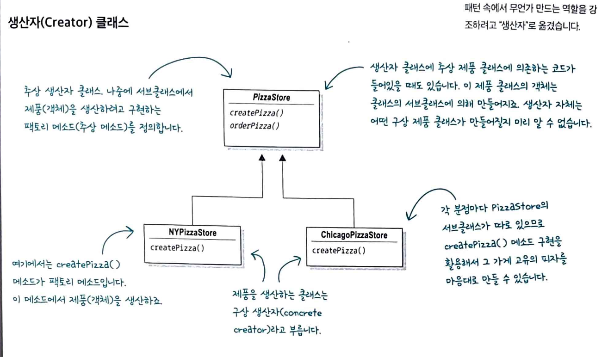
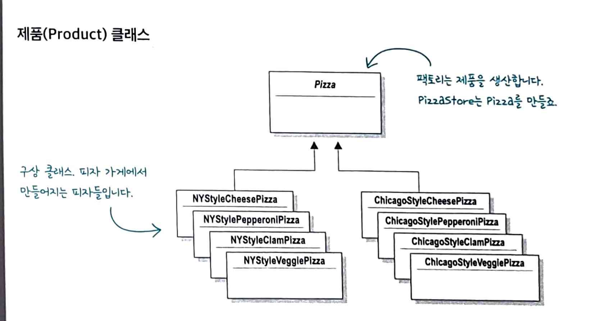

## 4. 팩토리 패턴

객체 생성 로직을 캡슐화하는 디자인 패턴입니다.
객체를 직접 생성하는 대신 팩토리 함수나 클래스를 통해 생성하는 방식입니다.

객체 생성 로직이 복잡하거나 생성할 객체 타입이 런타임에 결정되거나 생성 과정을 중앙화하고 싶을 때 유용합니다.

### 구상 클래스의 생성 방식

```js
Duck duck;

if(picnic){
    duck = new MallardDuck();
}else if(hunting){
    duck = new DecoyDuck()
}else if(inBathTub){
    duck = new RubberDuck();
}
```

구성 클래스의 인스턴스가 여러 개 있으며, 인스턴스 형식은 실행 시에 주어진 조건에 따라 결정됩니다.
변경/확장 시 코드를 확인하고 추가/제거를 해야하기 때문에 유지보수 측면에서 단점이 있습니다.

### 객체 생성 부분 캡슐화하기

피자를 예시로 들 때, 피자를 만드는 일만 처리하는 객체를 전담하는 것으로 캡슐화합니다.

캡슐화할 때의 장점 :
`SimplePizzaFactory`를 사용하는 클라이언트가 매우 많은 경우 해당 객체를 여러 클래스에서 사용할 수 있습니다.

### 클라이언트 코드가 수정되는 경우

```js
class PizzaStore {
  constructor(factory) {
    this.factory = factory;
  }

  orderPizza(type) {
    let pizza;

    // 팩토리로 피자 객체를 만듭니다
    pizza = this.factory.createPizza(type);

    // new 연산자 대신 팩토리 객체의 create 메소드를 사용
    // 이제 더 이상 구상 클래스의 인스턴스를 직접 만들 필요가 없습니다
    pizza.prepare();
    pizza.bake();
    pizza.cut();
    pizza.box();

    return pizza;
  }

  // 기타 메소드
}
```

**간단한 팩토리**
간단한 팩토리가 패턴은 아니지만 프로그래밍에서 자주 쓰이는 관용구에 가깝습니다.



### 다양한 팩토리 만드릭

다양한 곳에 지점을 내는 경우 해당 지역에 맞춰 로컬라이징된 피자를 제공해야합니다.

```js
NYPizzaFactory nyFactory = new NYPizzaFactory();
PizzaStore nyStore = new PizzaStore(nyFactory);
nyStore.orderPizza('veggie');

ChicagoPizzaFactory chicagoFactory = new ChicagoPizaFactory();
PizzaStore chicagoStore = new PizzaStore(chicagoFactory);
chicagoStore.orderPizza('veggie')
```

### 팩토리 메서드 패턴 특징

팩토리 메서드 패턴에서는 어떤 클래스의 인스턴스를 만들지를 서브클래스에서 결정합니다.

**패턴 사용 시기**

- 클래스 생성과 사용 처리 로직을 분리하여 결합도를 낮출 때
- 코드가 동작해야 하는 객체 유형과 종속성을 캡슐화를 통해 정보 은닉 처리를 할 경우
- 기존 객체를 재구정하는 대신 기존 객체를 재사용하여 리소스를 절약하고자 하는 경우


Creator : 최상위 공장 클래스로, 팩토리 메서드를 추상화하여 서브 클래스로 하여금 구현하도록 합니다.

- 객체 생성 처리 메서드(someOperartion) : 객체 생성에 관한 전처리 / 후처리를 템플릿화한 메서드
- 팩토리 메서드(createProduct) : 서브 공장 클래스에서 재정의할 객체 생성 추상 메서드

ConcreteCreator : 각 서브 공장 클래스들은 이에 맞는 제품 객체를 반환하도록 생성 추상 메서드를 재정의합니다. 제품 객체 하나당 그에 걸맞는 생산 공장 객체가 위치됩니다.


Product : 제품 구현체를 추상화
ConcreteProduct : 제품 구현체

**장점**

- 객체 생성 코드를 전부 한 객체 또는 메소드에 넣어 코드 중복을 제거할 수 있고, 관리할 때도 한 군데에만 신경쓰면 됩니다. 또한 객체 인스턴스를 만들 때 인터페이스만 있으면 되므로 이를 바탕으로 프로그래밍 할 수 있어 유연성과 확장성이 뛰어난 코드를 만들 수 있습니다.

### 의존성 뒤집기 원칙

고수준 모듈(비즈니스 모듈)이 저수준 모듈(구체적인 구현)에 직접 의존하면 안되고 둘 다 추상화에 의존하는 것

- 변수에 구상 클래스 레퍼런스를 저장하지 않는다.
- 구상 클래스에서 유도된 클래스를 만들지 않는다.
- 베이스 클래스에 이미 구현된 메소드를 오버라이드하지 안흔ㄴ다.
  라는 가이드라인이 존재합니다.

```js
// 추상화 (인터페이스 역할)
class PizzaFactory {
  createPizza(type) {
    throw new Error("구현 필요");
  }
}

// 구체적인 구현
class NYPizzaFactory extends PizzaFactory {
  createPizza(type) {
    if (type === "cheese") return new NYCheesePizza();
    if (type === "pepperoni") return new NYPepperoniPizza();
  }
}

// 고수준 모듈이 추상화에 의존
class PizzaStore {
  constructor(factory) {
    this.factory = factory; // 추상화(팩토리)에 의존
  }

  orderPizza(type) {
    const pizza = this.factory.createPizza(type);
    pizza.prepare();
    pizza.bake();
    return pizza;
  }
}
```

### 추상 팩토리 패턴

구상 클래스에 의존하지 않고도 서로 연관되거나 의존적인 객체로 이뤄진 제품군을 생산하는 인터페이스를 제공합니다. 구상 클래스는 서브클래스에서 만듭니다.

팩토리 패턴과 다른점은
팩토리 패턴 -> 한 종류의 객체를 생성 (피자만)
추상 팩토리 패턴 -> 관련된 여러 객체를 함께 생성(피자+도우+소스+치즈)

## 5. 싱글턴 패턴

클래스의 인스턴스가 오직 하나만 존재하도록 보장하는 패턴으로 그 인스턴스에 전역적으로 접근할 수 있게 해줍니다.

```java
class Singleton{
    private static Signleton uniqueInstance;
    private Singleton(){}

    //null이 아니면 이미 객체가 있다는 것이므로 한번만 생성됩니다
    public static Singleton getInstance(){
        if(uniqueInstance == null){
            uniqueInstance = new Singleton()
        }
        return uniqueInstance;
    }

}

```

**예시**

```js
// logger.js
class Logger {
  constructor() {
    this.logs = [];
  }

  log(message) {
    this.logs.push({ time: Date.now(), message });
    console.log(message);
  }

  getLogs() {
    return this.logs;
  }
}

// 인스턴스를 직접 export
export default new Logger();
```

```js
// app.js
import logger from "./logger.js";
logger.log("첫 번째 로그");

// otherFile.js
import logger from "./logger.js";
logger.log("두 번째 로그");
console.log(logger.getLogs()); // 두 개 다 보임!
```

- 어디서 임포트하든 같은 인스턴스를 받습니다
- 자바와 달리 자바스크립트에서는 es6 모듈 자체가 싱글턴처럼 동작합니다. (애초에 싱글스레드 언어!ㅇ)
