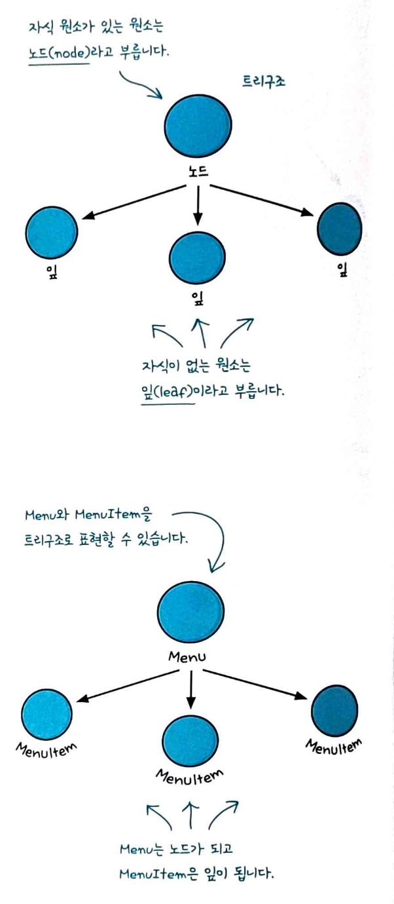
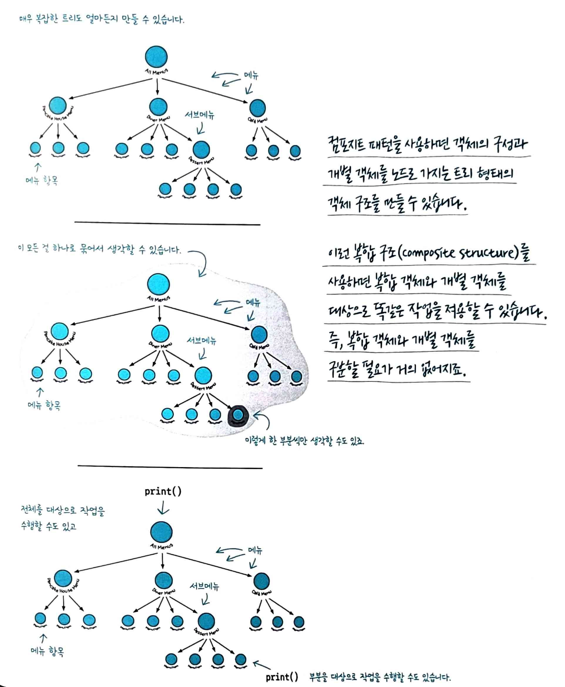

## 반복자 패턴

컬렉션의 내부 구조를 노출하지 않고 순회할 수 있게 해주는 패턴

=> 배열, 트리, 그래프 등 다양한 자료구조를 순회할 때 각각 다른 방식으로 접근해야 하는데, 반복자 패턴은 이런 차이를 추상화하여 동일한 인터페이스로 순회할 수 있게 합니다.
=> 각 항목에 일일이 접근할 수 있게 해주는 기능을 집합체가 아닌 반복자 객체가 책임지는 장점이 있습니다. 따라서 집합체 인터페이스와 구현이 간단해지고 각자에게 중요한 일을 처리할 수 있습니다.

```js
// 반복자 인터페이스
interface Iterator<T> {
  next(): T | null;
  hasNext(): boolean;
}

// 컬렉션 인터페이스
interface Iterable<T> {
  createIterator(): Iterator<T>;
}

// 구체적인 컬렉션
class CameraList implements Iterable<Camera> {
  private cameras: Camera[] = [];

  addCamera(camera: Camera) {
    this.cameras.push(camera);
  }

  createIterator(): Iterator<Camera> {
    return new CameraIterator(this.cameras);
  }
}

// 구체적인 반복자
class CameraIterator implements Iterator<Camera> {
  private position = 0;

  constructor(private cameras: Camera[]) {}

  next(): Camera | null {
    if (this.hasNext()) {
      return this.cameras[this.position++];
    }
    return null;
  }

  hasNext(): boolean {
    return this.position < this.cameras.length;
  }
}

// 사용 예시
const cameraList = new CameraList();
cameraList.addCamera(camera1);
cameraList.addCamera(camera2);

const iterator = cameraList.createIterator();
while (iterator.hasNext()) {
  const camera = iterator.next();
  console.log(camera);
}
```

=> `for of`, `forEach()`, `function*`이 모두 반복자 패턴을 기반으로 합니다.
=> 리액트 쿼리의 페이지네이션 처리나 무한 스크롤 구현에도 유용하게 사용할 수 있습니다.

## 컴포지트 패턴

객체들을 트리 구조로 구성하여 개별 객체와 복합 객체를 동일하게 다룰 수 있게 해주는 패턴입니다.

파일/폴더 구조, UI 컴포넌트 계층, 조직도 처럼 부분-전체 계층을 표현할 때 개별 요소와 그룹을 똑같은 방식으로 처리할 때 사용합니다.

리액트 컴포넌트 트리 구조 자체가 컴포지트 패턴입니다.





```js
// 공통 인터페이스
interface DeviceComponent {
  getName(): string;
  getStatus(): string;
  display(depth: number): void;
}

// Leaf (개별 객체)
class Camera implements DeviceComponent {
  constructor(private name: string, private status: string) {}

  getName(): string {
    return this.name;
  }

  getStatus(): string {
    return this.status;
  }

  display(depth: number): void {
    console.log(`${'  '.repeat(depth)}📷 ${this.name} - ${this.status}`);
  }
}

// Composite (복합 객체)
class DeviceGroup implements DeviceComponent {
  private children: DeviceComponent[] = [];

  constructor(private name: string) {}

  add(component: DeviceComponent): void {
    this.children.push(component);
  }

  remove(component: DeviceComponent): void {
    const index = this.children.indexOf(component);
    if (index !== -1) {
      this.children.splice(index, 1);
    }
  }

  getName(): string {
    return this.name;
  }

  getStatus(): string {
    const activeCount = this.children.filter(
      child => child.getStatus() === 'active'
    ).length;
    return `${activeCount}/${this.children.length} active`;
  }

  display(depth: number): void {
    console.log(`${'  '.repeat(depth)}📁 ${this.name} - ${this.getStatus()}`);
    this.children.forEach(child => child.display(depth + 1));
  }
}

// 사용 예시
const building1F = new DeviceGroup('1층');
building1F.add(new Camera('로비 카메라', 'active'));
building1F.add(new Camera('입구 카메라', 'active'));

const building2F = new DeviceGroup('2층');
building2F.add(new Camera('복도 카메라', 'inactive'));

const building = new DeviceGroup('본관');
building.add(building1F);
building.add(building2F);

building.display(0);
// 📁 본관 - 2/3 active
//   📁 1층 - 2/2 active
//     📷 로비 카메라 - active
//     📷 입구 카메라 - active
//   📁 2층 - 0/1 active
//     📷 복도 카메라 - inactive
```

장점 : 클라이언트를 단순화 시킬 수 있다 / 메소드 하나만 호출하면 전체 구조를 대상으로 반복 작업을 처리할 수 있다.
