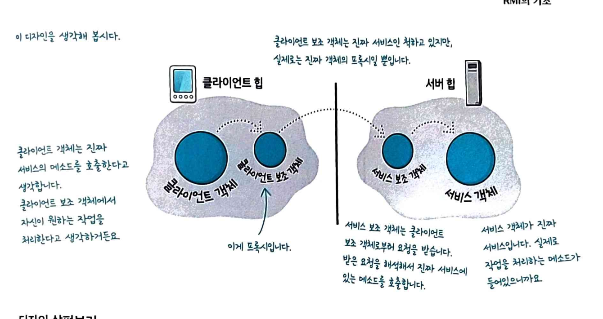

## 프록시 패턴

실제 객체에 대한 접근을 제어하기 위해 프록시를 제공하는 패턴
실제 객체와 동일한 인터페이스를 구현하기 때문에 클라이언트에서는 차이를 느끼지 못합니다.

- 프록시 패턴은 접근 제어가 목적(동일 인터페이스)
- 데코레이터는 기능 추가가 목적(동일 인터페이스)
- 어댑터는 인터페이스 변환이 목적(다른 인터페이스)

**사용 시기**
실제 객체에 직접 접근하기 전에 추가적인 로직이 필요한 경우에 사용합니다.

- 접근 권한을 제어하고 싶은 경우
- 로깅, 캐싱 등 부가 기능을 추가하고 싶은 경우
- 비용이 큰 객체 생성을 지연시키고 싶은 경우
- 원격 객체에 대한 로컬 대리자가 필요한 경우

**원격 프록시**
다른 주소 공간(다른 서버/프로세스)에 있는 객체를 로컬에 있는 것처럼 사용할 수 있게 해주는 프록시입니다. 네트워크 통신 복잡성을 숨기고 로컬 객체를 호출하는 것처럼 보이게 합니다.

실제 객체가 원격 서버에 있을 때 :

- 클라이언트는 네트워크 통신, 직렬화/역직렬화, 에러 처리 등을 신경 쓰지 않아도 됩니다.
- 로컬 객체를 호출하듯이 간단하게 원격 객체를 사용 가능합니다.
- 네트워크 장애, retry 등을 프록시가 처리합니다.



**가상 프록시**
비용이 큰 객체 생성을 실제로 필요할 때까지 지연합니다.

```ts
// 실제 객체 인터페이스
interface VideoStream {
  play(): void;
  getSize(): number;
}

// 실제 비용이 큰 객체
class RealVideoStream implements VideoStream {
  private url: string;
  private data: Buffer | null = null;

  constructor(url: string) {
    this.url = url;
    this.loadVideo(); // 생성 시 바로 로드 (비용 큼)
  }

  private loadVideo(): void {
    console.log(`📥 비디오 로딩 중... ${this.url}`);
    // 실제로는 네트워크 요청, 디코딩 등 무거운 작업
    this.data = Buffer.from("video-data");
    console.log("✅ 로딩 완료!");
  }

  play(): void {
    console.log(`▶️ 재생: ${this.url}`);
  }

  getSize(): number {
    return this.data?.length || 0;
  }
}

// 가상 프록시
class VideoStreamProxy implements VideoStream {
  private realStream: RealVideoStream | null = null;
  private url: string;

  constructor(url: string) {
    this.url = url;
    console.log("프록시 생성 (실제 로딩은 아직 안함)");
  }

  play(): void {
    // 실제로 필요할 때만 생성 (Lazy Loading)
    if (!this.realStream) {
      this.realStream = new RealVideoStream(this.url);
    }
    this.realStream.play();
  }

  getSize(): number {
    if (!this.realStream) {
      return 0; // 아직 로드 안됨
    }
    return this.realStream.getSize();
  }
}

// 사용 예시
const video = new VideoStreamProxy("rtsp://camera1/stream");
// 프록시 생성 (실제 로딩은 아직 안함)

console.log("다른 작업 수행...");

video.play();
// 📥 비디오 로딩 중... rtsp://camera1/stream
// ✅ 로딩 완료!
// ▶️ 재생: rtsp://camera1/stream
```

**보호 프록시**
접근 권한을 제어하는 프록시입니다.

```js
interface DeviceControl {
  reboot(): void;
  updateFirmware(version: string): void;
  viewStatus(): string;
}

class Device implements DeviceControl {
  reboot(): void {
    console.log('🔄 디바이스 재부팅 중...');
  }

  updateFirmware(version: string): void {
    console.log(`⬆️ 펌웨어 업데이트: ${version}`);
  }

  viewStatus(): string {
    return '정상 작동 중';
  }
}

// 보호 프록시
class ProtectedDeviceProxy implements DeviceControl {
  private device: Device;
  private userRole: 'admin' | 'operator' | 'viewer';

  constructor(device: Device, userRole: 'admin' | 'operator' | 'viewer') {
    this.device = device;
    this.userRole = userRole;
  }

  reboot(): void {
    if (this.userRole === 'admin') {
      this.device.reboot();
    } else {
      console.log('❌ 권한 없음: 관리자만 재부팅 가능합니다.');
    }
  }

  updateFirmware(version: string): void {
    if (this.userRole === 'admin') {
      this.device.updateFirmware(version);
    } else {
      console.log('❌ 권한 없음: 관리자만 펌웨어 업데이트 가능합니다.');
    }
  }

  viewStatus(): string {
    // 모든 사용자 접근 가능
    return this.device.viewStatus();
  }
}

// 사용 예시
const device = new Device();

const adminProxy = new ProtectedDeviceProxy(device, 'admin');
adminProxy.reboot(); // 🔄 디바이스 재부팅 중...

const viewerProxy = new ProtectedDeviceProxy(device, 'viewer');
viewerProxy.reboot(); // ❌ 권한 없음: 관리자만 재부팅 가능합니다.
```

**캐싱 프록시**
반복적인 요청 결과를 캐싱합니다.

```js
interface CameraAPI {
  getSnapshot(cameraId: string): Promise<string>;
}

class RealCameraAPI implements CameraAPI {
  async getSnapshot(cameraId: string): Promise<string> {
    console.log(`📸 API 호출: ${cameraId} 스냅샷 요청`);
    // 실제 네트워크 요청 시뮬레이션
    await new Promise(resolve => setTimeout(resolve, 1000));
    return `snapshot-${cameraId}-${Date.now()}`;
  }
}

class CachingCameraProxy implements CameraAPI {
  private api: RealCameraAPI;
  private cache: Map<string, { data: string; timestamp: number }> = new Map();
  private cacheExpiry = 5000; // 5초

  constructor(api: RealCameraAPI) {
    this.api = api;
  }

  async getSnapshot(cameraId: string): Promise<string> {
    const cached = this.cache.get(cameraId);
    const now = Date.now();

    // 캐시가 있고 유효하면 캐시 반환
    if (cached && now - cached.timestamp < this.cacheExpiry) {
      console.log(`💾 캐시에서 반환: ${cameraId}`);
      return cached.data;
    }

    // 캐시가 없거나 만료되면 실제 API 호출
    const data = await this.api.getSnapshot(cameraId);
    this.cache.set(cameraId, { data, timestamp: now });
    return data;
  }
}

// 사용 예시
const api = new RealCameraAPI();
const proxy = new CachingCameraProxy(api);

await proxy.getSnapshot('camera1'); // 📸 API 호출
await proxy.getSnapshot('camera1'); // 💾 캐시에서 반환 (빠름!)
```

**로깅 프록시**
메소드 호출을 로깅합니다.

```js
interface DataService {
  save(data: any): void;
  load(id: string): any;
}

class RealDataService implements DataService {
  save(data: any): void {
    // 실제 저장 로직
  }

  load(id: string): any {
    // 실제 로드 로직
    return { id, data: 'some data' };
  }
}

class LoggingDataServiceProxy implements DataService {
  private service: RealDataService;

  constructor(service: RealDataService) {
    this.service = service;
  }

  save(data: any): void {
    console.log(`[LOG] save 호출됨 - data:`, data);
    const start = performance.now();

    this.service.save(data);

    const duration = performance.now() - start;
    console.log(`[LOG] save 완료 - 소요시간: ${duration}ms`);
  }

  load(id: string): any {
    console.log(`[LOG] load 호출됨 - id: ${id}`);
    const start = performance.now();

    const result = this.service.load(id);

    const duration = performance.now() - start;
    console.log(`[LOG] load 완료 - 소요시간: ${duration}ms`);
    return result;
  }
}
```

**자바스크립트의 프록시 객체**
자바스크립트는 언어 레벨에서 프록시 패턴을 지원합니다.

```js
const target = {
  message: "Hello",
  count: 0,
};

const handler = {
  get(target: any, property: string) {
    console.log(`🔍 ${property} 속성 읽기`);
    return target[property];
  },

  set(target: any, property: string, value: any) {
    console.log(`✏️ ${property} 속성 쓰기: ${value}`);
    target[property] = value;
    return true;
  },
};

const proxy = new Proxy(target, handler);

console.log(proxy.message); // 🔍 message 속성 읽기 / Hello
proxy.count = 5; // ✏️ count 속성 쓰기: 5
```

---

실전에서는 프록시 패턴의 변종을 더 많이 봅니다.
변종의 공통점으로는 클라이언트가 실제 객체의 메소드를 호출하면 그 호출을 중간에 가로챕니다.
-> 간접적으로 작업을 처리하면 요청 내역을 원격 시스템에 있는 객체에 전달, 생성하는 데 많은 비용이 드는 객체를 대변
